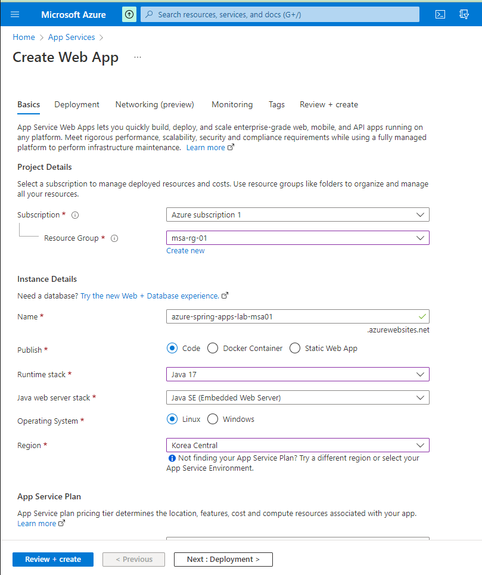

# 01-Azure Spring Apps생성
- using Azure CLI
---

## 1.Azure Subscription 확인

Azure CLI가 Azure 구독에 로그인되어 있는지 확인

  ```bash
  az login # Sign into an azure account(부라우저를 통하여 로그인 함)
  az account show # See the currently signed-in account.
  ```
- 결과
  ```
  {
    "environmentName": "AzureCloud",
    "homeTenantId": "b8d6f9c4-6aed-4744-b6ed-a7fa69bbad4d",
    "id": "2f3be25a-4f0c-4efe-b44f-474bf15974a3",
    "isDefault": true,
    "managedByTenants": [],
    "name": "Azure subscription 1",
    "state": "Enabled",
    "tenantId": "b8d6f9c4-6aed-4744-b6ed-a7fa69bbad4d",
    "user": {
      "name": "jcscom13@gmail.com",
      "type": "user"
    }
  }
```

구독 설정 방법
```
az account set --subscription <SUBSCRIPTION_ID>
#예시
az account set --subscription "Azure subscription 1"
```

## 2. 인스턴스 만들기
먼저 Azure Spring Apps 인스턴스의 이름을 지정
- __이름은 모든 Azure에 있는 모든 Azure Spring Apps 인스턴스에서 고유해야 합__.
  - 사용자 이름을 이름의 일부로 사용하는 것을 고려
  - 이름에는 소문자, 숫자 및 하이픈만 사용
  - 4~32자 길이

입력을 제한하려면 변수 `AZ_RESOURCE_GROUP`를 이전 섹션에서 만든 리소스 그룹의 이름으로 설정합니다. `AZ_SPRING_APPS_NAME`생성할 Azure Spring Apps 인스턴스의 이름으로 변수를 설정

>🛑 Be sure to substitute your own values for `AZ_RESOURCE_GROUP` and `AZ_SPRING_APPS_NAME` as described above.
    __`AZ_SPRING_APPS_NAME` 유일해야함(globally), 소문자(특수문자 불허).__

```bash
AZ_RESOURCE_GROUP=spring-apps-lab
AZ_SPRING_APPS_NAME=azure-spring-apps-lab
# 교육시 사용한 그룹
AZ_RESOURCE_GROUP=msa-rg-01
AZ_SPRING_APPS_NAME=msa-01
```

인스턴스 생성(20분 정도소요)

```bash
az spring create \
    -g "$AZ_RESOURCE_GROUP" \
    -n "$AZ_SPRING_APPS_NAME" \
    --sku standard
```

이 워크샵의 나머지 부분에서는 동일한 리소스 그룹 및 Azure Spring Apps 인스턴스를 참조하는 Azure CLI 명령을 실행합니다. 다시 지정할 필요가 없도록 기본값으로 설정n:

```bash
az configure --defaults group=$AZ_RESOURCE_GROUP
az configure --defaults spring=$AZ_SPRING_APPS_NAME
```

- __모음 (bash 에 설정하는 Config)__
    ```bash
    az login # Sign into an azure account(부라우저에서  로그인 함)
    az account show # See the currently signed-in account.
    # 교육시 사용한 그룹
    AZ_RESOURCE_GROUP=msa-rg-1
    AZ_SPRING_APPS_NAME=spring-apps-msa-01

    az configure --defaults group=$AZ_RESOURCE_GROUP
    az configure --defaults spring=$AZ_SPRING_APPS_NAME
   ```
- 참고: Create Web Application
  
