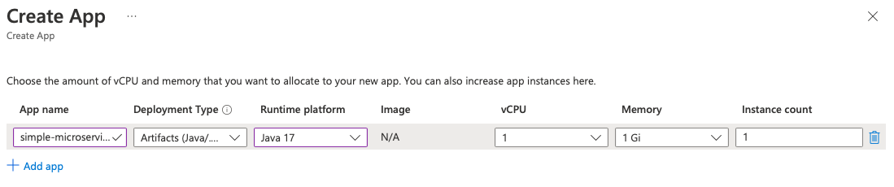
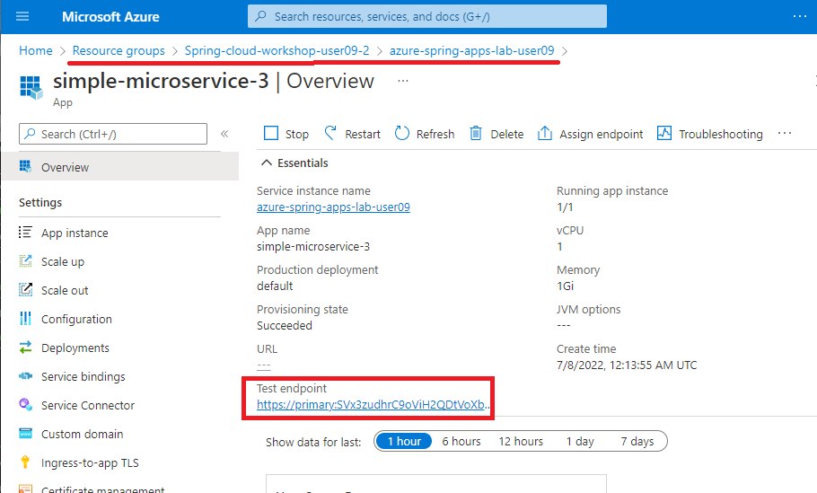

# 02-간단한 Spring Boot 마이크로서비스 빌드

 Spring 부트 마이크로서비스를 빌드하고 Azure Spring Apps에 배포. 이것은 이후 섹션에서 Spring Cloud 기술을 추가하기 위한 출발점을 제공.

---

## 1.Spring Boot 마이크로서비스 생성
Spring Initializer [https://start.spring.io/](https://start.spring.io/)를 이용하여 생성.

```bash
mkdir simple-microservice
cd simple-microservice
curl https://start.spring.io/starter.tgz -d dependencies=web -d baseDir=simple-microservice -d bootVersion=2.7.0 -d javaVersion=17 | tar -xzvf -
cd ..
```

## 2.Spring MVC Controller추가

`HelloController.java` 생성:

```java
package com.example.demo;

import org.springframework.web.bind.annotation.GetMapping;
import org.springframework.web.bind.annotation.RestController;

@RestController
public class HelloController {

    @GetMapping("/hello")
    public String hello() {
        return "Hello from Azure Spring Apps\n";
    }
}
```
## 3. 로컬Test

```bash
cd simple-microservice
./mvnw spring-boot:run &
cd ..
```

테스트
```bash
$ curl http://127.0.0.1:8080/hello
  % Total    % Received % Xferd  Average Speed   Time    Time     Time  Current
                                 Dload  Upload   Total   Spent    Left  Speed
100    30  100    30    0     0   1864      0 --:--:-- --:--:-- --:--:--  2307Hello from Azure Spring Cloud
```

Finally, kill running app:

```bash
kill %1
```

## 4.애플리케이션 생성 및 배포

portal에서 생성 [the Azure portal](https://portal.azure.com/?WT.mc_id=azurespringcloud-github-judubois):

- resource group에서 Azure Spring Apps 인스턴스를 찾습니다.(azure-spring-apps-lab-user09)
- 탐색 사이드바의 "Settings" 아래에 있는 "Apps" 링크를 클릭합니다.
- 앱 페이지 상단의 "Create App" 링크를 클릭합니다.
- Java 17 환경을 사용하여 "simple-microservice"라는 새 애플리케이션을 만듭니다.

- Click on "Create".

또는 명령줄을 사용하여 더 쉬운 앱 인스턴스를 만들 수 있습:

```bash
az spring app create -n simple-microservice-3 --runtime-version Java_17
```

You can now build your "simple-microservice" project and deploy it to Azure Spring Apps:

```bash
cd simple-microservice
./mvnw clean package
az spring app deploy -n simple-microservice --artifact-path target/demo-0.0.1-SNAPSHOT.jar
cd ..
```
로컬 디스크에 jar 파일이 생성되고 이전 단계에서 생성한 앱 인스턴스에 업로드됩니다. 이 az명령은 결과를 JSON으로 출력

## 5. Cloud Test

Go to [the Azure portal](https://portal.azure.com/?WT.mc_id=azurespringcloud-github-judubois):




- EndPoint에 "/hello"추가
For example.
    ```bash
    curl https://primary:...simple-microservice/default/hello/


    결과: `Hello from Azure Spring Apps`
    ```

## 6. Conclusion

이 가이드에서 수행한 모든 작업을 빌드하고 배포하기 위한 최종 스크립트:

```
curl https://start.spring.io/starter.tgz -d dependencies=web -d baseDir=simple-microservice -d bootVersion=2.7.0 -d javaVersion=17 | tar -xzvf -
cd simple-microservice
cat > HelloController.java << EOF
package com.example.demo;

import org.springframework.web.bind.annotation.GetMapping;
import org.springframework.web.bind.annotation.RestController;

@RestController
public class HelloController {

    @GetMapping("/hello")
    public String hello() {
        return "Hello from Azure Spring Apps";
    }
}
EOF
mv HelloController.java src/main/java/com/example/demo/HelloController.java
az spring app create -n simple-microservice --runtime-version Java_17
./mvnw clean package
az spring app deploy -n simple-microservice --artifact-path target/demo-0.0.1-SNAPSHOT.jar
cd ..
```

---

⬅️ Previous guide: [01-Create an Azure Spring Apps instance](./01-create-an-azure-spring-cloud-instance.md)

➡️ Next guide: [03-Configure monitoring](./03-configure-monitoring.md)
