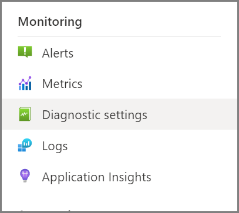
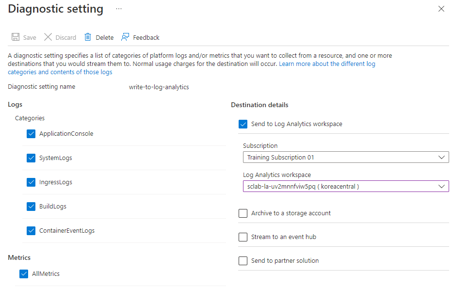

# 03-어플리케이션로그 구성

이제 애플리케이션이 배포되었으므로 문제가 발생할 경우 **애플리케이션의 로그를 빠르게 검색할 수 있도록 Log Analytics를 구성**하겠습니다. 이후 섹션에서 Log Analytics를 활용하는 방법을 살펴보겠지만 로그 항목이 들어오기 시작하는 데 시간이 걸리므로 교육을 계속하기 전에 여기에서 구성 단계를 수행합니다.

---

## 1. Configure log aggregation

실제로 애플리케이션의 로그에 액세스하는 방법에는
- [Azure Storage](https://docs.microsoft.com/en-us/azure/storage/common/storage-introduction/?WT.mc_id=azurespringcloud-github-judubois) ,
- [Azure Events Hub](https://docs.microsoft.com/en-us/azure/event-hubs/?WT.mc_id=azurespringcloud-github-judubois) 및
- [Log Analytics](https://docs.microsoft.com/en-us/azure/azure-monitor/log-query/get-started-portal/?WT.mc_id=azurespringcloud-github-judubois) 의 세 가지가 있습니다 .
여기서는 가장 일반적이고 Azure Spring Apps에 통합된 Log Analytics에 중점을 둘 것입니다.

**Log Analytics** 는 Azure Spring Apps에 잘 통합되고(well-integrated) 메트릭(metrics) 모니터링에도 사용할 [Azure Monitor](https://azure.microsoft.com/en-us/services/monitor/?WT.mc_id=azurespringcloud-github-judubois) 의 일부입니다 .

[Section 00](00-setup-your-environment.md) 의 설정을 완료하면 `sclab-la-<unique string>`이 워크숍의 리소스 그룹에 이름이 지정된 Log Analytics 작업 영역이 있어야 합니다 .
- **데이터를 이 작업 영역으로 보내도록 Azure Spring Apps 인스턴스를 구성__**

- Azure Portal에서 Azure Spring Apps 인스턴스로 이동하고 탐색 창의 "Monitoring" 섹션에서 "Diagnostic settings"을 선택:

- "Add diagnostic setting"를 클릭하고 방금 생성한 Log Analytics 작업 영역으로 모든 로그를 보내도록 인스턴스를 구성.
- 여기에 표시된 대로 값을 입력하고 "Save"을 클릭

⬅️ Previous guide: [02-Build a simple Spring Boot microservice](./02-build-a-simple-spring-boot-microservice.md)

➡️ Next guide: [04-Configure a Spring Cloud Config server](./04-configure-a-spring-cloud-config-server.md)
