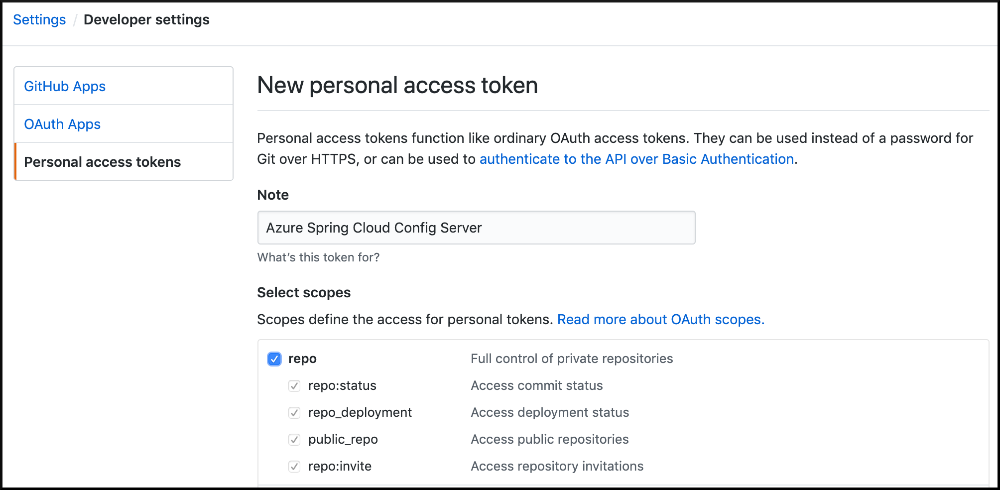
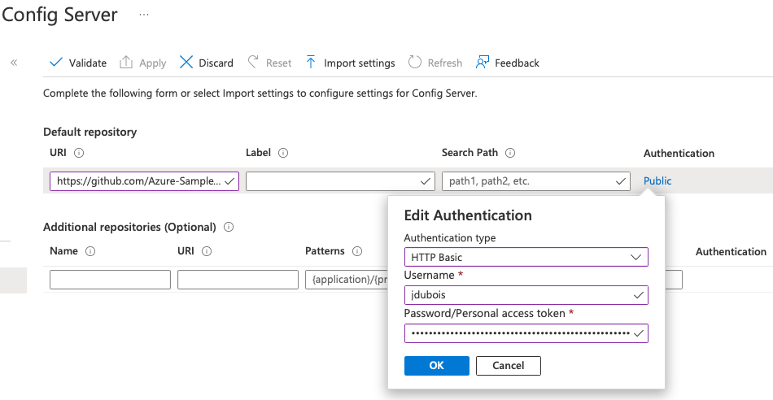

# 04-Spring Cloud Config 서버 구성

클라우드 네이티브 애플리케이션의 주요 기능(key feature)은
- 외부화된 구성(*externalized configuration*)-(응용 프로그램 코드와 별도로 구성을 저장, 관리 및 버전 설정하는 기능).
- 이 섹션에서는 이 기능을 활성화 하도록 [Spring Cloud Config Server](https://cloud.spring.io/spring-cloud-config)를 구성.
- 다음 섹션에서는 Spring Cloud Config가 Git 리포지토리의 구성을 애플리케이션에 삽입하는 방법을 볼 수 있습니다.
---
> 💡조직에서 Azure Repos를 소스 코드 리포지토리로 사용하는 경우 Azure Spring Apps 구성에[Using Azure Repos for Azure Spring Apps configuration](AzureReposForConfig.md)사용 을 참조하세요.

> ⏱private repository를 만드는 단계를 건너뛰려면 [https://github.com/Azure-Samples/spring-cloud-sample-public-config.git](https://github.com/Azure-Samples/spring-cloud-sample-public-config.git) 공개 리포지토리를 대신 사용할 수 있습니다 . 실제 배포에서는 구성을 public repository is not recommended.
We offer this public repository only as a shortcut for this workshop, for example if you don't have a GitHub account..

> 이 바로 가기를 사용하려면:
> - [the Azure portal](https://portal.azure.com/?WT.mc_id=azurespringcloud-github-judubois)로 이동합니다 .
> - Azure Spring Apps 서버의 개요 페이지로 이동하고 메뉴에서 "Config server"을 선택.
> - 리포지토리 URL을 설정--> 'https://github.com/Azure-Samples/spring-cloud-sample-public-config.git`
> - "Validate"을 클릭하고 작업이 성공할 때까지 대기
> - "Apply"을 클릭하고 작업이 성공할 때까지 wait
> Azure Spring Apps에서 이 리포지토리의 구성 파일로 구성 서버를 만들 수 있도록 했습니다. 이제 다음 가이드로 진행할 수 있습니다.
> ➡ [05-Build a Spring Boot microservice using Spring Cloud features](./05-build-a-spring-boot-microservice-using-spring-cloud-features.md)

## 1. 애플리케이션 구성을 저장하기 위한 Git 리포지토리 생성

[GitHub account](https://github.com)에서 Spring Boot 구성이 저장될 새 **private** repository를 생성

`application.yml`파일 추가
- 모든 마이크로서비스에 대한 구성 데이터를 저장

일반적으로 각 Spring Boot 애플리케이션은 애플리케이션 설정을 포함하는 애플리케이션 바이너리 내에 이러한 파일을 포함하나
- Spring Cloud Configuration Server를 사용하면 이러한 설정을 **단일 위치에 저장하고 단일 소스에서 제공**

```yaml
application:
    message: "이메시지가 보이면 Config서버 정상 설정"
```

Commit and push the new file.

## 2. Create a GitHub personal token

Azure Spring Apps는 공개, SSH로 보호 또는 HTTP 기본 인증을 사용하여 보호되는 Git 리포지토리에 액세스할 수 있습니다. GitHub를 사용하여 만들고 관리하는 것이 더 쉽기 때문에 마지막 옵션을 사용합니다.

[GitHub guide to create a personal token](https://help.github.com/en/articles/creating-a-personal-access-token-for-the-command-line)에 따라 개인 토큰을 만들고 토큰 을 저장.
  - to select scopes --> "repo" section , and nothing else
  - 오른쪽 상단(사용자) -> Settings -> Developer settings(왼쪽 마지막)

    

토큰이 생성되면 이 섹션이 끝날 때까지 해당 탭을 열어 둡니다(토큰값 입력을 위하여, 임시로 다른Edit에 Save..(가급적 암호화된 문서에 Save하는 습관을))

## 3. Git 리포지토리에 액세스하도록 Azure Spring Apps 구성

- Go to [the Azure portal](https://portal.azure.com/?WT.mc_id=azurespringcloud-github-judubois).
- Go to the overview page of your Azure Spring Apps server and select "Config server" in the menu
- Configure the repository we previously created:
  - 본인의 Git에 생성한 계정에 Add the repository URL, for example `https://github.com/Azure-Samples/spring-cloud-sample-public-config.git`

     >💡 Make sure you include the `.git` ending in the URL.

  - Click on `Authentication` and select `HTTP Basic`
  - The __username__ : your GitHub login name
  - The __password__ : personal token
  - `Label`에 무엇인가 입력했더니, "Validate"을 통과하지 못함
- Click on "Validate" and wait for the operation to succeed
- Click on "Apply" and wait for the operation to succeed

  

## 4. Review

이제 개인 구성 저장소를 만들었습니다. Azure Spring Apps에서 이 리포지토리의 구성 파일로 구성 서버를 만들 수 있도록 했습니다.

다음 섹션에서는 이 구성, 특히 `application.yml`에서 정의한 사용자 지정 메시지를 사용하는 응용 프로그램을 생성함

