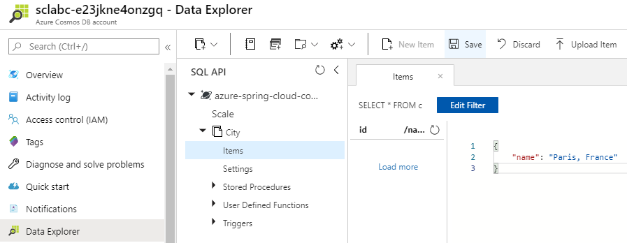
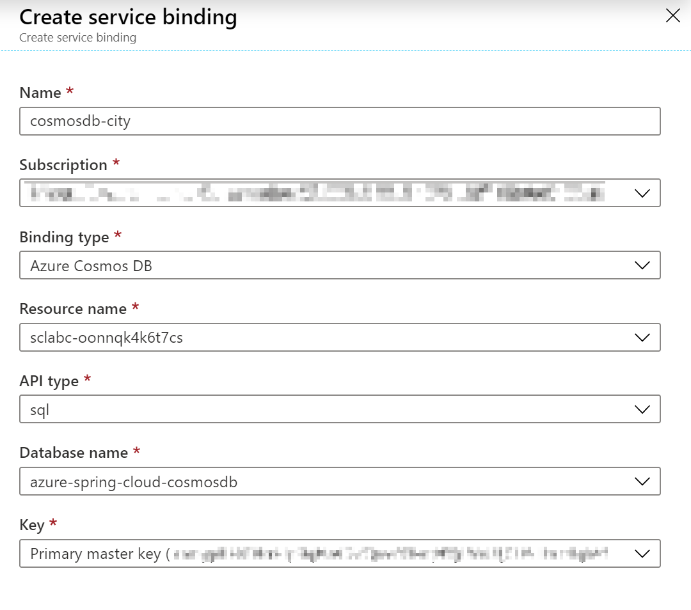

# 06-Cosmos DB를 사용하여 반응형 Spring Boot 마이크로서비스 빌드

이 섹션에서는 최적의 성능으로 전 세계에 분산된 데이터베이스에 액세스하기 위해 [Cosmos DB database](https://docs.microsoft.com/en-us/azure/cosmos-db/?WT.mc_id=azurespringcloud-github-judubois) 를 사용하는 애플리케이션을 빌드.

[Spring reactive stack](https://docs.spring.io/spring/docs/current/spring-framework-reference/web-reactive.html)을 활용하여 이 섹션에서 마이크로서비스를 빌드하기 위해 반응 프로그래밍 패러다임을 사용할 것 입니다.
---

## Cosmos DB 데이터베이스 준비

섹션 00에서 `sclabc-<unique string>`라는 CosmosDB 계정이 이미 있어야 합니다.

- "Data Explorer" menu item
  - Expand the container named `azure-spring-cloud-cosmosdb`.
  - In that container, expand the container named `City`.
  - Click on "Items" and use the "New Item" button to create some sample items using the contents below:

    ```json
    {
        "name": "Paris, France"
    }
    ```

    ```json
    {
        "name": "London, UK"
    }
    ```



## Spring Webflux 마이크로서비스 생성

마이크로 서비스를 생성하기 위해 명령줄에서 Spring Initalizer 서비스를 호출:

```bash
curl https://start.spring.io/starter.tgz -d dependencies=webflux,cloud-eureka,cloud-config-client -d baseDir=city-service -d bootVersion=2.7.0 -d javaVersion=17 | tar -xzvf -
```

> We use the `Spring Webflux`, `Eureka Discovery Client` and the `Config Client` Spring Boot starters.

## Cosmos DB API 추가

In the application's `pom.xml` file, add the Cosmos DB dependency just after the `spring-cloud-starter-netflix-eureka-client` dependency:

```xml
        <dependency>
            <groupId>com.azure</groupId>
            <artifactId>azure-cosmos</artifactId>
            <version>4.30.1</version>
        </dependency>
```

## Spring 반응형 코드(reactive code)를 추가하여 데이터베이스에서 데이터를 가져옵니다.
Add Spring reactive code to get the data from the database

Next to the `DemoApplication` class, create a `City` domain object:

```java
package com.example.demo;

class City {

    private String name;

    public String getName() {
        return name;
    }

    public void setName(String name) {
        this.name = name;
    }
}
```

CityController.java 생성

> CityController 클래스는 나중에 구성할 Azure Spring Apps 서비스 바인딩에서 Cosmos DB 구성을 가져옵니다.

```java
package com.example.demo;

import com.azure.cosmos.CosmosAsyncContainer;
import com.azure.cosmos.CosmosClientBuilder;
import com.azure.cosmos.models.CosmosQueryRequestOptions;
import com.azure.cosmos.models.FeedResponse;

import org.springframework.beans.factory.annotation.Value;
import org.springframework.web.bind.annotation.GetMapping;
import org.springframework.web.bind.annotation.RestController;
import reactor.core.publisher.Flux;

import javax.annotation.PostConstruct;
import java.util.List;

@RestController
public class CityController {

    @Value("${azure.cosmosdb.uri}")
    private String cosmosDbUrl;

    @Value("${azure.cosmosdb.key}")
    private String cosmosDbKey;

    @Value("${azure.cosmosdb.database}")
    private String cosmosDbDatabase;

    private CosmosAsyncContainer container;

    @PostConstruct
    public void init() {
        container = new CosmosClientBuilder()
                .endpoint(cosmosDbUrl)
                .key(cosmosDbKey)
                .buildAsyncClient()
                .getDatabase(cosmosDbDatabase)
                .getContainer("City");
    }

    @GetMapping("/cities")
    public Flux<List<City>> getCities() {
        CosmosQueryRequestOptions options = new CosmosQueryRequestOptions();
        return container.queryItems("SELECT TOP 20 * FROM City c", options, City.class)
                .byPage()
                .map(FeedResponse::getResults);
    }
}
```

## Azure Spring Apps에서 애플리케이션 만들기

[02-Build a simple Spring Boot microservice](./02-build-a-simple-spring-boot-microservice.md)와 같이, city-serviceAzure Spring Apps 인스턴스에서 특정 애플리케이션을 만듭:

```bash
az spring app create -n city-service --runtime-version Java_17
```

## Cosmos DB 데이터베이스를 애플리케이션에 바인딩

Azure Spring Apps는 우리가 만든 Cosmos DB 데이터베이스를 마이크로 서비스에 자동으로 바인딩할 수 있습니다.

- Azure Spring Apps 인스턴스에서 "Apps"으로 이동합니다.
- `city-service`애플리케이션 선택
- 이동 `Service bindings`
- `Create service binding`를 클릭합니다.
  - 예를 들어 바인딩 이름을 `cosmosdb-city`지정하십시오
  - 우리가 만든 Cosmos DB 계정과 데이터베이스를 선택하고 기본 `sql`API 유형 을 유지합니다.
  - 드롭다운 목록에서 기본 마스터 키를 선택합니다.
  - `Create`데이터베이스 바인딩을 만들려면 클릭하십시오.



## 애플리케이션 배포

이제 "city-service" 프로젝트를 빌드하고 Azure Spring Apps로 보낼 수 있습니다.:

```bash
cd city-service
./mvnw clean package -DskipTests
az spring app deploy -n city-service --artifact-path target/demo-0.0.1-SNAPSHOT.jar
cd ..
```

## 클라우드에서 프로젝트 테스트

- Azure Spring Apps 인스턴스에서 "Apps"으로 이동.
  - `city-service`에 `Registration status`which 가 있는지 확인하십시오 1/1. 이것은 Spring Cloud Service Registry에 올바르게 등록되었음을 보여줍니다.
  - city-service마이크로 서비스에 대한 자세한 정보를 보려면 선택하십시오 .
- 제공된 "Test Endpoint"를 복사/붙여넣기 합니다.
이제 cURL을 사용하여 /cities끝점을 테스트할 수 있으며 생성한 도시 목록을 제공해야 합니다. 예를 들어, 이 가이드에 나와 있는 것과 같이 생성 Paris, France하고 London, UK다음을 얻을 수 있습니다.

[[{"name":"Paris, France"},{"name":"London, UK"}]]
코드를 확인해야 하는 경우 "city-service" 폴더 에서 최종 프로젝트를 사용할 수 있습니다


```json
[[{"name":"Paris, France"},{"name":"London, UK"}]]
```
