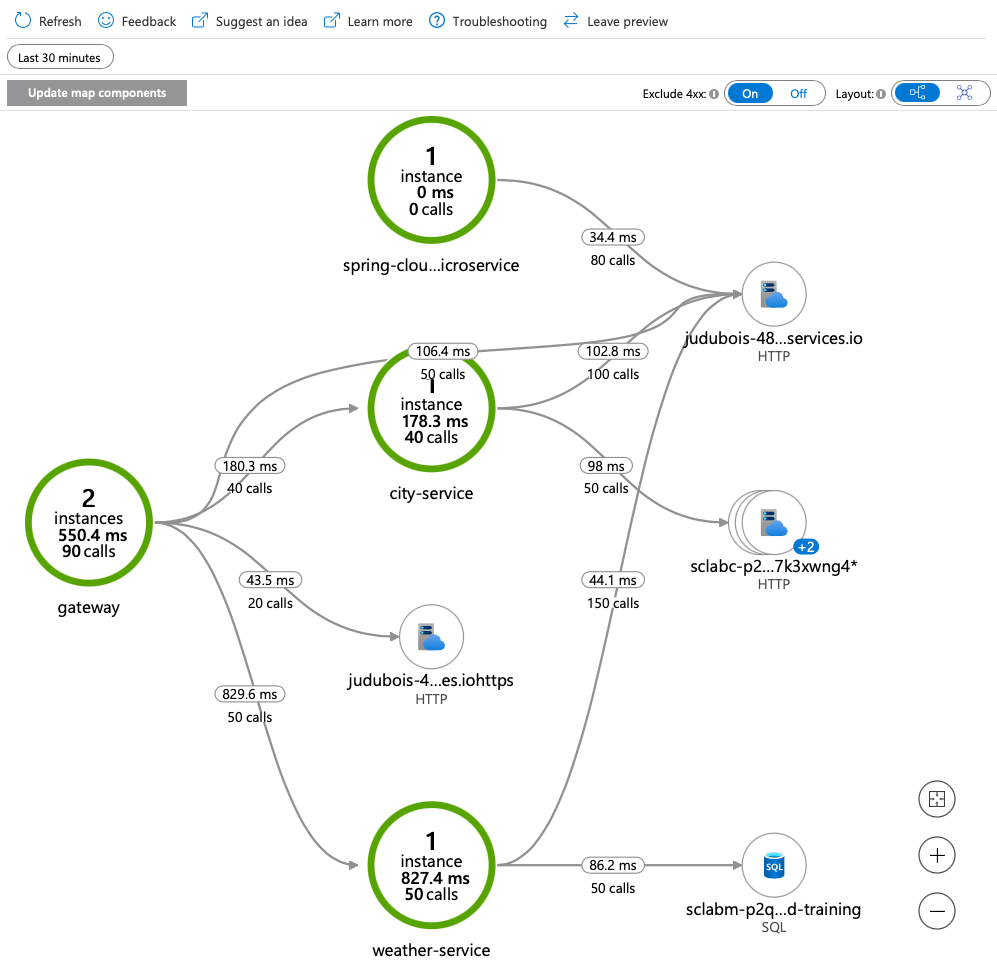
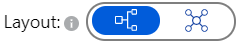
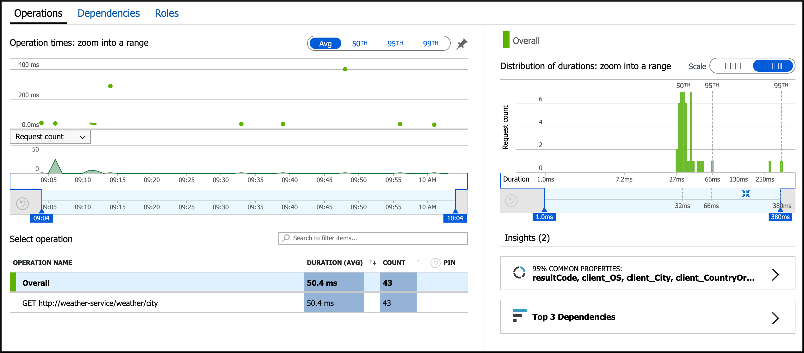
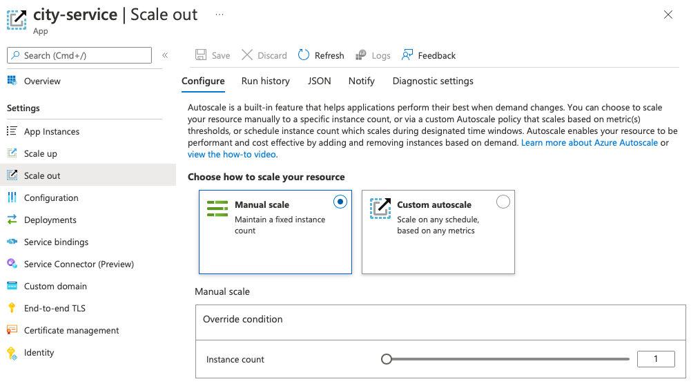

# 09-UI에서 2개의서비스호출

이제 두 개의 마이크로서비스를 공개적으로 사용할 수 있게 만들었으므로 사용자 인터페이스를 통합하여 작동하는 모습을 볼 것입니다. 그런 다음 Azure Monitor를 사용하여 서비스 간 트래픽 흐름을 모니터링하고 메트릭을 추적합니다.

---

## 마이크로서비스 스택에 프런트 엔드 추가

완전한 마이크로서비스 스택:

- Spring Cloud Gateway를 기반으로 하는 게이트웨이
- Cosmos DB에 데이터를 저장 하는 반응형 `city-service`마이크로 서비스
- MySQL에 데이터를 저장 하는 `weather-service`마이크로서비스.

이 아키텍처를 완료하려면 프런트 엔드를 추가:

- 우리는 이미 "weather-app" 폴더 에서 사용할 수 있는 VueJS 애플리케이션을 구축
- 프런트 엔드는 동일한 도메인 이름을 사용하여 Azure Spring Apps에서 호스팅될 수 있습니다(이 가이드에서는 그렇지 않으며 이전에 게이트웨이에서 CORS를 활성화한 이유입니다).
- 교차 출처 리소스 공유(Cross-Origin Resource Sharing, CORS)는 추가 HTTP 헤더를 사용하여, 한 출처에서 실행 중인 웹 애플리케이션이 다른 출처의 선택한 자원에 접근할 수 있는 권한을 부여하도록 브라우저에 알려주는 체제

Spring Cloud를 이해하는 것과 관련이 없는 이 부분을 단순화하기 위해 이미 실행 중인 프론트엔드를 구축:

__[https://spring-training.azureedge.net/](https://spring-training.azureedge.net/)__

참고로 이 웹사이트는 Azure Storage에서 호스팅되며 최적의 성능을 위해 Azure CDN을 통해 제공.

Go to [https://spring-training.azureedge.net/](https://spring-training.azureedge.net/), 으로 이동 하여 텍스트 필드에 Spring Cloud Gateway의 공개 URL을 입력하고 "이동"을 클릭합니다. 다음 화면이 표시되어야 합니다.:
- https://spring-apps-msa-01-gateway.azuremicroservices.io

## 아키텍처를 더 잘 이해하기 위해 분산 추적 검토

분산 추적은 Azure Spring Apps에서 기본적으로 사용하도록 설정되어 있으므로 마이크로서비스 및 게이트웨이가 이미 모니터링되고 있습니다.

이제 https://spring-training.azureedge.net/ 에서 VueJS 애플리케이션을 사용 하여 마이크로서비스 스택에서 일부 트래픽을 생성할 수 있습니다.

> 💡추적 데이터는 시스템에서 수집하는 데 몇 분이 걸릴 수 있으므로 이 시간을 사용하여 약간의 로드를 생성하십시오.

Azure Portal의 "Application Insights" 메뉴에서 이제 전체 애플리케이션 맵과 성능 병목 현상을 찾을 수 있는 검색 엔진에 액세스할 수 있습니다.

> 💡애플리케이션 맵이 위의 맵과 다른 경우 오른쪽 상단 모서리에 있는 레이아웃 스위치에서 계층적 보기를 선택합니다.:
>
> 

## 성능 측정항목 검토

`Performance`애플리케이션에 의해 노출된 작업에 대한 응답 시간 및 요청 수를 볼 수 있는 블레이드에서 보다 전체적인 보기(holistic view)를 엽니다

더 자세한 데이터를 보려면 모든 종속성, 응답 시간 및 요청 수를 볼 수 `Dependencies`있는 블레이드의 탭으로 이동하십시오

## 스케일 애플리케이션

이제 분산 추적이 활성화되었으므로 필요에 따라 애플리케이션을 확장할 수 있습니다.

- [the Azure portal](https://portal.azure.com/?WT.mc_id=azurespringcloud-github-judubois)로 이동
- Azure Spring Apps 서버의 개요 페이지로 이동하고 메뉴에서 "Apps" 을 선택합니다.
  - 하나의 서비스를 선택하고 메뉴에서 "Scale Out"을 클릭합니다.  확장할 서비스를 선택합니다.
  - 서비스를 수동으로 확장하려면 인스턴스 수를 수정하십시오. 메트릭을 기반으로 사용자 지정 Auto Scaling을 설정할 수도 있습니다.

  

---
