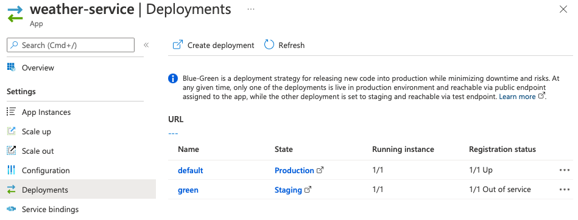

# 10-Blue/Green deployment

블루-그린 배포 패턴을 사용하면
- 프로덕션 인프라에서 최신 애플리케이션 변경 사항을 테스트할 수 있지만
- 테스트가 완료될 때까지 변경 사항을 소비자에게 노출하지 않음
이 섹션에서는 Azure CLI를 사용하여 블루-그린 배포를 수행
- 배포 단계를 수동으로 진행하지만
- Azure CLI 명령은 CI/CD 파이프라인에서 자동화

---

우리는 07년에 개발된 "weather-service" 마이크로서비스의 새로운 릴리스를 배포할 것입니다
- 이전에 수정한 부분 반영(swagger 메인 메시지 변경)

## 현재 애플리케이션 수정

"weather-service" 애플리케이션에서 현재 코드를 커밋하고 변경 작업을 수행할 새 분기로 전환합니다.

`WeatherController`클래스를 열고 `getWeatherForCity()`항상 맑은 날씨를 반환하도록 메서드를 수정합니다(코드에서 수정한 내용을 그래픽으로 쉽게 확인할 수 있음):

```java
package com.example.demo;

import org.springframework.stereotype.Controller;
import org.springframework.web.bind.annotation.*;

@Controller
@RequestMapping(path="/weather")
public class WeatherController {

    private final WeatherRepository weatherRepository;

    public WeatherController(WeatherRepository weatherRepository) {
        this.weatherRepository = weatherRepository;
    }

    @GetMapping("/city")
    public @ResponseBody Weather getWeatherForCity(@RequestParam("name") String cityName) {
        return weatherRepository.findById(cityName).map(weather -> {
            weather.setDescription("It's always sunny on Azure Spring Apps");
            weather.setIcon("weather-sunny");
            return weather;
        }).get();
    }
}
```

## "green" deployment

`deployment`새 버전의 애플리케이션을 빌드하고 `green`이라는 새 버전에 배포:

```bash
cd weather-service
./mvnw clean package -DskipTests
az spring app deployment create --name green --app weather-service --runtime-version Java_17 --artifact-path target/demo-0.0.1-SNAPSHOT.jar
cd ..
```

애플리케이션이 배포되면 [https://spring-training.azureedge.net/](https://spring-training.azureedge.net/)으로 이동 하면 마이크로 서비스의 새 버전이 현재 준비 영역에 있고 아직 프로덕션 단계가 아니기 때문에 동일한 데이터를 갖게 됩니다.

[the Azure portal](https://portal.azure.com/?WT.mc_id=azurespringcloud-github-judubois)에서 Azure Spring Apps 인스턴스로 이동합니다 .

- resource group에서 Azure Spring Apps 인스턴스를 찾습니다.
- Go to "Apps"
  - `weather-service`마이크로서비스 선택
  - 메뉴에서 "Deployments"를 클릭하십시오. 이제 "default" 배포 아래에 "green" 배포가 표시되어야 합니다.



섹션 7에서와 동일한 URL을 호출하여 배포를 테스트할 수 있지만 배포 이름 `default`을 `green`으로 대체합니다

```bash
curl "https://***.test.azuremicroservices.io/weather-service/green/weather/city?name=Paris%2C%20France"
```

최근 수정 결과를 확인:

```json
{"city":"Paris, France","description":"It's always sunny on Azure Spring Apps","icon":"weather-sunny"}
```

Note:  우리는 gateway애플리케이션을 통해 친환경 배포를 테스트하지 않습니다. 친환경 배포의 목적은 프로덕션 트래픽을 마이크로서비스로 라우팅하기 전에 마이크로서비스에 대한 변경 사항을 테스트하는 것입니다. 따라서 weather-service섹션 8에서와 같이 공개 게이트웨이 URL을 통해 액세스하면 서비스의 원래 버전으로 라우팅됩니다.

`green`배포를 프로덕션에 적용하려면:

```bash
az spring app set-deployment -n weather-service --deployment green
```

또 다른 솔루션은 [the Azure portal](https://portal.azure.com/?WT.mc_id=azurespringcloud-github-judubois)을 사용

- Azure Spring Apps 인스턴스 찾기
- "Apps" menu를 클릭
- `weather-service` "배포"를 클릭하십시오.

> 배포 이름을 재사용하려면 먼저 해당 이름으로 이전 배포를 삭제
>
> ```bash
> az spring app deployment delete --name green --app weather-service
> ```

배치를 교환하고 green활성화된 것을 확인하면 Spring Cloud Service Registry가 애플리케이션에서 이 새 버전을 동기화하고 사용할 때까지 몇 초를 기다려야 합니다 gateway. 그러면 새로 수정된 데이터를 볼 수 있습니다.

