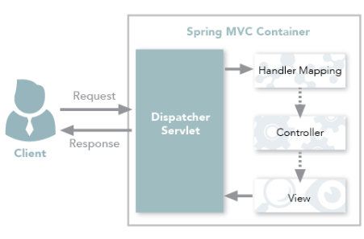
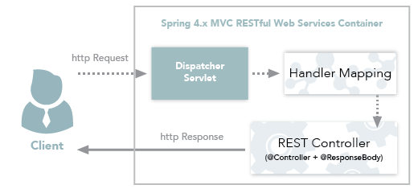
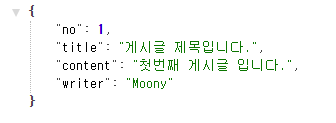
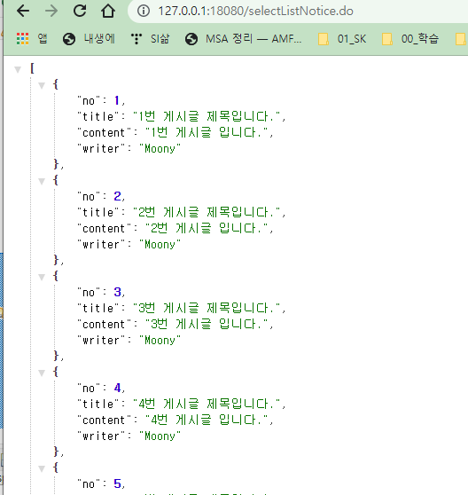
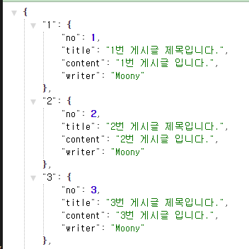
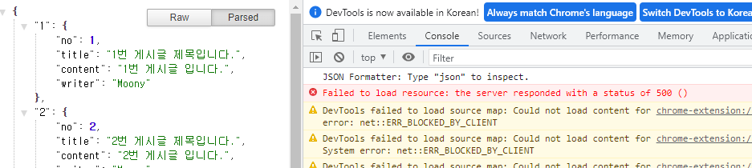

<style>
.burk {
    background-color: red;
    color: yellow;
    display:inline-block;
}
</style>
# Controller비교
참조: https://devmoony.tistory.com/103
-demo-ResponseEntity(D:\APP\GIT-AMF3\backend\demo-ResponseEntity)

## 1. Controller와 RestController의 차이점
일반적인 API는 반환하는 리소스에 Value값만 있지 않습니다. 상태코드, 상태 메시지 등등 데이터들이 있는데 이러한 Data를 return하는 것을 주용도로 사용하는 것이 ResponseEntity 클래스 입니다.

먼저 ResponseEntity를 배우기 전에 Controller와 RestController의 차이점을 알아보겠습니다.

1. Controller와 RestController의 차이점
   - Spring MVC Controller와 Restful Controller의 가장 큰 차이점은 HTTP Response Body가 생성되는 방식에 있습니다.
   - 기존 MVC Controller
     - view 기술을 사용하며, 주로 view(화면)을 return 해주었습니다.
   - Restful 웹 서비스 Controller
     - 객체를 반환하기만 하면 객체 데이터는 JSON/XML 형식의 HTTP 응답을 작성하여 return 합니다.
     - Data를 return하는 것이 주 용도입니다.
---
## 2. Spring MVC의 Work Flow

Spring MVC 전통적인 흐름



대표적인 Spring MVC Controller

```java
@Controller
public class HomeController {

    @RequestMapping("/main")
    public String main(){
        return "main";
    }
}
```
Controller에서 return해주는 view (main.html)
demo-ResponseEntity\src\main\resources\templates\main.html
```html
<%@ page language="java" contentType="text/html; charset=UTF-8" pageEncoding="UTF-8"%>
<!DOCTYPE html>
<html>
<head>
<meta http-equiv="Content-Type" content="text/html; charset=UTF-8">
<title></title>
</head>
<body>
    <h1>메인 페이지</h1>
</body>
</html>
```
위 예제 처럼 Spring MVC의 흐름을 간략히 설명하자면

1. 클라이언트는 URL 형식으로 Web Service에 요청(request)을 합니다.
2. 요청은 Handler Mapping과 그 type을 찾는 DispatcherServlet에 의해 인터셉트 됩니다.
3. 요청은 Controller에 의해 처리되고 응답은 DispatcherServlet으로 리턴된 후 DispatcherServlet은 View로 디스패치됩니다.

이처럼 Spring MVC Work Flow는 모델앤 뷰 (ModelAndView) 객체가 Controller에서 Client로 전달됩니다.

하지만 @ResponseBody 어노테이션을 사용하면 View를 return 하지 않고 Controller에서 직접 Data를 return해줄 수 있습니다.

하지만 Spring 4.x version 부터는 @RestController 어노테이션을 사용해 더 쉽게 사용할 수 있게 되었습니다.

## 3. @RestController 개념 및 예제

Spring 4.x MVC Restful Work Flow



@RestController 사용 예제

RestController
```java
import java.util.ArrayList;
import java.util.HashMap;
import java.util.List;
import java.util.Map;

import org.springframework.web.bind.annotation.RequestMapping;
import org.springframework.web.bind.annotation.RestController;

@RestController
public class HomeController {

    // JSON 객체 리턴
    @RequestMapping(value="/selectOneNotice.do")
    public NoticeVO selectOneNotice() {
        NoticeVO notice = new NoticeVO();
        notice.setNo(1);
        notice.setTitle("게시글 제목입니다.");
        notice.setContent("첫번째 게시글 입니다.");
        notice.setWriter("Moony");
        return notice;
    }

    // JSON 객체 리스트 리턴
    @RequestMapping(value="/selectListNotice.do")
    public List<NoticeVO> selectListNotice() {
        List<NoticeVO> datas = new ArrayList();
        for(int i=1; i<=10; i++) {
            NoticeVO notice = new NoticeVO();
            notice.setNo(i);
            notice.setTitle(i + "번 게시글 제목입니다.");
            notice.setContent(i + "번 게시글 입니다.");
            notice.setWriter("Moony");
            datas.add(notice);
        }
        return datas;
   }

    // JSON 객체 Map 리턴
    @RequestMapping(value="/selectMapNotice.do")
    public Map<Integer, NoticeVO> selectMapNotice(){

        Map<Integer, NoticeVO> dataMap = new HashMap<Integer, NoticeVO>();

        for(int i=1; i<=10; i++) {
            NoticeVO notice = new NoticeVO();
            notice.setNo(i);
            notice.setTitle(i + "번 게시글 제목입니다.");
            notice.setContent(i + "번 게시글 입니다.");
            notice.setWriter("Moony");

            dataMap.put(i, notice);
        }
        return dataMap;
    }

}

```

```java
public class NoticeVO {
	int	no;
	String	title;
	String	content;
	String	writer;
}
```


브라우저 화면 (결과)
- selectOneNotice.do
  
- selectListNotice.do
  
- selectMapNotice.do
  


## 4. ResponseEntity 개념 및 예제

RestController는 별도의 View를 제공하지 않는 형태로 서비스를 실행

때문에 결과데이터가 에외적인 상황에서 문제가 발생할 수 있습니다.

**ResponseEntity는**
- 개발자가 직접 결과 데이터와 HTTP 상태 코드를 직접 제어할 수 있는 클래스로
- 개발자는 404나 500 ERROR 와 같은 HTTP 상태 코드를 전송하고 싶은 데이터와 함께 전송할 수 있기 때문에 좀 더 세밀한 제어가 필요한 경우 사용

```java
// ResponseEntity : 데이터 + HTTP status code

@RequestMapping("/selectMapNotice2")
public ResponseEntity<Map<Integer, NoticeVO>> selectMapNotice2(){

    Map<Integer, NoticeVO> dataMap = new HashMap<Integer, NoticeVO>();

    for(int i=1; i<=10; i++) {
        NoticeVO notice = new NoticeVO();

        notice.setNo(i);
        notice.setTitle(i + "번 게시글 제목입니다.");
        notice.setContent(i + "번 게시글 입니다.");
        notice.setWriter("Moony");

        dataMap.put(i, notice);
    }

    // return 할 때 data와 HTTP 상태메시지를 함께 전송
    return new ResponseEntity<>(dataMap, HttpStatus.INTERNAL_SERVER_ERROR);
}
```
실행결과

