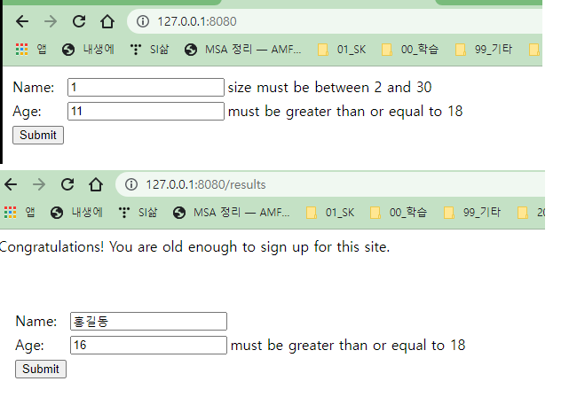

<style>
.burk {
    background-color: red;
    color: yellow;
    display:inline-block;
}
</style>
# Validating Form Input
- 참조: https://spring.io/guides/gs/validating-form-input/
- 입력값 검증
- git clone https://github.com/spring-guides/gs-validating-form-input.git
-d:\APP\Workspace-springIO-Guided\Guides\ValidatingFormInput\gs-validating-form-input\initial\

## 1. 주요 로직

1.  Dependencies and select Spring Web, Thymeleaf, and Validation.
2.  DTO 객체
      ```java
      public class PersonForm {

         @NotNull
         @Size(min=2, max=30)   //Allows names between 2 and 30 characters long.
         private String name;

         @NotNull   //Null값을 허용하지 않음
         @Min(18)  //최소값
         private Integer age;
      }
      ```
3. Controller
   - @Valid PersonForm personForm: 해당 객체를 Validation 하라
   - BindingResult bindingResult: Validation  결과
   - bindingResult.hasErrors(): 오류 유무
   ```java
   @Controller
   public class WebController implements WebMvcConfigurer {

      @Override
      public void addViewControllers(ViewControllerRegistry registry) {
         registry.addViewController("/results").setViewName("results");
      }

      @GetMapping("/")
      public String showForm(PersonForm personForm) {
         return "form";
      }

      @PostMapping("/")
      public String checkPersonInfo(@Valid PersonForm personForm, BindingResult bindingResult) {

         if (bindingResult.hasErrors()) {
            return "form";
         }

         return "redirect:/results";
      }
   }
   ```

4. Form (form.html)
      ```html
      <!DOCTYPE HTML>
      <html xmlns:th="http://www.thymeleaf.org">
         <body>
            <form action="#" th:action="@{/}" th:object="${personForm}" method="post">
                  <table>
                     <tr>
                        <td>Name:</td>
                        <td><input type="text" th:field="*{name}" /></td>
                        <td th:if="${#fields.hasErrors('name')}" th:errors="*{name}">Name Error</td>
                     </tr>
                     <tr>
                        <td>Age:</td>
                        <td><input type="text" th:field="*{age}" /></td>
                        <td th:if="${#fields.hasErrors('age')}" th:errors="*{age}">Age Error</td>
                     </tr>
                     <tr>
                        <td><button type="submit">Submit</button></td>
                     </tr>
                  </table>
            </form>
         </body>
      </html>
      ```

## 2. 테스트 주요 화면 이미지


