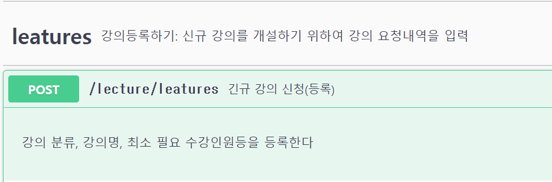
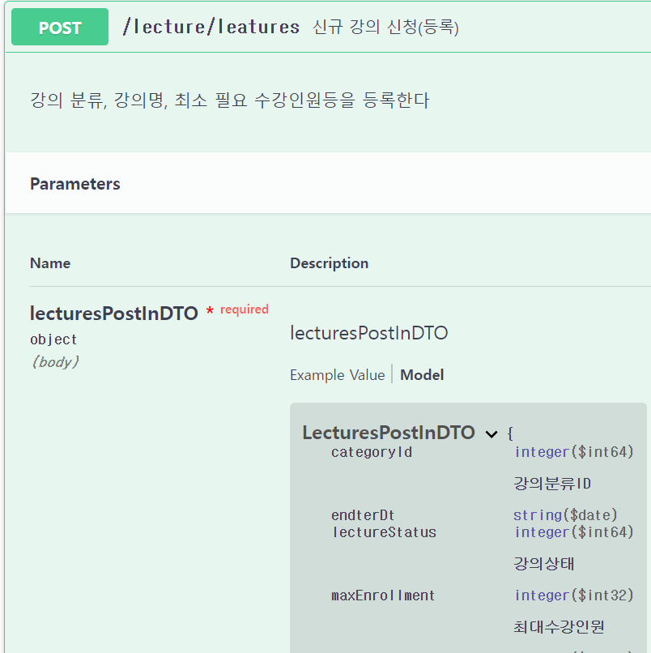
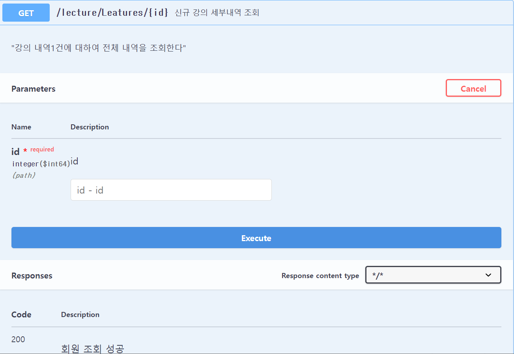

# Lecture-Swagger

## 1. Swagger 연동
- 참고한 싸이트: https://gaemi606.tistory.com/entry/Spring-Boot-Swagger2-%EC%82%AC%EC%9A%A9-springfox-boot-starter300

1. pom.xml 수정
   - 'springfox-swagger2', 'springfox-swagger-ui' 는 추가 하지 않음
    ```xml
    <dependency>
        <groupId>io.springfox</groupId>
        <artifactId>springfox-boot-starter</artifactId>
        <version>3.0.0</version>
    </dependency>
    ```

2. SwaggerConfig 작성
    ```java
    package lecturemgt.config.swagger;

    @Configuration
    public class SpringFoxConfig {
        @Bean
        public Docket api() {
            return new Docket(DocumentationType.SWAGGER_2)
                    .apiInfo(apiInfo())
                    .select()
                    .apis(RequestHandlerSelectors.any())
                    .paths(PathSelectors.any())
                    .build();
        }

        private ApiInfo apiInfo() {
            return new ApiInfoBuilder()
                    .title("AMF-Level3 교육")
                    .version("1.0")
                    .description("AMF4차수- 모두의강의")
                    .license("AMF42조")
                    .build();
        }
    }
    ```

3. 테스트
   - http://localhost:8081/swagger-ui/index.html
   - (이전버전) http://localhost/swagger-ui.html

   - (Swagger 문서): https://springfox.github.io/springfox/docs/current

## 2. Swagger 관련 API 주석 정리 부분
### 2.1 주요 Annotation
출처: https://blog.jiniworld.me/91 [hello jiniworld:티스토리]

1. api 그룹 설정 : @Tag
   - Target : ANNOTATION_TYPE, METHOD, TYPE
     - name : 태그의 이름
     - description : 태그에 대한 설명
   - Tag에 설정된 name이 같은 것 끼리 하나의 api 그룹으로 묶습니다.
   - 주로 Controller Class 나 Controller Method 영역에 설정

2. api Schema 설정 : @Schema
   - Target : ANNOTATION_TYPE, FIELD, METHOD, PARAMETER, TYPE
     - description : 한글명
     - defaultValue : 기본값
     - allowableValues :
   - Schmea(= Model)에 대한 정보를 작성하는 곳입니다.
        ```java
        @Schema(description = "사용자")
        @Getter @Setter
        public class UserValue {

            @Pattern(regexp = "[0-2]")
            @Schema(description = "유형", defaultValue = "0", allowableValues = {"0", "1", "2"})
            private String type;

            @Email
            @Schema(description = "이메일", nullable = false, example = "abc@jiniworld.me")
            private String email;

            @Schema(description = "이름")
            private String name;

            @Pattern(regexp = "[1-2]")
            @Schema(description = "성별", defaultValue = "1", allowableValues = {"1", "2"})
            private String sex;

            @DateTimeFormat(pattern = "yyMMdd")
            @Schema(description = "생년월일", example = "yyMMdd", maxLength = 6)
            private String birthDate;

            @Schema(description = "전화번호")
            private String phoneNumber;

            @Schema(description = "비밀번호")
            private String password;

        }
        ```
   - Validation 체크를 하고 싶다면 javax.validation.constraints 패키지를 이용하면 됩니다.
   - 특정 Regex를 이용하여 패턴체크를 하고 싶다면 Pattern을 이용하면 됩니다

3. api 상세 정보 설정 : @Operation
   - Target : ANNOTATION_TYPE, METHOD
     - summary : api에 대한 간략 설명
     - description : api에 대한 상세 설명
     - responses : api Response 리스트
     - parameters : api 파라미터 리스트
   - 애너테이션으로 api 동작에 대한 명세를 작성하는 애너테이션으로, Controller method에 설정
   - Swagger UI가 fold상태일때도 간략히 확인할 수 있는 간략정보는 summary에 작성하고, 필요에 따라 상세 정보를 표기하고자 한다면 description에 설명을 추가
        ```java
        @GetMapping("/{id}")
        @Operation(summary = "회원 조회", description = "id를 이용하여 user 레코드를 조회합니다.")
        public ResponseEntity<? extends BasicResponse> select(
            @Parameter(description = "user 의 id") @PathVariable("id") long id) {
        ...
        }
        ```
4. api response 설정 : @ApiResponse
   - Target : ANNOTATION_TYPE, METHOD, TYPE
     - responseCode : http 상태코드
     - description : response에 대한 설명
     - content : Response payload 구조
       - schema : payload에서 이용하는 Schema
         - hidden : Schema 숨김여부
         - implementation : Schema 대상 클래스
   - @ApiResponse 는 응답 결과에 따른 response 구조를 미리 확인할 수 있게 해줍니다.

   - (참고)페이로드(payload)는 전송되는 데이터를 의미합니다. 데이터를 전송할 때, 헤더와 메타데이터, 에러 체크 비트 등과 같은 다양한 요소들을 함께 보내어, 데이터 전송의 효율과 안정성을 높히게 됩니다. 이 때, 보내고자 하는 데이터 자체를 의미하는 것이 바로 페이로드입니다.
   - (wiki)페이로드(payload)라는 단어는 운송업에서 비롯하였는데, 지급(pay)해야 하는 적화물(load)을 의미합니다. 예를 들어, 유조선 트럭이 20톤의 기름을 운반한다면 트럭의 총 무게는 차체, 운전자 등의 무게 때문에 그것보다 더 될 것이다. 이 모든 무게를 운송하는데 비용이 들지만, 고객은 오직 기름의 무게만을 지급(pay)하게 된다. 그래서 ‘pay-load’란 말이 나온 것이다

    ```java
    @GetMapping("/{id}")
    @ApiResponses(value = {
        @ApiResponse(responseCode = "200", description = "회원 조회 성공", content = @Content(schema = @Schema(implementation = UserResponse.class))),
        @ApiResponse(responseCode = "404", description = "존재하지 않는 리소스 접근", content = @Content(schema = @Schema(implementation = ErrorResponse.class))) })
    @Operation(summary = "회원 조회", description = "id를 이용하여 user 레코드를 조회합니다.")
    public ResponseEntity<? extends BasicResponse> select(
        @PathVariable("id") long id) {
    ...
    }
    ```
5. api parameter 설정 : @Parameter
   - Target : ANNOTATION_TYPE, FIELD, METHOD, PARAMETER
     - name : 파라미터 이름
     - description : 파라미터 설명
     - in : 파라미터 위치
       - query, header, path, cookie

   - @ApiResponse 와 마찬가지로 @Parameters 애너테이션에 @Parameter 리스트를 담아 api 메서드에 설정할 수 있고,  @Operation 애너테이션의 parameters 요소에 설정할 수 있습니다.
     - 그리고, 파라미터의 경우, api method의 인자값에 붙여 명시적으로 설정할 수도 있습니다
    ```java
    @GetMapping("/{id}")
    @Operation(summary = "회원 조회", description = "id를 이용하여 user 레코드를 조회합니다.", responses = {
        @ApiResponse(responseCode = "200", description = "회원 조회 성공", content = @Content(schema = @Schema(implementation = UserResponse.class))),
        @ApiResponse(responseCode = "404", description = "존재하지 않는 리소스 접근", content = @Content(schema = @Schema(implementation = ErrorResponse.class))) })
    public ResponseEntity<? extends BasicResponse> select(
        @Parameter(name = "id", description = "user 의 id", in = ParameterIn.PATH) @PathVariable("id") long id) {
    ...
    }
    ```

### 2.2 실 소스에 적용한 내영
1. @Tag
    ```java
    @Tag(name = "leatures", description = "강의등록하기: 신규 강의를 개설하기 위하여 강의 요청내역을 입력")
    @RestController
    //@RequestMapping("/lectures")
    public class LectureController {

        @Tag(name = "leatures")
        @PostMapping("/leatures")
        @Operation(summary = "신규 강의 신청(등록)",
                    description = "강의 분류, 강의명, 최소 필요 수강인원등을 등록한다")
        public ResponseEntity<LecturesPostOutDTO> registerLecture(@RequestBody LecturesPostInDTO lecturesPostInDTO)

    ```
  - 결과
     


2. @Schema
    ```java
    @Schema(description = "강의 등록요청 Input DTO")
    public class LecturesPostInDTO implements Serializable {

        private static final long serialVersionUID = 1L;

        // @NotNull(message="writer is null.")		// NULL 체크
        // @NotEmpty(message="writer is empty.")	// 공백 체크
        @Schema(description = "강의분류ID", defaultValue = "1")
        private long    categoryId;		//강의분류ID

        // @NotNull(message="writer is null.")		// NULL 체크
        // @NotEmpty(message="writer is empty.")	// 공백 체크
        @Schema(description = "강의명")
        private String  title;
    ```
    
3. @Operation, @ApiResponse
    ```java
        @Tag(name = "leatures")    //swagger용
        @GetMapping("/Leatures/{id}")

        @Operation(summary = "신규 강의 세부내역 조회", description = "\"강의 내역1건에 대하여 전체 내역을 조회한다\"",
        responses = {
                @ApiResponse(responseCode = "200", description = "회원 조회 성공",
                        content = @Content(schema = @Schema(implementation = LecturesGetDetailOutDTO.class))),
                @ApiResponse(responseCode = "404", description = "존재하지 않는 리소스 접근",
                        content = @Content(schema = @Schema(implementation = BadRequestAlertException.class))) })
        public ResponseEntity<LecturesGetDetailOutDTO> getLeature(@PathVariable Long id) {
            log.debug("_START: {}", id);

            Optional<Lecture> lecture = lectureService.findOne(id);
            if (lecture.isEmpty()) {
                log.debug("해당 자료없음 id: {}", id);
                return ResponseEntity.ok().body(null);
            }
            LecturesGetDetailOutDTO lectureGetDetailDTO = lectureGetDetailOutMapper.toDto(lecture.get());
            log.debug("_END: {}", lectureGetDetailDTO);
            return ResponseEntity.ok().body(lectureGetDetailDTO);
        }
    ```
    
