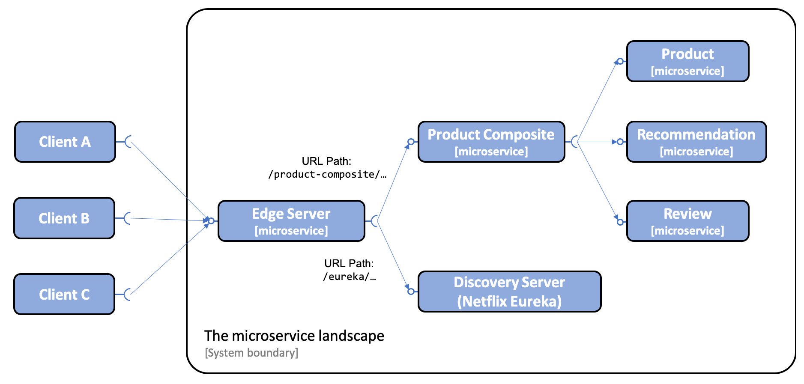

# GateWay설정
- 2022-07-25
- 스피링 클라우드 게이트웨어를 에지 서버로 사용하는 방법
  - 즉 마이크로서비스 기반 시스템 환경의 공개 API를 제어하는 방법
- Service Discovery(Eureeka)는 추후 검토
- 추가되면
  - docker의 각 서비스에서 local서버로 포트 포워딩을 하지 않는다
  - 
  - 참고한 자료: 스프링으로 하는 마이크로서비스 구축
## 1. Gateway 서비스 추가

1. SpringBootApplication은 별도 로직 없음(java 프로그램은 이 부분만 있음)
   ```java
   @SpringBootApplication
   public class ApplicationGateway {

      public static ApplicationContext applicationContext;
      public static void main(String[] args) throws Exception{
         applicationContext = SpringApplication.run(ApplicationGateway.class, args);
      }
   }
   ```
2. application.yaml
   - 도커 기준만 설명
   ```yaml
   spring:
   profiles: docker
   cloud:
      config.import-check.enabled: false
      gateway:
         discovery:
         locator:
            enabled: false  # 향후 eureka부분 추가되면 변경예정

   spring.cloud.gateway.routes:
   #url이 'lecture'로 시작하면 lecture 서버로 라우팅 하라
   - id: lecture
     uri: http://lecture:8080
     predicates:
     - Path=/lecture/**

   server.port: 8080
   ```
3. lecture 서비스에서 모든 contexts 설정 추가(API ROOT)
   - 라우팅을 편하게 하기 위하여
   - application.yaml에 추가함
   -  http://localhost:8081/lecture/lectures/1 형식으로 정의함
      ```yaml
      server.servlet.context-path: /lecture
      ```
4. gatewat의 pom.xml은 별도 설명하지 않음
   - eureka는 임시로 주석 처리
5. docker-compose-lecture.yml 파일 수정
   - 특이 설정 없음
   - 다른 마이크로서비스의 poets 포워딩은 설정제거해도됨(테스트 완료후 제거)
   ```yaml
   gateway:
      build: gateway
      mem_limit: 200m
      ports:
      - 8080:8080
      environment:
      - SPRING_PROFILES_ACTIVE=docker
   ```

## 2. 빌드 및 테스트
1. gateway, lecture 빌드
   ```bash
   cd ../lecture-domain
   mvn clean package -DskipTests=true

   cd ../gateway
   mvn clean package -DskipTests=true
   ```
2. docker-compose 빌드 및 수행
   ```bash
   $> docker-compose -f docker-compose-lecture.yaml build
   $> docker-compose -f docker-compose-lecture.yaml up
   ```
3. 기존 방식으로 테스트
   ```bash
   http://localhost:8081/lecture/lectures/1

   http://127.0.0.1:8081/lecture/swagger-ui/index.html

   ```
4. gateway경유 테스트 (포트를 gateway만 설정)
   ```bash
   http://localhost:8080/lecture/lectures/1

   http://127.0.0.1:8080/lecture/swagger-ui/index.html

   ```
