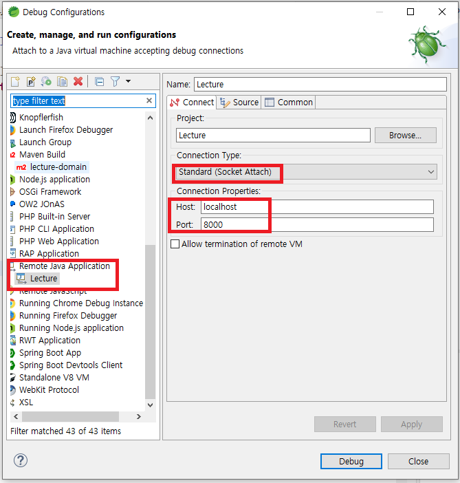
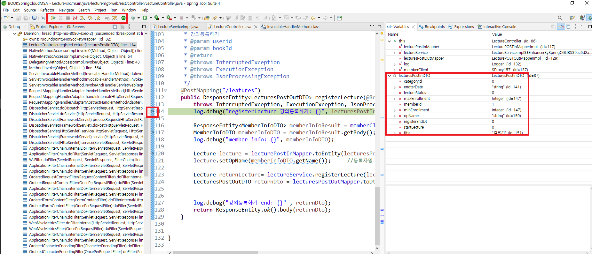

# Docker Remote Debug
- 2022-07-29: 초안 작성
- 도커로 실행한 서비스 Remote Debugging 설정하기
- Eclipse 기반 설정
## 1. 설정 변경 내용
1. Debugging대상 컴포넌트의 DockerFile 수정
   ```yaml
   FROM openjdk:15-jdk-alpine
   COPY target/*SNAPSHOT.jar app.jar
   #8000 port는 Remote Debug용으로 추가함 (추가시 space로 구분함)
   EXPOSE 8080 8000

   ENV TZ=Asia/Seoul

   RUN ln -snf /usr/share/zoneinfo/$TZ /etc/localtime && echo $TZ > /etc/timezone

   ENV JAVA_OPTS=""

   #"-agentlib ~ suspend=n" debug 관련 추가
   # suspend=n  ==> Remote Debug 설정시 attach 시점(y로 설정하면 접속을 해야 부팅이 시작됨)
   # JDK 11부토 포트 설정시 '*.8000', 이전 버전은 '8888'로 설정
   ENTRYPOINT ["java","-agentlib:jdwp=transport=dt_socket,address=*:8000,server=y,suspend=n","-Djava.security.egd=file:/dev/./urandom","-jar","/app.jar"]
   #-Djava.security.egd=file:/dev/./urandom -Dspring.profiles.active=docker
   ```
2. docker-compose.yaml파일에 Debug Attach포트 Open
   - yaml 파일명은 각자의 yaml 파일에 설정함
   - 지금은 docker-compose-lecture.yml에 설정함
      ```yaml
      lecture:
         build: lecture-domain
         mem_limit: 400m
         ports:
            - "8000:8000"  #remote Debug관련 포트 Local에 Open
            - "8081:8080"
         environment:
            - SPRING_PROFILES_ACTIVE=docker
         depends_on:
            - kafka, mysql, gateway
      ```
3. Eclipse debug설정
   
4. package 및 빌드후 실헹
   ```bash
   cd lecture-domain
   mvn clean package -DskipTests=true

   cd ..
   docker-compose -f docker-compose-lecture.yml build
   docker-compose -f docker-compose-lecture.yml up
   ```
5. EClipse에서 Break Point 설정후 debug 시작
   


## 2. 기타
- 꼭 설정하기를
- 따라하기 2시간 이상 소비되면 본 문서 Update를
