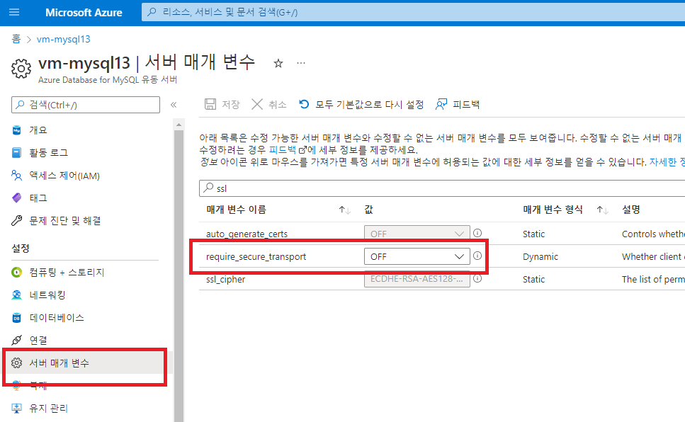
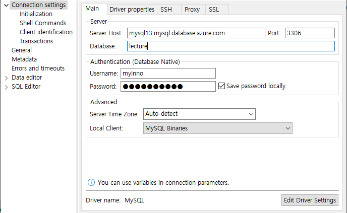
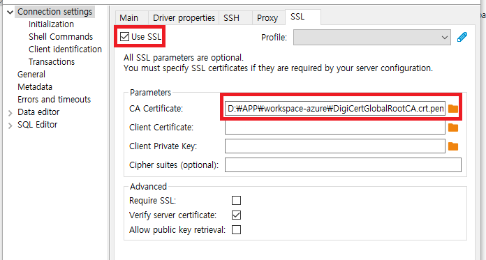
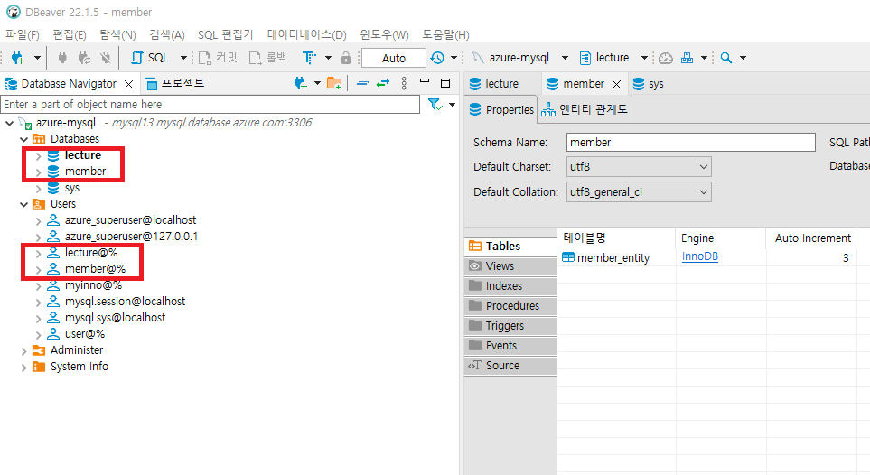

# Azure Mysql 생성
- 2022-08-20정리

##  생성 및 환경설정

1. Azure Portal
   - Home > Azure Database for MySQL 서버


### 인증서 관련 DigiCertGlobalRootCA.crt(무시)
Azure Portal "CLI"에서 접속을 하니 해당 파일 생성됨
해당 파일을 로컬로 다운로드하고

```console
mira [ ~ ]$ wget --trust-server-names --no-check-certificate 'https://go.microsoft.com/fwlink/?linkid=2157444'
--2022-09-05 03:42:56--  https://go.microsoft.com/fwlink/?linkid=2157444
Resolving go.microsoft.com... 23.199.144.55, 2600:1417:3f:1282::2c1a, 2600:1417:3f:128e::2c1a
Connecting to go.microsoft.com|23.199.144.55|:443... connected.
HTTP request sent, awaiting response... 302 Moved Temporarily
Location: https://dl.cacerts.digicert.com/DigiCertGlobalRootCA.crt.pem [following]
--2022-09-05 03:42:56--  https://dl.cacerts.digicert.com/DigiCertGlobalRootCA.crt.pem
Resolving dl.cacerts.digicert.com... 172.64.149.82, 104.18.38.174, 2606:4700:4400::6812:26ae, ...
Connecting to dl.cacerts.digicert.com|172.64.149.82|:443... connected.
HTTP request sent, awaiting response... 301 Moved Permanently
Location: https://cacerts.digicert.com/DigiCertGlobalRootCA.crt.pem [following]
--2022-09-05 03:42:56--  https://cacerts.digicert.com/DigiCertGlobalRootCA.crt.pem
Resolving cacerts.digicert.com... 104.18.38.174, 172.64.149.82, 2606:4700:4400::6812:26ae, ...
Connecting to cacerts.digicert.com|104.18.38.174|:443... connected.
HTTP request sent, awaiting response... 200 OK
Length: 1338 (1.3K) [application/x-pem-file]
Saving to: ‘DigiCertGlobalRootCA.crt.pem’

DigiCertGlobalRootCA.crt.pem                                100%[========================================================================================================================================>]   1.31K  --.-KB/s    in 0s

2022-09-05 03:42:56 (23.2 MB/s) - ‘DigiCertGlobalRootCA.crt.pem’ saved [1338/1338]

mira [ ~ ]$ mysql -h mysql13.mysql.database.azure.com -u myinno '--ssl-ca=DigiCertGlobalRootCA.crt.pem' -p
Enter password:
```

## SSL 설정 제외하기
- 서버 매개 변수 (동적 반영됨)
- 
### 로컬 DBEaver에서 접속하기
- Server host: mysql13.mysql.database.azure.com
- 
- SSL 설정
  - 다운로드 받은 인증서 파일 연결
  - 


### ssl 연결 DISABLE


### User/DB 생성
1. 각각의 MSA별로 user/database 생성 (로컬에서 DB 클라이언트 도구로 생성)


