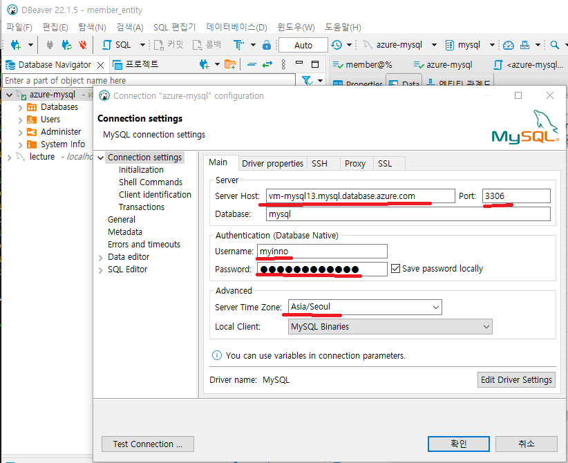
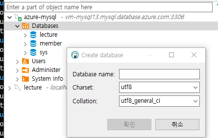
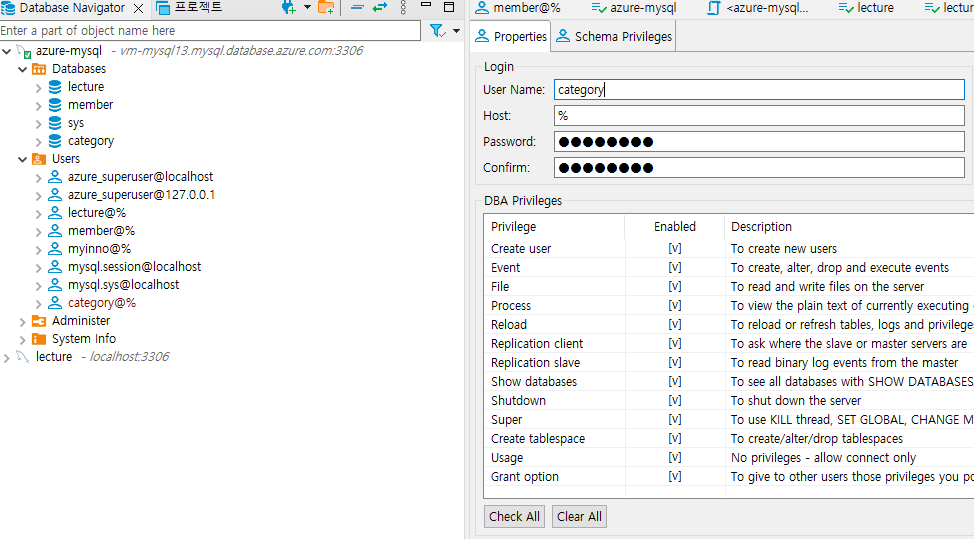
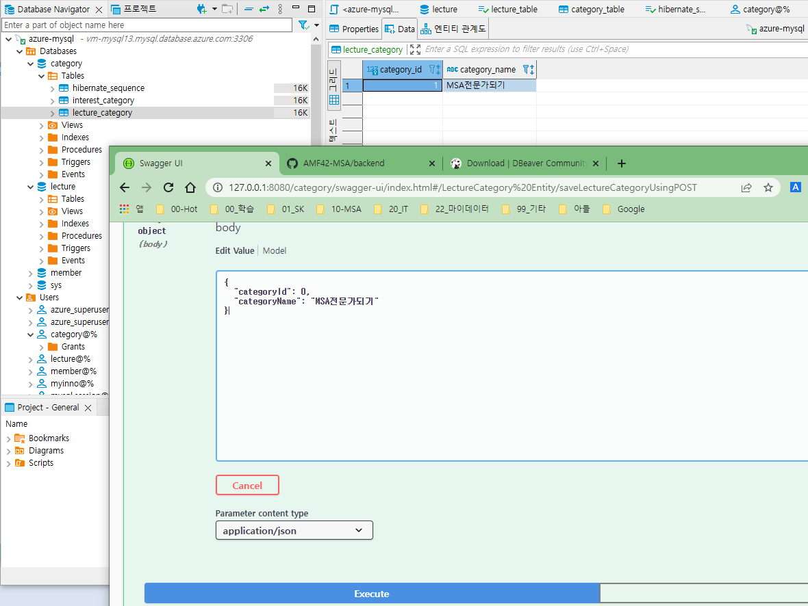

##  docker 기반을 구동하기

### gateway, kafka 기동
```bash
# gateway jar파일 생성
cd /d/APP/GIT-AMF3/backend/gateway
$> mvn clean package -DskipTests
```
```bash
$ cd /d/APP/GIT-AMF3/backend
$ docker-compose -f docker-compose-infra.yml up --build
```

###  member , category 기동

- member 빌드
  ```bash
  $ cd /d/APP/GIT-AMF3/backend/member-domain
  $ mvn clean package -DskipTesats
  ```

- category 빌드
  ```bash
  $ cd /d/APP/GIT-AMF3/backend/lecturecategory-domain
  $ mvn clean package -DskipTesats
  ```

- mebmber, category 구동
```bash
$ cd /d/APP/GIT-AMF3/backend
$ docker-compose -f docker-compose-domain.yml up --build
```

###  Lecture 기동
```bash
$ cd /d/APP/GIT-AMF3/backend/lecture-domain (main)
$ mvn clean package -DskipTests

$ cd /d/APP/GIT-AMF3/backend
$ docker-compose -f docker-compose-lecture.yml up --build
```


##  mysql 적용하기
### mysql 접속 정보
1. MySQL Client 다운로드
   https://dbeaver.io/download/

2. DBeaver로 접속하기
   - sever host: vm-mysql13.mysql.database.azure.com
   - username: lecture
     
   - password: ...


3. 본인의 database을 생성하자
   "Databases"에서 마우스 오른쪽 클릭  이름을 입력하고 생성
  

4. user 생성
  각자의 DB에 user를 생성하자
  (또는 lecture를 사용해도 무방)
    

   권한 부여...

### lecturecategory의 DBMS를 Mysql로 변경하기
1. application.yaml 수정
    ```bash
    server.servlet.context-path: /category  # 첫줄

    # DBMS 접속관련 추가 내용 (Docker 관련 추가)
    spring.datasource:
      url: jdbc:mysql://vm-mysql13.mysql.database.azure.com:3306/category?useUnicode=true&serverTimezone=Asia/Seoul
      username: category
      password: category

    hibernate.dialect: org.hibernate.dialect.MySQLInnoDBDialect


    spring.datasource.hikari.initializationFailTimeout: 30000

    spring.jpa.generate-ddl: true
    spring.jpa.hibernate.ddl-auto: update
    spring.jpa.properties:
      hibernate:
        show_sql: true
        format_sql: true

    ```
2. pom.xml
    ```xml
        <!-- h2database-Test용으로 -->
        <dependency>
          <groupId>com.h2database</groupId>
          <artifactId>h2</artifactId>
          <scope>test</scope>
        </dependency>

        <!-- MYSQL -->
        <dependency>
          <groupId>mysql</groupId>
          <artifactId>mysql-connector-java</artifactId>
          <scope>runtime</scope>
        </dependency>
    ```
3.  lecturecategory 빌드 및 배포
    ```bash
    $ cd /d/APP/GIT-AMF3/backend/lecturecategory-domain
    $ mvn clean package -DskipTesats

    $ cd /d/APP/GIT-AMF3/backend
    $ docker-compose -f docker-compose-domain.yml up --build

    ```
4. 테스트
   swagger로 데이터 등록하고, DBMS데이터 확인한 내용
   

