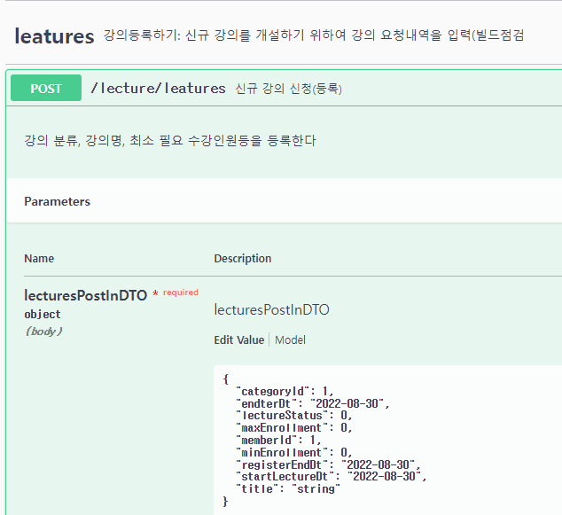

# CORS
- Cross-Origin Resource Sharing
##  1. 테스트 과정에서 발생한 오류
2022-08-29 등록

### 1.1 cors 설정
"http://127.0.0.1:3000" 에서 "http://127.0.0.1:8080"접속오류가 발생하여 아래 추가 하여 정상 처리됨

```java
@Configuration
public class WebConfig  implements WebMvcConfigurer {
		@Override
		public void addCorsMappings(CorsRegistry registry) {
				registry.addMapping("/**")
				.allowedOrigins("http://localhost:3000")
				.allowedMethods("*");
		}
}
```

### 1.2 위 수정이후 swagger에서 일부 오류 발생
1. 오류 발생(강의 등록): 403 오류 발생
   

		```console
		http://everylecture-dev:8080/lecture/swagger-ui/index.html#/leatures/registerLectureUsingPOST

		curl -X POST "http://everylecture-dev:8080/lecture/leatures" -H "accept: */*" -H "Content-Type: application/json" -d "{ \"categoryId\": 1, \"endterDt\": \"2022-08-30\", \"lectureStatus\": 0, \"maxEnrollment\": 0, \"memberId\": 1, \"minEnrollment\": 0, \"registerEndDt\": \"2022-08-30\", \"startLectureDt\": \"2022-08-30\", \"title\": \"string\"}"

		```

2. 오류 발생시 swagger의 다른 화면은 정상 처리됨
   - http://everylecture-dev:8080/lecture/entityLectures 정상
   - 나머지 화면도 정상
   - 오류가 발생하는 1번관련도 'curl'로 수행하면 정상 수행됨
### 1.3 수정 내용
아래와 같이 수정 후 정상 처리됨(why? - myinno)
```java
@Configuration
//@EnableWebSecurity
public class WebConfig  implements WebMvcConfigurer {
	@Override
	public void addCorsMappings(CorsRegistry registry) {
		registry.addMapping("/**").allowedMethods("*");
	}
}
```
