# Jenkins로 기본 CI Pipeline 구축

- http://www.jenkins.io/

---
- Jenkins CheatSheet
https://www.edureka.co/blog/cheatsheets/jenkins-cheat-sheet/


## 1. Jenkins와 GitHub 연동

`Freestyle project` Job을 생성하여 GitHub과 연동하는 방법확인

### 1.1 Jenkins Job 구성

Jenkins 로그인 주소는 http://[AWS > EC2 > 네트워크 및 보안 > 탄력적 IP > tools-eip의 IP주소]:8080

ID/PW : admin/...01

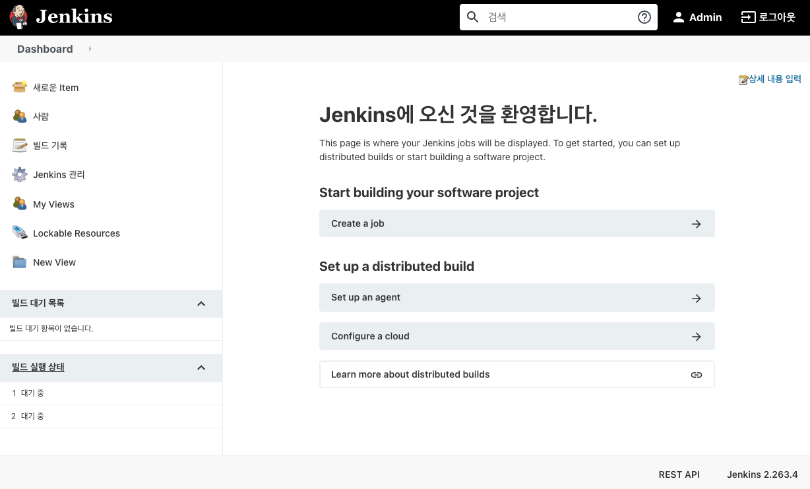
 ----------------------------------------------------

다음과 같이 수행하여 Jenkins Job을 생성

1. 사이드 바에서 **새로운 Item (New Item)** 메뉴를 클릭
2. Job 이름:  `Freestyle project`를 선택
3.  **OK** 버튼을 클릭
4 **Source Code Management(소스 코드 관리)** 탭을 클릭하면 **소스 코드 관리** 섹션으로 이동
5. `Git`을 선택하면 Repository 정보를 입력할 수 있는 폼이 나타납니다.6. GitHub Repository의 녹색 버튼을 클릭하여 Clone HTTPS URL을 복사하여 Jenkins의 Repository URL 필드에 붙여 넣습니다.
6. **Credentials** 필드의 **Add** 버튼을 클릭하고 `Jenkins`를 선택합니다.
7. **Jenkins Credentials Provider: Jenkins** 모달 창이 나타나면, 다음 항목을 입력하거나 선택한 후 **Add** 버튼을 클릭합니다.
   * **Domain** : `Global credentials (unrestricted)` 선택
   * **Kind** : `Username and password` 선택
   * **Scope** : `Global (Jenkins, nodes, items, all child items, etc)` 선택
   * **Username** : GitHub의 ID (또는 이메일 입력)
   * **Password** : GitHub 패스워드(**토큰**) 입력
   * **ID** : 원하는 고유한 ID 입력해도 되나, 여기서는 skcc-devopsXX-github으로 통일한다. (XX는 부여받은 번호)
   * **Description** : (선택사항) 유사한 자격 증명(credentials)을 구분하는 데 도움이 되는 설명 입력

    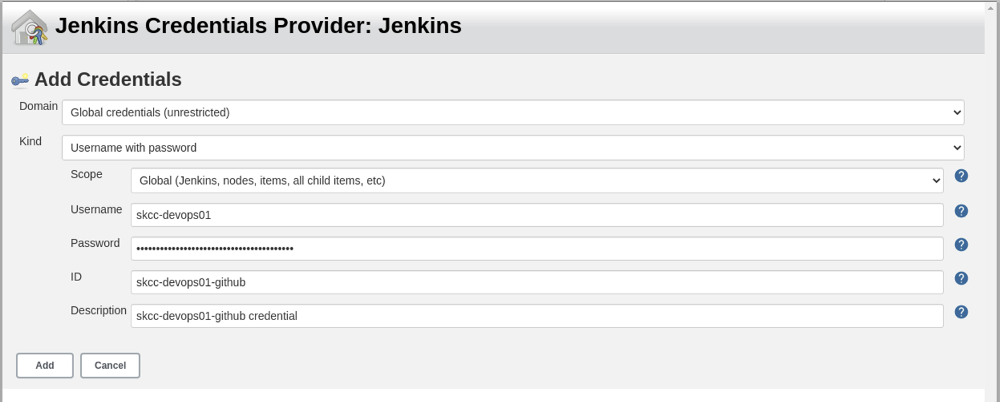

    > 생성된 자격 증명(credentials)은 **Dashboard dropdown menu > Jenkins 관리 > Security > Manage Credentials**을 선택하면 확인할 수 있습니다.

* **Credentials** 필드(기본값: `- none -`)에서 방금 생성한 자격 증명을 선택합니다.

    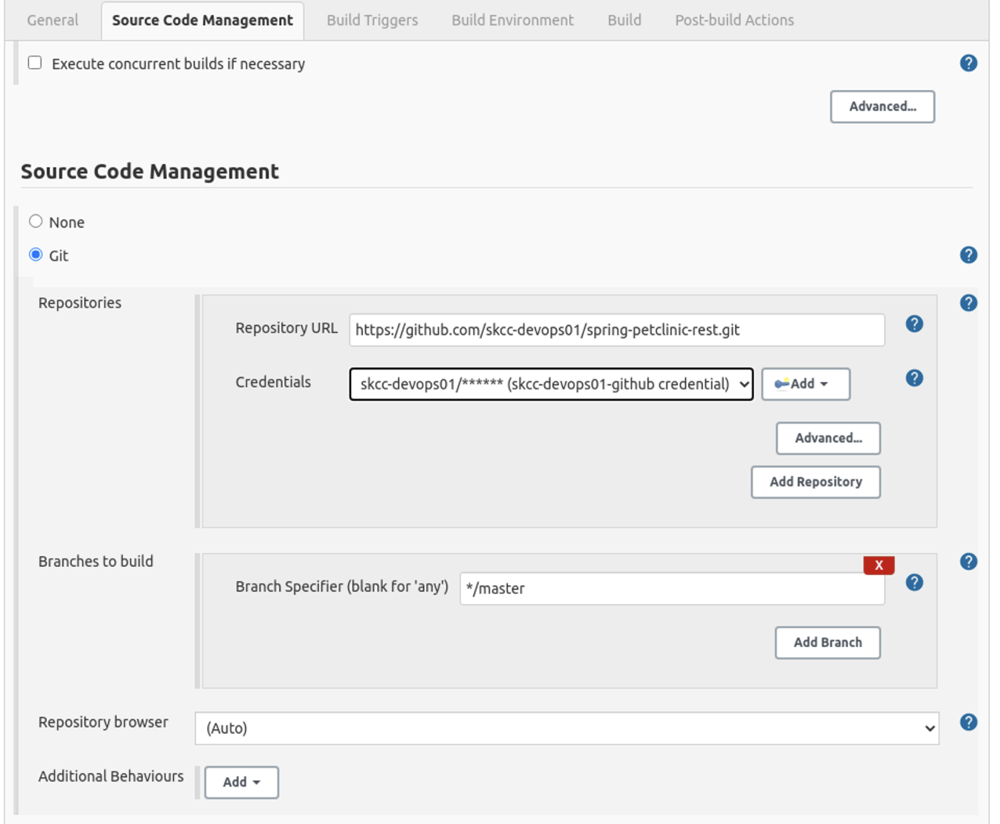

* **Branch Specifier (blank for 'any')** 필드를 `*/master`를 확인합니다.
* **Save(저장)** 버튼을 클릭합니다.

### 1.2 Jenkins Job 실행

- 사이드 바에서 **Build Now**를 클릭하면 Job이 실행
- **Build History**에서 **#일련번호**을 선택한 다음, **Console Output**을 선택하면 빌드 로그를 확인

    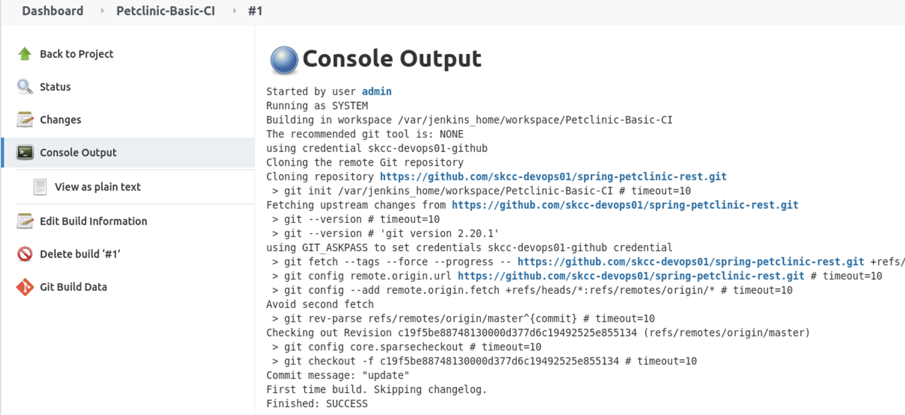

## 2. 기본 CI Pipeline 구성

### 2.1 Jenkinsfile 생성

- Jenkins Pipeline은 Jenkins에 지속적 전달(delivery) 파이프라인을 구현하고 통합하는 것을 지원하는 플러그인 모음입니다.
Pipeline은 Pipeline DSL(domain-specific language, 도메인 특정 언어) 구문을 통해 "코드로" 간단한 것에서 복잡한 것으로(simple-to-complex) 전달 파이프라인을 모델링하기 위한 확장 가능한 도구 세트를 제공합니다.

Jenkins Pipeline의 정의는 프로젝트의 소스 제어 저장소에 커밋 될 수 있는 텍스트 파일(Jenkinsfile)에 기록됩니다.

(참고) Scripted / Declarative Pipelines
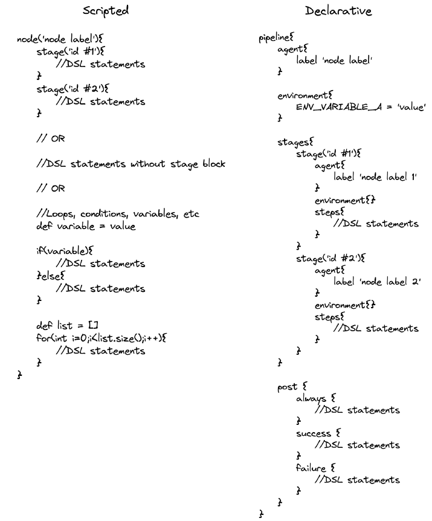

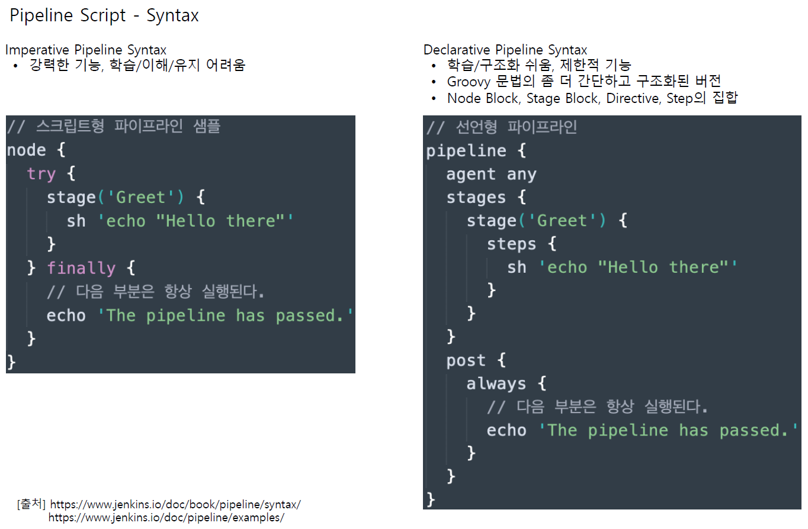

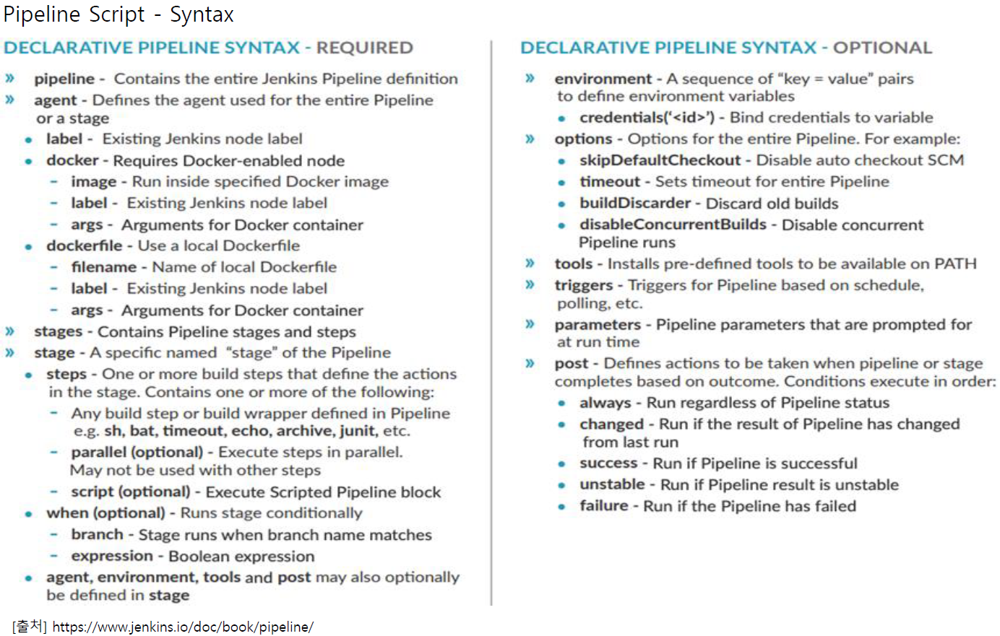

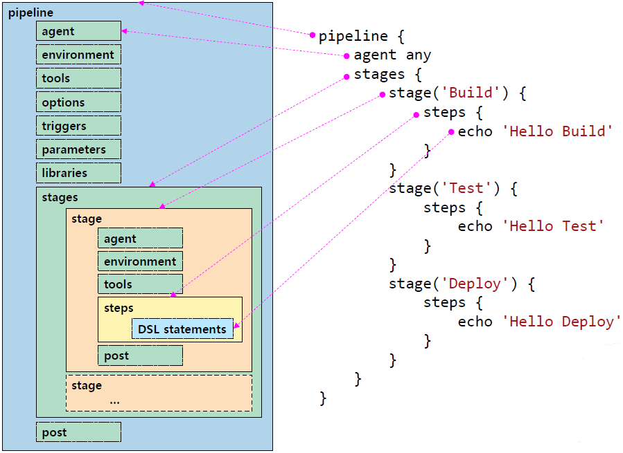


다음을 수행하여 `Jenkinsfile` 파일을 작성하고 GitHub에 Push 합니다.

* `spring-petclinic-rest` Workspace에서 `Jenkinsfile` 파일을 생성하고 아래 내용을 붙여 넣습니다.
  * 이 부분은 docker 기반 jenkins에서는 수행 불가(mvn 설치가 안되어 있어서..)

    ```groovy
    pipeline {
        agent any
        stages {
            stage('Build') {
                steps {
                    sh './mvnw compile'
                }
            }
        }
    }
    ```

* 아래 명령을 수행하여 GitHub에 Push 합니다.

    ```bash
    git add .
    git commit -m "Add initial Jenkinsfile"
    git push
    ```

### 2.2 CI Pipeline Job 생성

* 사이드 바에서 **새로운 Item (New Item)** 메뉴를 클릭 합니다.
* Job 이름(예: `Petclinic-Basic-CI-Pipeline`)을 입력하고 `Pipeline`를 선택한 다음 **OK** 버튼을 클릭합니다.
* **Pipeline** 탭을 클릭하면 아래로 스크롤 되어 **Pipeline** 섹션으로 이동합니다.
* **Definition** 필드에 `Pipeline script from SCM`을 선택합니다.
* **SCM** 필드에 `Git`을 선택합니다.
* **Repository URL** 필드에 GitHub Repository의 Clone HTTPS URL을 복사하여 붙여 넣습니다.
* **Credentials** 필드에 이전 단계에서 생성한 자격 증명을 선택합니다.
* **Branch Specifier** 필드에 `*/master`으로 수정한 다음 **저장** 버튼을 클릭합니다.

    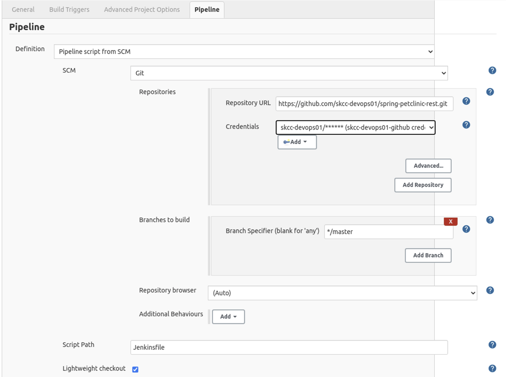
    -

### 2.3 CI Pipeline Job 실행

* 사이드 바에서 **Build Now**를 클릭하면 Job이 실행됩니다.
* **Build History**에서 **#일련번호**을 선택한 다음, **Console Output**을 선택하면 빌드 로그를 확인할 수 있습니다.

```bash
Started by user admin
Obtained Jenkinsfile from git https://github.com/skcc-devops01/spring-petclinic-rest.git
Running in Durability level: MAX_SURVIVABILITY
[Pipeline] Start of Pipeline
[Pipeline] node
Running on Jenkins in /var/jenkins_home/workspace/Petclinic-Basic-CI-Pipeline
[Pipeline] {
[Pipeline] stage
[Pipeline] { (Declarative: Checkout SCM)
[Pipeline] checkout
The recommended git tool is: git
using credential skcc-devops01-github
Cloning the remote Git repository
Cloning repository https://github.com/skcc-devops01/spring-petclinic-rest.git
 > git init /var/jenkins_home/workspace/Petclinic-Basic-CI-Pipeline # timeout=10
Fetching upstream changes from https://github.com/skcc-devops01/spring-petclinic-rest.git
 > git --version # timeout=10
 > git --version # 'git version 2.20.1'
using GIT_ASKPASS to set credentials skcc-devops01-github credential
 > git fetch --tags --force --progress -- https://github.com/skcc-devops01/spring-petclinic-rest.git +refs/heads/*:refs/remotes/origin/* # timeout=10
 > git config remote.origin.url https://github.com/skcc-devops01/spring-petclinic-rest.git # timeout=10
 > git config --add remote.origin.fetch +refs/heads/*:refs/remotes/origin/* # timeout=10
Avoid second fetch
 > git rev-parse refs/remotes/origin/master^{commit} # timeout=10
Checking out Revision 702e066d2b0422961f710c89c677b937a5119bd6 (refs/remotes/origin/master)
 > git config core.sparsecheckout # timeout=10
 > git checkout -f 702e066d2b0422961f710c89c677b937a5119bd6 # timeout=10
Commit message: "Add initial Jenkinsfile"
First time build. Skipping changelog.
[Pipeline] }
[Pipeline] // stage
[Pipeline] withEnv
[Pipeline] {
[Pipeline] stage
[Pipeline] { (Build)
[Pipeline] sh
+ ./mvnw clean compile
[INFO] Scanning for projects...
Downloading from central: https://repo.maven.apache.org/maven2/org/springframework/boot/spring-boot-starter-parent/2.4.2/spring-boot-starter-parent-2.4.2.pom
Progress (1): 2.7/8.6 kB
...

[INFO]
[INFO] ---------< org.springframework.samples:spring-petclinic-rest >----------
[INFO] Building spring-petclinic-rest 2.4.2
[INFO] --------------------------------[ jar ]---------------------------------
Downloading from central: https://repo.maven.apache.org/maven2/org/springframework/boot/spring-boot-maven-plugin/2.4.2/spring-boot-maven-plugin-2.4.2.pom
Progress (1): 2.9 kB

(생략)

Downloaded from central: https://repo.maven.apache.org/maven2/org/codehaus/plexus/plexus-java/0.9.10/plexus-java-0.9.10.jar (39 kB at 145 kB/s)
...

Progress (2): 4.7 kB  21 kB
...

Downloaded from central: https://repo.maven.apache.org/maven2/org/codehaus/plexus/plexus-compiler-manager/2.8.4/plexus-compiler-manager-2.8.4.jar (4.7 kB at 8.8 kB/s)
Downloaded from central: https://repo.maven.apache.org/maven2/org/codehaus/plexus/plexus-compiler-javac/2.8.4/plexus-compiler-javac-2.8.4.jar (21 kB at 39 kB/s)
[INFO] Changes detected - recompiling the module!
[INFO] Compiling 83 source files to /var/jenkins_home/workspace/Petclinic-Basic-CI-Pipeline/target/classes
[INFO] ------------------------------------------------------------------------
[INFO] BUILD SUCCESS
[INFO] ------------------------------------------------------------------------
[INFO] Total time:  02:47 min
[INFO] Finished at: 2021-09-07T13:30:16+09:00
[INFO] ------------------------------------------------------------------------
[Pipeline] }
[Pipeline] // stage
[Pipeline] }
[Pipeline] // withEnv
[Pipeline] }
[Pipeline] // node
[Pipeline] End of Pipeline
Finished: SUCCESS
```

> './mvnw: Permission denied' 오류가 발생하면 `spring-petclinic-rest` Workspace로 이동하여 `sudo chmod +x mvnw` 명령을 수행하고 Git Push 합니다.

## CI Pipeline에 Unit Test 추가

* * *
(참고) JUnit (https://junit.org/junit5/)
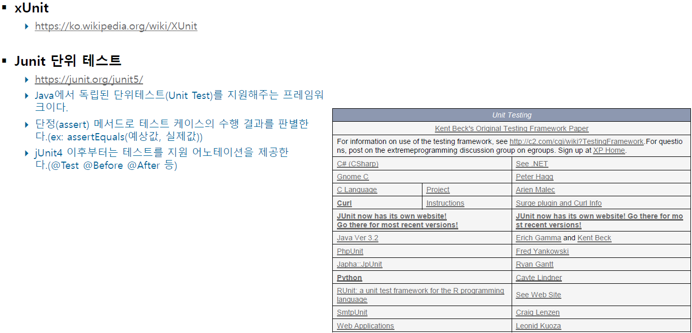

- JUnit5 = JUnit Platform + JUnit Jupyter + JUnit Vintage
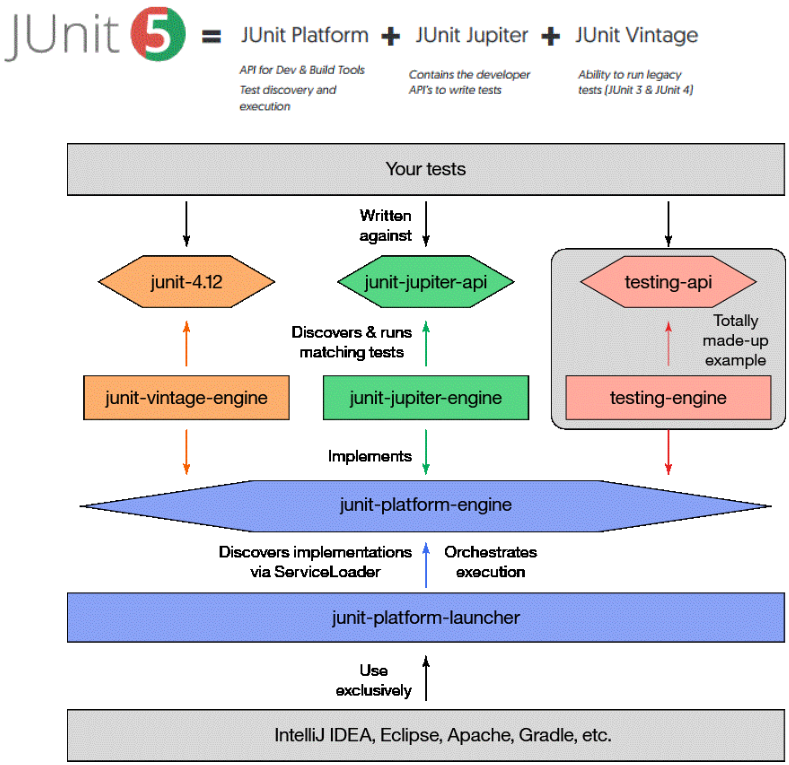
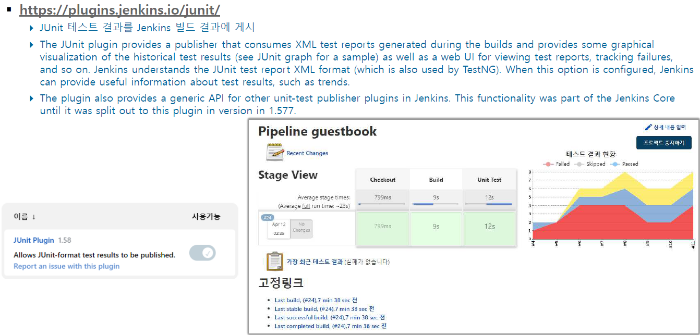

* (참고) 소스 샘플
  - PetTypeRestController.java
    

  - PetTypeRestControllerTests.java
    
    

  - 결과
    
    

* * *

### Unit Test 코드 작성


pom.xml에 [Spring Boot Starter Test](https://mvnrepository.com/artifact/org.springframework.boot/spring-boot-starter-test) dependency를 추가하면 Java 기반 애플리케이션 Unit Test에 필요한 [JUnit](https://junit.org/junit5/docs/current/user-guide/), [Hamcrest](http://hamcrest.org/JavaHamcrest/tutorial) 및 [Mockito](https://site.mockito.org/) 의존성 라이브러리가 설치됩니다.

다음을 수행하여 단위 테스트 코드를 작성하고 GitHub에 Push 합니다.

* STS에서 `src/test/java` 디렉토리 하위에 프로젝트 생성 시 지정했던 패키지의 `org.springframework.samples.petclinic` 파일을 열고, 확인합니다.

### Jenkinsfile에 `Unit Test` stage 추가

다음을 수행하여 `Jenkinsfile` 파일에 `Unit Test` stage를 추가하고 GitHub에 Push 합니다.

* `Jenkinsfile` 파일을 열고 `Build` stage 다음에 아래 내용을 붙여 넣습니다.

    ```groovy
            stage('Unit Test') {
                steps {
                    sh './mvnw test'
                }
                post {
                    always {
                        junit 'target/surefire-reports/*.xml'
                    }
                }
            }
    ```

* 아래 명령을 수행하여 GitHub에 Push 합니다.

    ```bash
    git add .
    git commit -m "Add 'Unit Test' stage to Jenkinsfile"
    git push
    ```

### CI Pipeline Job 실행 (Build > Unit Test)

* 사이드 바에서 **Build Now**를 클릭하여 Job이 실행합니다.
* **Build History**에서 **#일련번호**을 선택한 다음, **Console Output**을 선택하면 빌드 로그를 확인합니다.

```bash
Started by user admin
Obtained Jenkinsfile from git https://github.com/skcc-devops01/spring-petclinic-rest.git
Running in Durability level: MAX_SURVIVABILITY
[Pipeline] Start of Pipeline
[Pipeline] node
Running on Jenkins in /var/jenkins_home/workspace/Petclinic-Basic-CI-Pipeline
[Pipeline] {
[Pipeline] stage
[Pipeline] { (Declarative: Checkout SCM)
[Pipeline] checkout
The recommended git tool is: git
using credential skcc-devops01-github
 > git rev-parse --resolve-git-dir /var/jenkins_home/workspace/Petclinic-Basic-CI-Pipeline/.git # timeout=10
Fetching changes from the remote Git repository
 > git config remote.origin.url https://github.com/skcc-devops01/spring-petclinic-rest.git # timeout=10
Fetching upstream changes from https://github.com/skcc-devops01/spring-petclinic-rest.git
 > git --version # timeout=10
 > git --version # 'git version 2.20.1'
using GIT_ASKPASS to set credentials skcc-devops01-github credential
 > git fetch --tags --force --progress -- https://github.com/skcc-devops01/spring-petclinic-rest.git +refs/heads/*:refs/remotes/origin/* # timeout=10
 > git rev-parse refs/remotes/origin/master^{commit} # timeout=10
Checking out Revision 63ba6ad33e6db30eb3d5c2e81e8cb3d80725470f (refs/remotes/origin/master)
 > git config core.sparsecheckout # timeout=10
 > git checkout -f 63ba6ad33e6db30eb3d5c2e81e8cb3d80725470f # timeout=10
Commit message: "Add 'Unit Test' stage to Jenkinsfile"
 > git rev-list --no-walk 702e066d2b0422961f710c89c677b937a5119bd6 # timeout=10
[Pipeline] }
[Pipeline] // stage
[Pipeline] withEnv
[Pipeline] {
[Pipeline] stage
[Pipeline] { (Build)
[Pipeline] sh
+ ./mvnw clean compile
[INFO] Scanning for projects....

(생략)

[INFO] --- maven-compiler-plugin:3.8.1:compile (default-compile) @ spring-petclinic-rest ---
[INFO] Changes detected - recompiling the module!
[INFO] Compiling 83 source files to /var/jenkins_home/workspace/Petclinic-Basic-CI-Pipeline/target/classes
[INFO] ------------------------------------------------------------------------
[INFO] BUILD SUCCESS
[INFO] ------------------------------------------------------------------------
[INFO] Total time:  5.699 s
[INFO] Finished at: 2021-09-07T13:50:03+09:00
[INFO] ------------------------------------------------------------------------
[Pipeline] }
[Pipeline] // stage
[Pipeline] stage
[Pipeline] { (Unit Test)
[Pipeline] sh
+ ./mvnw test
[INFO] Scanning for projects...
[INFO]
[INFO] ---------< org.springframework.samples:spring-petclinic-rest >----------
[INFO] Building spring-petclinic-rest 2.4.2
[INFO] --------------------------------[ jar ]---------------------------------
Downloading from central: https://repo.maven.apache.org/maven2/org/apache/maven/plugins/maven-surefire-plugin/2.22.2/maven-surefire-plugin-2.22.2.pom
Progress (1): 2.7/5.0 kB
Progress (1): 5.0 kB

(생략)

[INFO] Results:
[INFO]
[INFO] Tests run: 172, Failures: 0, Errors: 0, Skipped: 0
[INFO]
[INFO] ------------------------------------------------------------------------
[INFO] BUILD SUCCESS
[INFO] ------------------------------------------------------------------------
[INFO] Total time:  54.806 s
[INFO] Finished at: 2021-09-07T13:51:00+09:00
[INFO] ------------------------------------------------------------------------
Post stage
[Pipeline] junit
Recording test results
[Checks API] No suitable checks publisher found.
[Pipeline] }
[Pipeline] // stage
[Pipeline] }
[Pipeline] // withEnv
[Pipeline] }
[Pipeline] // node
[Pipeline] End of Pipeline
Finished: SUCCESS
```

### Unit Test Report


-
사이드 바에서 **Test Result**를 클릭하면 Unit Test Report를 확인할 수 있습니다.


-

* * *

STS에서 실행한 JUnit 결과(샘플: PetTypeRestController) : 안될 경우 Build Path > Configure Output Folder로 지정 후 재실행

-

* * *

* Jenkins Dashboard

 
 -

* * *

Jenkins Build Trigger에서 잘 쓰는 건 2개이다.

 
 -

- Build periodically 주기적으로 수행

     
     -

    분(0-59)  시간(0-23)  일(1-31)  월(1-12)  요일(0-7)  명령 순서이다. 맨뒤에는 명령을 붙일 수 있다.
    (요일에서 0과 7은 일요일. 1부터 월요일이고 6이 토요일)

    ```
    0 4 * * *          # 매일 새벽 4시
    15 14 * * *        # 매일 낮 2시 15분에 실행
    00 01 5 * *        # 매월 5일 새벽 한시 실행
    00 06 * 3 *        # 3월동안 6시에 실행
    00 01 * * 7        # 일요일마다 새벽1시 실행
    */15 * * * *       # 15분마다 실행
    */10 2-4 * * *     # 2시 ~ 4시 동안 10분마다 실행
    * 5,9 * * *        # 5시, 9시에 실행
    */10 2,3,4 5-6 * * # 5일에서 6일까지 2시,3시,4시에 매 10분마다 실행
    ```
    > Linux rontab, K8S cronjob도 동일한 패턴입니다.

- Poll SCM Git 형상관리에 다녀오기

     
     -

    ```
    30 * * * 1-5 # 월화수목금만 30분 단위로 갔다와
    30 * * * *   # 매30분마다 돌아라
    * * * * *    # 1분마다 돌아라
    ```

* * *

Jenkins에서 많이 사용하는 플러그인
* Timestamper
* Warning Next Generation
* Html Publisher
* TextFinder
* Simple Theme
* ThinBackup

* * *

* Jenkins Global Variable Reference - env

 
 -

 
 -

 
 -

 
 -

* * *

* Jenkins 오늘 날자 구하는 방법

 
 -

 
 -

 
 -

* * *

## 참고

[Using Jenkins - Using credentials](https://www.jenkins.io/doc/book/using/using-credentials/)
[Build a Java app with Maven](https://www.jenkins.io/doc/tutorials/build-a-java-app-with-maven/)
[Getting started with Pipeline](https://www.jenkins.io/doc/book/pipeline/getting-started/)
[Jenkins Pipeline](https://www.jenkins.io/doc/book/pipeline/)
[Using Docker with Pipeline](https://www.jenkins.io/doc/book/pipeline/docker/)
