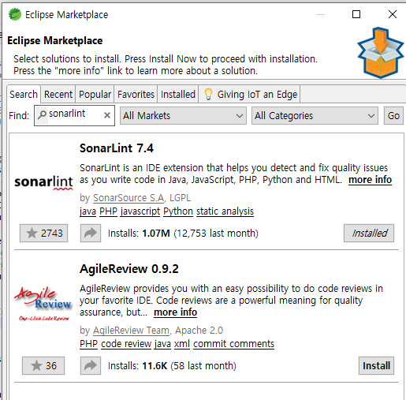
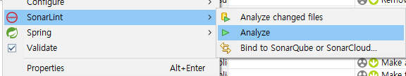

<style>
.burk {
    background-color: red;
    color: yellow;
    display:inline-block;
}
</style>
# 도커 기반 SonarQube
- 도커 기반 SonarQube 설정
- 주요 참조 문서
  - https://www.sonarqube.org/features/deployment/
- 설치 환경:노트북, window10

## 1. 환경 설정

### STS에 SonarLint 설치

1. 설치
   -  Help --> Eclipse marketplace
    
    offline 설치시는 "[다운로드](https://binaries.sonarsource.com/SonarLint-for-Eclipse/releases/)"
    offline 설치시는 "check all update ... "체크 해지 후 실행

2. 실행
  - 특정 프로젝트 또는 소스에서 마우스 오른쪽 클릭
    
3. SonarLint와 서버 연결 정보 추가 필요
   1. eclipse File > New > Other 선택
   2. SonarLint > New Server Connection 선택 > Next
   3. sonarqube 선택 > Nex
   4. URL에 SonarQube 서버의 주소/IP 입력 > Next
   5. Username + Password 선택 > Next
   6. 계정(공통팀에 문의) 입력 > Next
   7.  필요에 따라 Connection name 변경 > Next

### SonarQube Docker 설치
Docker기반으로 SonarQube 설정 (Community Edition)


1. 도커 이미지 다운로드

```bash
docker pull sonarqube:9.6-community
```
2. 1
3. 1
4. 1
5. 1
6. 1
```bash
```
```bash
```
```bash
```
```bash
```
```bash
```
```bash
```
