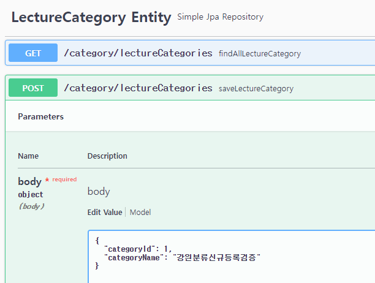
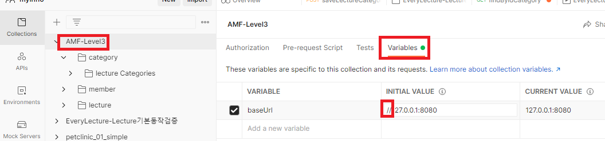

<style>
.burk {
    background-color: red;
    color: yellow;
    display:inline-block;
}
</style>
# Function 테스트
- 참조
  - 사내강의: DevOps이해 및 Test Automation구현=류해식, 차일환
  - https://www.postman.com/
- 설치 환경:노트북, window10
- WIndow에 postman을 설치하고
  - lecturecategory에서 강의 분류 신규 등록
  - 해당 내역을 kafka에 등록됨
  - lecure에서 해당 내역이 정상 들어왔는지 점검

- ToDo
  - Postman을 도커 기반으로 변경 예정
  - pipeline과 연동
## 1. 환경 설정

1. Postman 다운로드 및 설치(windows 기준)
   - windows 64-bit 다운로드 함
    ```bash
    https://www.postman.com/downloads/
    ```

2. 설치 관련
   - 다운로드 파일 설치관련 특이사항 없음

## 2. 로컬 테스트(손으로하는 테스트)
1. swagger로 기본 업무 테스트 흐름
   1. 강의 분류 등록
   2. kafka 토픽에 등록여부 확인
   3. lecture에서 해당 레코드 확인
2. 강의 분류 등록
   - http://127.0.0.1:8080/category/swagger-ui/index.html
   - lecturecategory에 swagger 등록 했음
   

3. kafka 토픽에 해당 내역 등록 확인
   - 설정에 토픽이름은 "lecture"로 되어 있음
   - Docker Desktop에서 CLI Open
    
   - 토픽 리스트 조회(lecture)
      ```bash
      sh-4.4$ /bin/kafka-topics --list --bootstrap-server localhost:9092
      __consumer_offsets
      lecture
      lectureChanged
      ```
   - 토픽 데이터 조회
      ```bash
      sh-4.4$ /bin/kafka-console-consumer \
      >        --bootstrap-server localhost:9092 \
      >        --topic lecture \
      >        --from-beginning
      {"eventType":"LectureCategoryRegistered","timestamp":1661379479214,"categoryId":1,"categoryName":"강의분류등록08-25"}
      {"eventType":"MemberJoined","timestamp":1661379685096,"memberId":1,"loginId":"string","password":null,"name":"홍길동0825","birth":"string","mobile":"string","memberType":"ADMIN"}
      {"eventType":"LectureCategoryRegistered","timestamp":1661380604156,"categoryId":2,"categoryName":"강의분류08-25-01"}
      ```
   -  확인하려고 하는 내용: 강의분류를 등록하면 토픽에 데이터가 들어가는것 확인
4. lecture-domain에 해당 내역이 정상 등록되었는지 확인
   - swagger로 확인
     

## 3. 스크립터 작성
### 3.1 Swagger import

swagger API 내역을 Postman 으로 import
1. Swagger의 API URL 복사
   
2. "Postman"에서 Collections 메뉴에서 Import 선택
   
3. Link을 선택하고 복사한 URL을 입력 --> "Continue"
   
4. Lecture, category, member 관련도 동일하게 Import한다음 필요한 부분만 하나로 집합한다(선택)
   
5. base URL 정보에서 "//" 부분 삭제함 (INITAL VALUE, CURRENT VALUE 두군데 수정)
   <span class=burk>"주의" 수정하면 Tab별로 "save"</span>
   
6. 개별 스크립터 정상 작동여부 확인
   

### 3.2 Postman 스크림터 작성
1.  Collections을 하나 만들고, 디렉토리() 생성함
2.  생성된 디렉토리에 Swagger에서 복사한 API중 사용하려고 하는 API만 복사하여 붙여 넣는다
   
3. saveLectureCategory 에 수정된 스크립터
   - 점검 목적으로 "분류명"에 현 시간을 추가함 --> 단순 테스틑 목적
   - headers는 복사본에서 수정하지 않음
   - body
      ```javascript7
      {
        "categoryId": 1,
        "categoryName": "강의분류-Postman-{{current_datetime}}"
      }
      ```

   - Pre-request Script
      ```javascript
      let current = new Date();
      let cDate = current.getFullYear() + '-' + (current.getMonth() + 1) + '-' + current.getDate();
      let cTime = current.getHours() + ":" + current.getMinutes() + ":" + current.getSeconds();
      let dateTime = cDate + ' ' + cTime;

      pm.globals.set("current_datetime", dateTime);
      pm.globals.set("current_date", cDate);
      ```

   - Tests
      ```javascript
      const res = pm.response.json();
      //const req = request.data;
      //Request 값을 가져온다
      const req =JSON.parse(pm.request.body.raw)

      console.log("category - request categoryId : " + req.categoryId);
      console.log("category - response categoryName : " + res.categoryName);

      pm.collectionVariables.set("categoryId", req.categoryId);
      pm.collectionVariables.set("categoryName", res.categoryName);

      // lecture에서 해당 값이 정상 반영되었는지 확인하기 위하여 변수 저장함
      console.log("category - Collection Variable categoryId : " + pm.collectionVariables.get("categoryId"));
      console.log("category - Collection Variable categoryName : " + pm.collectionVariables.get("categoryName"));
      ```
   - 작성이 완료되면 "Send" 하여 해당 스크립터 확인 (Console에 로그 확인)
     

4. 등로내역 확인
   - 등록시에 저장한 id, name 기준으로 동일 레코드 검증
   - headers는 복사본에서 수정하지 않음
   - Params (GET 메소드 이므로 Params에 등록)
      ```javascript7
      key = id
      VALUE = {{categoryId }}  <--
      ```
     

   - Tests
      ```javascript
      pm.test("lecture kafka연동테스트 : response check", function () {
          pm.response.to.have.status(200);  //싱태는 200이어야 함
          pm.response.to.be.ok;             // 결과는 OK
          //pm.expect(pm.response.text()).to.include(pm.collectionVariables.get("categoryName"));
          const res = pm.response.json();

          console.log("lecture - response categoryName : " + res.categoryName);
          console.log("lecture - collectionVariables categoryName : " + pm.collectionVariables.get("categoryName"));

          pm.expect(pm.collectionVariables.get("categoryName")).to.equal(res.categoryName);  //등록시 입력한 값과 조회한 값이 동일여부 체크
      });
      ```
### 3.3 Postman으로 테스트
- "일일기능검증-Lecture"에서 "RUn"
- Run을 "Save responses" 을 선택하고 수행 <-- 결과를 상세 확인하기 위한 목적
  
- 참고: 지금은 동일한 값이 있는 경우는 Kafka로 전달허지 않기 때문에 오류(fail) 발생
- 데이터가 없는 경우는 정상 처리됨

## 4 요약

- 기본적인(일일검증) 작업은 스크립터를 작성하자
- 매일 일일 점검(화면기준)을 작성해 보자
- 기본 체크(고객등록 --> 계좌개설 --> 입금)을 테스트 환경에 추가하지

