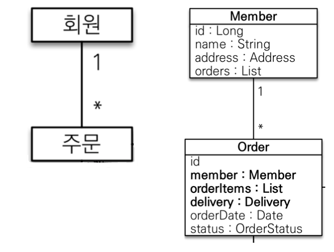
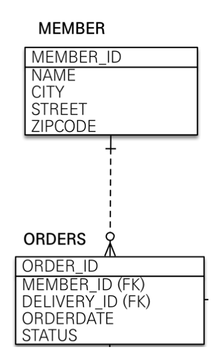
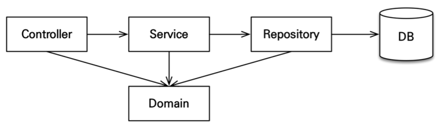

<style>
.burk {
    background-color: red;
    color: yellow;
    display:inline-block;
}
</style>
# 스프링 부트와 JPA 활용 1편 정리
- https://velog.io/@tmdgh0221
  - 스프링 부트와 JPA 활용 1편 정리
  - tmdgh0221·2021년 2월 23일

세상에서 가장 쉬운것 : 남에게 충고
## 1. 프로젝트 환경설정

### 1.1 프로젝트 생성

Spring Boot Starter로 프로젝트 기본 세팅(Gradle로 진행)

- Spring Web: 기본적인 Web에 필요한 dependency를 가져옵
- Spring Data JPA: 주로 Spring Data와 Hibernate를 이용하여 JPA Data를 처리
- Thymeleaf: Spring에서 밀고있는 server-side template으로, 해당 형식의 문서를 별도의 수정 작업없이 HTML로 바로 볼 수 있다는 점이 강점
- Validation: @NotNull, @Min과 같이 도메인에 대한 검증을 하는 Bean Validation의 구현체로써 Hibernate를 사용
- Lombok: 다양한 annotation library로, 주로 Getter와 Setter를 편리하게 세팅할 때 사용

### 1.2 DB 설치

in-memory 방식의 H2 DB를 사용
- H2에서 다운로드 및 설치 후 ./bin/ 경로의 OS에 맞게 bat 혹은 sh 파일을 실행해서 구동
- 처음에는 jdbc:h2:~/{Table Name}로 접속해서 table을 생성 후, 이후에는 jdbc:h2:tcp://localhost/~/{Table Name}으로 접속할 수 있습니다.
- Spring Boot 프로젝트에서 DB 설정: application.yml

   ```yaml
   spring:
   datasource:
      url: jdbc:h2:tcp://localhost/~/{Table Name}
      username: sa
      password:
      driver-class-name: org.h2.Driver
   jpa:
      hibernate:
         ddl-auto: create
      properties:
         hibernate:
         # show_sql: true
         format_sql: true
   logging.level:
   org.hibernate.SQL: debug
   # org.hibernate.type: trace
   ```

## 2. 도메인 분석 및 설계

### 2.1 도메인 모델

간단한 쇼핑몰
- 회원, 상품, 주문, 배송
- 각 도메인 간의 관계를 설정
  - 회원과 주문의 관계는 1:N일 것이고,
  - 주문과 배송의 관계는 1:1일
  - 상품을 구현할 때 필요하다면 상속 관계도 사용


### 2.2 테이블 설계

- PK(Primary Key)식별
- FK(Foreign Key) 도출
- 주로 FK가 있는 도메인을 해당 연관관계의 주인으로 정하는 것이 권장
   - 예를 들어 회원과 주문 도메인은 1:N 관계인데,
   - 1:N 관계에서 FK는 항상 N쪽에 FK가 위치하므로주문 도메인에 위치하여 이 연관관계의 주인은 주문이 됩니다.
   

### 2.3 Entity 클래스 개발

- @Entity annotation으로 해당 클래스가 영속적인 도메인 오브젝트임을 표현
- 해당 entity에 @Id, @GeneratedValue, @Column(name = "{Column Name}") 등의 annotation으로 필드를 표현

- entity간의 연관관계는 @OneToOne, @OneToMany, @ManyToOne, @ManyToMany로 표현하고,
  - 연관관계의 주인 표현은 주인 entity 쪽에 @JoinColumn(name = "{Column Name}")과 그렇지 않은 entity 쪽에 @OneToMany(mappedBy = "{주인 Entity의 Field Name}")으로 합니다.
  - 연관관계를 구현할 때는 EAGER(즉시 로딩)보다는 LAZY(지연 로딩) 방식으로 설정해야 합니다.
  - EAGER일 경우 예측이 어렵고, 어떤 SQL이 실행될 지 추적하기 여렵습니다.
  - 특히 N+1 문제 등이 자주 발생할 수 있습니다.
  - @XToMany의 경우 기본값이 LAZY이지만, @XToOne의 경우 기본값이 EAGER이기 때문에 @ManyToOne(fetch = FetchType.LAZY)처럼 설정해야 합니다.
  - 만약 연관된 entity를 함께 조회해야하는 경우라면, fetch join 혹은 entity graph 기능을 사용하여 해결합니다.

- 컬렉션은
  - 필드에서 초기화하는 것이 안전
  - 1:N 관계의 경우 List<>()를 사용해서 컬렉션을 표현하는데 필드에서 초기화할 수도 있고, 필드에서는 선언만 하고 생성자에서 초기할 수도 있습니다.
  - 선언과 초기화를 분리한다면 NullPointerException 문제가 발생할 수 있기 때문에 약간의 메모리를 더 소비하더라도 필드에서 초기화하는 것이 안전

예를 들어 회원과 주문 entity는 아래처럼 구현됩니다.

   ```java
   @Entity
   @Getter @Setter
   public class Member {
      @Id @GeneratedValue
      @Column(name = "member_id")
      private Long id;

      private String name;

      @Embedded
      private Address address;

      @OneToMany(mappedBy = "member")
      private List<Order> orders = new ArrayList<>();
   }
   ```

   ```java
   @Entity
   @Table(name = "orders")
   @Getter @Setter
   public class Order {
      @Id @GeneratedValue
      @Column(name = "order_id")
      private Long id;

      @ManyToOne(fetch = FetchType.LAZY)
      @JoinColumn(name = "member_id")
      private Member member;

      @OneToMany(mappedBy = "order", cascade = CascadeType.ALL)
      private List<OrderItem> orderItems = new ArrayList<>();

      @OneToOne(cascade = CascadeType.ALL, fetch = FetchType.LAZY)
      @JoinColumn(name = "delivery_id")
      private Delivery delivery;

      private LocalDateTime orderDate;

      @Enumerated(EnumType.STRING)
      private OrderStatus status;
   }
   ```

> 실무에서는 @ManyToMany를 사용하지 않는 게 좋습니다.
> - 편리할 것 같지만 중간 테이블에 column을 추가할 수 없고,
> - 세밀하게 query를 실행하기 어렵기 때문에 실무에서 사용하기에는 한계가 있습니다.
> - 중간 entity를 만들고 @ManyToOne, @OneToMany로 mapping해서 사용하는 게 좋습니다.


## 3. Application 개발

### 3.1 Application Architecture

계층형 구조를 사용

- controller, web: 웹 계층
- service: 비즈니스 로직, 트랜잭션 처리
- repository: JPA를 직접 사용하는 계층, entity manager 사용
- domain: entity가 모여 있는 계층, 모든 계층에서 사용
- 개발은
  - 도메인 설계 및 개발 후,
  - service와 repository 계층을 개발하고,
  - test case로 검증을 마치면
  - 웹 계층을 개발하는 순서로 진행



### 3.2 Repositoy & Service 계층 개발

repository
   ```java
   @Repository
   @RequiredArgsConstructor
   public class OrderRepository {
      private final EntityManager em;
      /* persist order logic */
      public void save(Order order) {}

      /* find order logic */
      public Order findOne(Long id) {}
   }
   ```
  - @Repository
    - 스프링 빈으로 등록되도록 해주고, JPA Exception을 Spring 기반 Exception으로 변환
  - Entity Manager은
    - entity와 관련된 작업을 하기 위해 DB에 액세스하는 역할을 수행
    - 원래는 @PersistenceContext annotation으로 주입을 해야하지만,
    - Spring Boot에서는 entity manage를 final처리하고 lombok의 @RequiredArgsConstructor annotation으로 대체할 수 있다.
service
   ```java
   @Service
   @Transactional(readOnly = true)
   @RequiredArgsConstructor
   public class OrderService {
      private final OrderRepository orderRepository;

      /* order logic */
      @Transactional
      public Long order(Long memberId, Long itemId, int count) {}

      /* order cancel logic */
      @Transcational
      public void cancelOrder(Long orderId) {}

   }
   ```
  - @Service
    - 비즈니스 로직을 처리하는 객체를 스프링 빈으로 등록
  - @Transactional
    - 트랜잭션을 보내고, 트랜잭션의 성질을 기준으로 commit할 지, rollback할 지 판단
  	 - readOnly = true 옵션은 데이터 변경이 없는 메서드에 사용
  	 - 영속성 context를 flush하지 않으므로 약간의 성능 향상을 기대
  	 - 기본값은 false이므로 메서드의 용도에 맞게 annotation을 정해야 합니다.
  - @RequiredArgsConstructor
    - Spring boot에서 final 처리된 filed를 파라미터로 갖는 생성자를 만들어줍
    - 따라서 @Autowired annotation을 쓰지 않고, 생성자로 주입하는 코드 없이도 그 역할을 수행
    - 권장하는 방법 또한 @Autowired를 통한 field injection보다는 Constructor injection을 권장하므로 이 방법을 사용하였습니다.

 > 참고로, 이 강의에서는 비즈니스 로직 대부분이 entity에 있고 service 계층은 단순히 entity에 필요한 요청을 위함하는 역할을 수행하도록 짜여있습니다.
 > 이처럼 entity가 비즈니스 로직을 가지고 객체 지향의 특성을 적극 활용하는 것을 <span class=burk>도메인 모델 패턴(조금 더 객체 지향 목적을 충실)</span>이라고 합니다.
 > 반대로 entity에는 비즈니스 로직이 거의 없고 service 계층에서 대부분의 비즈니스 로직을 처리하는 것을 <span class=burk>트랜잭션 스크립트 패턴</span>(코드를 이해하는데 더 직관적)이라고 합니다.

### 3.3 Test Code

 지금의 test code는 Spring과 결합하여 작성했지만, 더 좋은 test code는 각 메서드마다 제 역할을 잘 수행하는 지 단위 테스트하는 것입니다.

   ```java
   @RunWith(SpringRunner.class)
   @SpringBootTest
   @Transactional
   public class OrderServiceTest {

      @PersistenceContext
      EntityManager em;

      @Autowired
      OrderService orderService;

      /* test code */
      @Test
      public void 상품주문() throws Exception {}

   }
   ```
- @RunWith(SpringRunner.class)
  - Spring과 테스트를 통합하겠다는 의미
- @SpringBootTest
  - 테스트 코드를 실행하기 전에 Spring Boot를 띄우고 하겠다는 의미
  - 이게 없다면 @Autowired와 같은 annotation들은 모두 실패합니다.
- @Transactional
  - 각각의 테스트를 실행할 때마다 트랜잭션을 시작하고 테스트가 끝나면<span class=burk> 강제로 rollback하여 반복 가능한 테스트를 지원</span>합니다.

## 4. 웹 계층 개발

### 4.1 레이아웃

해당 강의에서는 thymeleaf server-side template과 Bootstrap을 사용해 프론트 부분을 구현합니다.

먼저 thymeleaf 적용을 위해 application.yml에 추가 설정 정보를 작성해야합니다.

```yaml
spring:
  thymeleaf:
    prefix: classpath:/templates/
    suffix: .html
```
위의 정보를 토대로 Spring에서 렌더링할 View를 매핑합니다.

그리고 Bootstrap은 공식 웹사이트에서 css와 js를 다운받을 수 있습니다. 파일 전체를 resources/static/경로로 옮기고, 필요한 경우 추가 css 파일을 만들어줍니다.

### 4.2 Controller

회원관련 기능과 주문관련 기능을 예시로 설명
- 회원 등록 및 조회 기능을 위한 Controller

   ```java
   @Controller
   @RequiredArgsConstructor
   public class MemberController {

      private final MemberService memberService;

      @GetMapping(value = "/members")
      public String list(Model model) {
         /* logic for find all members */

         model.addAttribute("members", members);
         return "members/memberList";
      }

      @GetMapping(value = "/members/new")
      public String createForm(Model model) {
         model.addAttribute("memberForm", new MemberForm());
         return "members/createMemberForm";
      }

      @PostMapping(value = "/members/new")
      public String create(@Valid MemberForm form, BindingResult result) {
         if (result.hasErrors()) {
               return "members/createMemberForm";
         }
         /* logic for input new member info */

         memberService.join(member);
         return "redirect:/";
      }
   }
   ```
  - @Controller는
    - Web MVC(Model View Controller)에서 Controller 역할을 수행하도록 Spring에 알려주고 빈으로 등록
    - Controller는 주로 사용자의 요청을 처리한 후 지정된 View에 Model 객체를 넘겨주는 동작을 수행
  - @GetMapping, @PostMapping는 GET/POST 요청을 처리하는 메서드에 사용하며, value 옵션으로 경로를 지정

Controller에서 create 부분을 살펴보면 entity를 직접 사용하지 않고 form 객체를 통해 동작을 수행
   - 이는 화면 요구사항이 복잡해지면 해당 기능들이 점점 늘어나서 화면을 위한 로직을 처리하는 객체를 추가로 만든 것입니다.
   - Entity는 핵심 비즈니스 로직만 가지고 있고, 다른 로직은 없어야 합니다.
   - 따라서 주로 form 객체나 DTO(Data Transfer Object)를 사용하여 구현됩니다.
아래의 예시는 회원 Entity에 대한 Form 객체입니다.

```java
@Getter @Setter
public class MemberForm {
    @NotEmpty(message = "회원 이름은 필수 입니다")
    private String name;

    private String city;
    private String street;
    private String zipcode;
}
```

다음은 주문 관련 기능을 위한 Controller입니다.

   ```java
   @Controller
   @RequiredArgsConstructor
   public class OrderController {

      private final OrderService orderService;
      private final MemberService memberService;
      private final ItemService itemService;

      @GetMapping(value = "/orders")
      public String orderList(@ModelAttribute("orderSearch") OrderSearch orderSearch, Model model) {
         /* logic for find all orders */

         model.addAttribute("orders", orders);
         return "order/orderList";
      }

      @GetMapping(value = "/order")
      public String createForm(Model model) {
         /* logic for find all members and items */

         model.addAttribute("members", members);
         model.addAttribute("items", items);
         return "order/orderForm";
      }

      @PostMapping(value = "/order")
      public String order(@RequestParam("memberId") Long memberId,
                           @RequestParam("itemId") Long itemId,
                           @RequestParam("count") int count) {
         /* logic for order */

         return "redirect:/orders";
      }

      @PostMapping(value = "/orders/{orderId}/cancel")
      public String cancelOrder(@PathVariable("orderId") Long orderId) {
         /* logic for cancel order */

         return "redirect:/orders";
      }
   }
   ```
  - @RequestParam은
    - 사용자가 요청시 전달하는 값을 매개변수와 1:1 매핑
    - 다른 옵션없이 annotation 기본 형태만 사용된다면 매개변수명으로 매핑하고 ( )안에 별도로 이름을 정해줄 수 있습니다.
  - @ModelAttribute는
    - 사용자가 요청시 전달하는 값을 Object 형태로 매핑
    - 회원 예시처럼 Form 객체가 존재하거나 매개할 객체가 존재한다면 이 annotation을 사용해서 한번에 매핑할 수 있습니다.
  - @PathVariable은
    - URI의 특정 부분에 접근하여 매개변수로 할당
    - URI 상에서 { }로 감싸여있는 부분에 접근할 수 있는데, 별도의 annotation 옵션이 없다면 매개변수명과 동일한 URI 특정 부분을 찾고 ( )안에 이름을 정해서 찾을 수도 있습니다.

### 4.3 변경 감지와 병합

이 부분은 웹 계층이라기 보다는 JPA에 해당하는 부분
- 웹 계층관련 기능을 개발하다보면 Entity를 업데이트하는 기능을 구현
- 예를 들어 주문객체는 처음에 만들어지고 사용자의 요청에 의해 배송지와 같은 정보가 수정될 수 있습니다.
  - 이때 변경 감지 혹은 병합 방식으로 업데이트가 수행됩니다.

- 준영속 Entity는
  - 영속성 Context가 더는 관리하지 않는 Entity를 말합니다.
  - 예를 들어 주문 정보를 업데이트하는 updateOrder라는 메서드가 있다면, 해당 메서드에는 DB에 정보를 업데이트하는 요청을 위임하는 부분이 있을 것입니다. 이때 전달되는 객체가 준영속 Entity입니다.
    - 해당 객체는 이미 DB에 한번 저장되어서 식별자를 가지고 있어서 준영속 Entity로 볼 수 있습니다.
    - 이 Entity를 수정하는 방식이 바로 변경 감지와 병합인 것입니다.

- 변경 감지 기능은
  - 영속성 Context에서 Entity를 다시 조회한 후에 데이터를 수정하는 방법입니다.
  - 트랜잭션 안에서 Entity를 다시 조회해서 변경할 값을 선택하고, commit 시점에 변경 감지(Dirty Checking)이 동작해서 DB에 UPDATE SQL이 실행되는 방식입니다.

변경감시 예제
```java
@Transactional
void update(Order orderParam) {    // orderParam: 파라미터로 넘어온 준영속 상태의 Entity
    Order findOrder = em.find(Order.class, orderParam.getId());    // 동일한 Entitiy를 조회
    findOrder.setAddress(orderParam.getAddress());    // 데이터를 수정
}
```
병합 기능은
- 준영속 상태의 Entity를 영속 상태로 변경
- 준영속 Entity의 식별자 값으로 영속 Entity를 조회해서 영속 Entity의 값을 준영속 Entity의 값으로 모두 교체
- 트랜잭션 commit 시점에 변경 감지 기능이 동작해서 DB에 UPDATE SQL이 실행되는 방식입니다. 아래는 간단한 예시입니다.

   ```java
   @Transactional
   void update(Order orderParam) {    // orderParam: 파라미터로 넘어온 준영속 상태의 Entity
      Order mergeOrder = em.merge(orderParam);
   }
   ```
  1. merge()를 실행
  2. 파라미터로 넘어온 준영속 Entity의 식별자 값으로 1차 캐시, 없다면 DB에서 Entity를 조회
  3. 조회한 영속 Entity의 값을 준영속 Entity의 값으로 교체
  4. 영속 상태인 Entity를 반환

- 주의점
  - 병합을 사용할 경우 모든 속성이 변경되어 변경할 값이 없다면 null로 업데이트될 수 있다는 점
  - 반면 변경 감지는 원하는 속성만 선택해서 변경할 수 있습
  - 실무에서는 보통 업데이트를 위한 기능은 매우 제한적입니다.
  - 그런데 병합은 모든 Field를 변경해버리고 데이터가 없으면 null로 업데이트 해버립니다.
  - 병합을 사용하면서 이 문제를 해결하려면, 변경 Form 화면에서 모든 데이터를 항상 유지해야 합니다. 실무에서는 보통 변경 가능한 데이터만 노출하기 때문에, 이는 오히려 번거로울 수 있습니다.
  - 띠리사 Entity를 변경할 때는 항상 변경 감지를 사용하는 게 권장됩니다.

