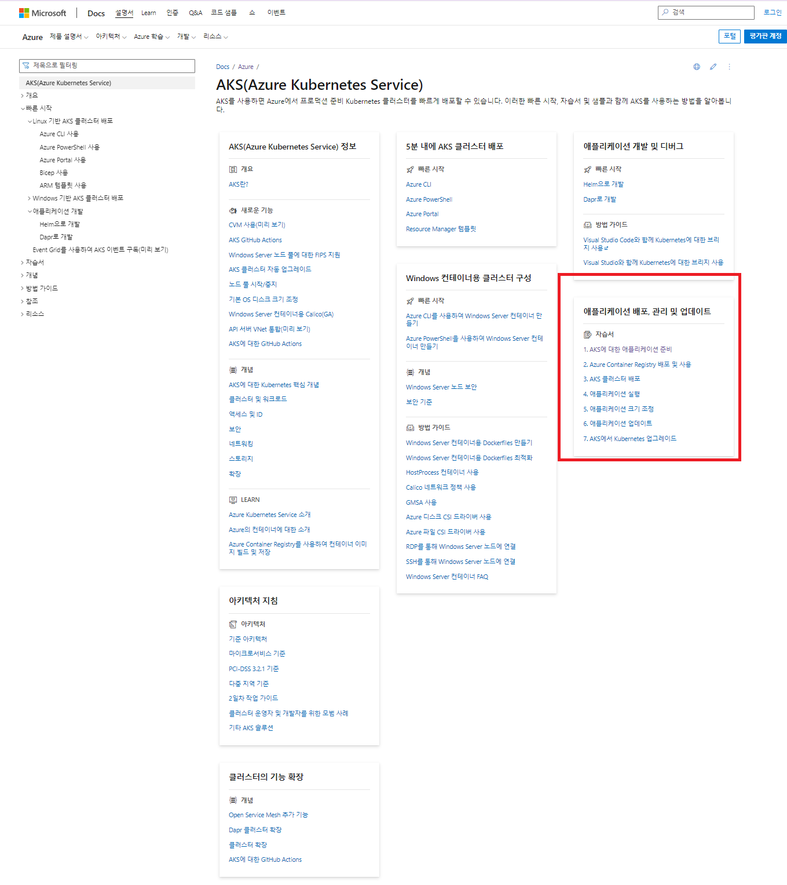
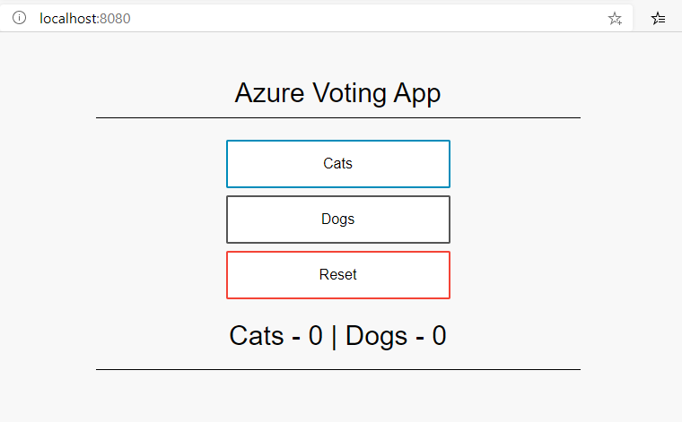
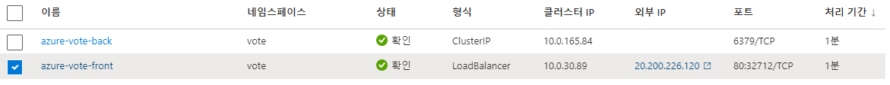
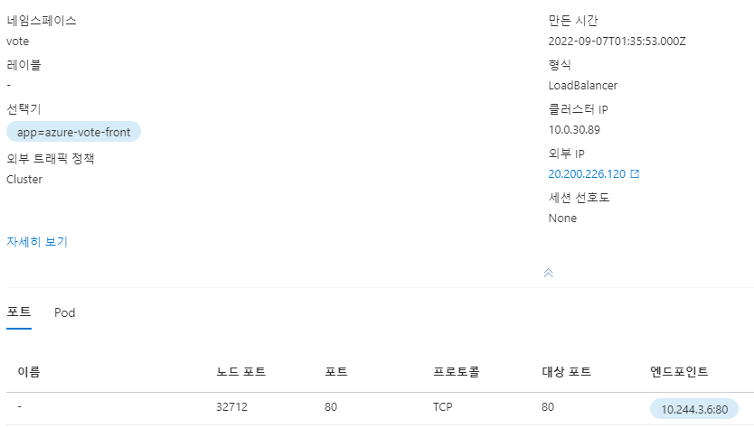

(pipeline:41-AKS애플리케이션배포)=
# AKS 애플리케이션배포(Azure가이드정리)
-https://docs.microsoft.com/ko-kr/azure/aks/tutorial-kubernetes-prepare-app


## 1 - AKS를 위한 애플리케이션 준비
목표
- GitHub에서 애플리케이션 예제 소스 복제
- 애플리케이션 예제 소스로 컨테이너 이미지 만들기
- 로컬 Docker 환경에서 다중 컨테이너 애플리케이션 테스트


### 1.1 애플리케이션 코드 가져오기
프런트 엔드 웹 구성 요소 및 백 엔드 Redis 인스턴스로 구성된 기본 투표 앱
  ```bash
  git clone https://github.com/Azure-Samples/azure-voting-app-redis.git
  ```
### 1.2 컨테이너 이미지 만들기
Docker Compose는 컨테이너 이미지 빌드 및 다중 컨테이너 애플리케이션 배포를 자동화하는 데 사용

- 샘플 docker-compose.yaml 파일을 사용하여 컨테이너 이미지를 만들고, Redis 이미지를 다운로드하고, 애플리케이션을 시작
  ```bash
  docker-compose up -d
  ```
  ```bash
  $ docker images
  REPOSITORY                                     TAG         IMAGE ID       CREATED             SIZE
  acr13myinno/azure-vote-front                   v2          3e61a2eb2c5a   About an hour ago   908MB
  mcr.microsoft.com/azuredocs/azure-vote-front   v1          3e61a2eb2c5a   About an hour ago   908MB
  acr13myinno.azurecr.io/azure-vote-front        v2          3e61a2eb2c5a   About an hour ago   908MB
  acr13myinno.azurecr.io/azure-vote-front        v1          983024eac785   3 hours ago         908MB
  acr13myinno/azure-vote-front                   v1          983024eac785   3 hours ago         908MB
  mcr.microsoft.com/oss/bitnami/redis            6.0.8       3a54a920bb6c   23 months ago       103MB
  mcr.microsoft.com/azuredocs/azure-vote-front   <none>      4d4d08c25677   4 years ago         935MB
  ```
  ```bash
  docker ps
  # 2기동 확인
  ```
### 1.3 로컬에서 애플리케이션 테스트
http://localhost:8080

### 1.4 리소스 정리
  ```bash
  docker-compose down
  ```
## 2 - 컨테이너 레지스트리 만들기
ACR(Azure Container Registry) 인스턴스 만들기
ACR에 대한 컨테이너 이미지 태그 지정
ACR에 이미지 업로드
레지스트리의 이미지 보기

## 2.0 전역변수 설정

```bash
az login # Sign into an azure account(부라우저에서  로그인 함)
az account show # See the currently signed-in account.
# 교육시 사용한 그룹

# Azure 리소스 이름
AZ_RESOURCE_GROUP=rg-aks
# 쿠베네트스 이름
AZ_AKS_NAME=myAKSCluster
# Azure 리파지토리 이름
AZ_ACR_NAME=acr13myinno

az configure --defaults group=$AZ_RESOURCE_GROUP
#az configure --defaults spring=$AZ_SPRING_APPS_NAME

K8S_NAMESPACE=confluent
```

### 2.1 Azure Container Registry 만들기
1. 리소스 그룹 생성
    ```bash
    az group create --name $AZ_RESOURCE_GROUP --location koreacentral
    ```
2. az acr create 명령을 사용하여 Azure Container Registry 인스턴스생성
  - <acrName> = acr13myinno
    ```bash
    az acr create --resource-group $AZ_RESOURCE_GROUP --name $AZ_ACR_NAME --sku Basic
    ```
### 2.2 컨테이너 레지스트리에 로그인
1. ACR 인스턴스를 사용하려면 먼저 로그인
    ```bash
    az acr login --name $AZ_ACR_NAME
    ```
### 2.3 컨테이너 이미지 태그 지정
1. 로컬 이미지 목록
    ```bash
    docker images
    ```
2. ACR에 azure-vote-front 컨테이너 이미지를 사용하려면 레지스트리의 로그인 서버 주소를 사용하여 이미지에 태그를 지정해야 함
    ```bash
    $ az acr list --resource-group $AZ_RESOURCE_GROUP --query "[].{acrLoginServer:loginServer}" --output table

    AcrLoginServer
    ----------------------
    acr13myinno.azurecr.io
    ```
3.  acrLoginServer 주소를 사용하여 로컬 azure-vote-front 이미지에 태그를 지정
    ```bash
    docker tag mcr.microsoft.com/azuredocs/azure-vote-front:v1 $AZ_ACR_NAME.azurecr.io/azure-vote-front:v1
    ```
4. 태그가 적용되었는지 확인하려면 docker images
    ```bash
    docker images
    ```
### 2.4 레지스트리에 이미지 푸시
1. 빌드 및 태그가 지정된 이미지를 사용하여 azure-vote-front 이미지를 ACR 인스턴스로 푸시
    ```bash
    docker push $AZ_ACR_NAME.azurecr.io/azure-vote-front:v1
    ```
### 2.5 레지스트리에서 이미지 나열
1. CR 인스턴스로 푸시된 이미지 목록을 반환
    ```bash
    az acr repository list --name $AZ_ACR_NAME --output table
    ```
2. 특정 이미지의 태그 확인
    ```bash
    az acr repository show-tags --name $AZ_ACR_NAME --repository azure-vote-front --output table
    ```
## 3 - Kubernetes 클러스터 만들기
- Azure container registry에 인증할 수 있는 Kubernetes AKS 클러스터 배포
- Kubernetes CLI(kubectl) 설치
- AKS 클러스터에 연결하도록 kubectl 구성

### 3.1 Kubernetes 클러스터 만들기
1. az aks create 명령을 사용하여 AKS 클러스터를 만듭
   - generate-ssh-keys: ssl로그인을 위하여
   - attach-acr: 이미지 배포시 az Repository에 접근하기 위하여
    ```bash
    az aks create \
        --resource-group $AZ_RESOURCE_GROUP \
        --name $AZ_AKS_NAME \
        --node-count 2 \
        --generate-ssh-keys \
        --attach-acr $AZ_ACR_NAME
    ```
### 3.2 Kubernetes CLI 설치
1. az aks install-cli 명령을 사용하여 kubectl을 로컬로 설치
   - Azure Cloud Shell을 사용하는 경우 kubectl이 이미 설치되어 있습
    ```bash
    az aks install-cli
    ```
### 3.3 kubectl을 사용하여 클러스터에 연결
 1. Kubernetes 클러스터에 연결하도록 kubectl을 구성
    - 아래 작업을 하면 "c:\Users\Administrator\.kube\config"파일이 생성됨
    - 동일 계정으로 다시 생성하는 경우는 해당 파일 삭제후 다시 생성(단 다른 정보도 삭제됨-해당 계정만 삭제)
    ```bash
    az aks get-credentials --resource-group $AZ_RESOURCE_GROUP --name $AZ_AKS_NAME
    ```
1. 클러스터 노드 목록
    ```bash
    kubectl get nodes
    ```
### 3.4 별도의NameSpace로 관리
```bash
$ kubectl create namespace vote
namespace/vote created

$ kubectl config set-context --current --namespace vote
```

## 4 - 애플리케이션 실행
- Kubernetes 매니페스트 파일 업데이트
- Kubernetes에서 애플리케이션 실행
- 애플리케이션 테스트
### 4.1 매니페스트 파일 업데이트
1. ACR(Azure Container Registry) 인스턴스가 애플리케이션 예제용 컨테이너 이미지를 저장
   - 애플리케이션을 배포하려면 ACR 로그인 서버 이름을 포함하도록 Kubernetes 매니페스트 파일에서 이미지 이름을 업데이트해야 합니다.
    ```bash
    $ az acr list --resource-group $AZ_RESOURCE_GROUP --query "[].{acrLoginServer:loginServer}" --output table
    AcrLoginServer
    ----------------------
    $AZ_ACR_NAME.azurecr.io
    ```
2. 매니페스트 파일 수정
   - 이미지 다운을 acr에서 하기 위하여 수정 (PC에서 직접 수정)
   - azure-vote-all-in-one-redis.yaml
    ```bash
    image: mcr.microsoft.com/azuredocs/azure-vote-front:v1
    -->
    image: acr13myinno.azurecr.io/azure-vote-front:v1
    ```
### 4.2 애플리케이션 배포
1. 배포하려면 kubectl apply 명령을 사용합니다. 이 명령은 매니페스트 파일을 구문 분석하고 정의된 Kubernetes 개체를 만듭
    ```bash
    $ kubectl apply -f azure-vote-all-in-one-redis.yaml

    deployment "azure-vote-back" created
    service "azure-vote-back" created
    deployment "azure-vote-front" created
    service "azure-vote-front" created
    ```
### 4.3 애플리케이션 테스트
1. 진행 상태를 모니터링용
    ```bash
    kubectl get service azure-vote-front --watch
    ```
2. 애플리케이션이 실제로 작동하는 모습을 보려면 웹 브라우저를 서비스의 외부 IP 주소로 엽니다
   - EXTERNAL-IP로 브라우저에서 테스트(80 port)
   - 로컬과 동일기능이 되는지 확인

## 5 - 애플리케이션 크기 조정
- Kubernetes 노드 크기 조정
- 애플리케이션을 실행하는 Kubernetes Pod의 크기를 수동으로 조정
- 앱 프런트 엔드를 실행하는 Pod 자동 크기 조정 구성

### 5.1 수동으로 Pod 크기 조정
1. Pod의 수와 상태를 확인
    ```bash
    kubectl get pods
    ```
2.  프런트 엔드 Pod 수를 5로
    ```bash
    kubectl scale --replicas=5 deployment/azure-vote-front
    ```
### 5.2 Pod 자동 크기 조정
1. 메트릭 서버는 Kubernetes에 리소스 사용률을 제공하는 데 사용되며, AKS 클러스터 버전 1.10 이상에서 자동으로 배포됩니다.
    ```bash
    az aks show --resource-group $AZ_RESOURCE_GROUP --name $AZ_AKS_NAME --query kubernetesVersion --output table
    ```
2. azure-vote-front 배포에서 프런트 엔드 컨테이너는 0.25 CPU를 요청하며 제한은 0.5 CPU
    ```bash
    containers:
    - name: azure-vote-front
        image: mcr.microsoft.com/azuredocs/azure-vote-front:v1
        ports:
        - containerPort: 80
        resources:
        requests:
            cpu: 250m
        limits:
            cpu: 500m
    ```
3. kubectl autoscale 명령을 사용하여 azure-vote-front 배포의 Pod 수를 자동으로 조정
    ```bash
    kubectl autoscale deployment azure-vote-front --cpu-percent=50 --min=3 --max=10
    ```
4. 또는 매니페스트 파일을 만들어 자동 크기 조정기 동작 및 리소스 제한을 정의
    azure-vote-hpa.yaml
    ```bash
    apiVersion: autoscaling/v1
    kind: HorizontalPodAutoscaler
    metadata:
    name: azure-vote-back-hpa
    spec:
    maxReplicas: 10 # define max replica count
    minReplicas: 3  # define min replica count
    scaleTargetRef:
        apiVersion: apps/v1
        kind: Deployment
        name: azure-vote-back
    targetCPUUtilizationPercentage: 50 # target CPU utilization

    ---

    apiVersion: autoscaling/v1
    kind: HorizontalPodAutoscaler
    metadata:
    name: azure-vote-front-hpa
    spec:
    maxReplicas: 10 # define max replica count
    minReplicas: 3  # define min replica count
    scaleTargetRef:
        apiVersion: apps/v1
        kind: Deployment
        name: azure-vote-front
    targetCPUUtilizationPercentage: 50 # target CPU utilization
    ```
5. kubectl apply를 사용하여 azure-vote-hpa.yaml 매니페스트 파일에 정의된 자동 크기 조정기를 적용
    ```bash
    kubectl apply -f azure-vote-hpa.yaml
    ```
6. 자동 조정기의 상태를 확인
    ```bash
    kubectl get hpa

    NAME               REFERENCE                     TARGETS    MINPODS   MAXPODS   REPLICAS   AGE
    azure-vote-front   Deployment/azure-vote-front   0% / 50%   3         10        3          2m
    ```
### 5.3 수동으로 AKS 노드 크기 조정
1. Kubernetes 클러스터의 노드 수를 3개로 늘립니다
    ```bash
    az aks scale --resource-group $AZ_RESOURCE_GROUP --name $AZ_AKS_NAME --node-count 3
    ```
## 6 - 애플리케이션 업데이트
- 프런트 엔드 애플리케이션 코드 업데이트
- 업데이트된 컨테이너 이미지 만들기
- Azure Container Registry에 컨테이너 이미지 푸시
- 업데이트된 컨테이너 이미지 배포

### 6.1 애플리케이션 업데이트
업무 수정
1. config_file.cfg 수정
    ```bash
    vi azure-vote/azure-vote/config_file.cfg

    # UI Configurations
    TITLE = 'Azure Voting App'
    VOTE1VALUE = 'Blue'
    VOTE2VALUE = 'Purple'
    SHOWHOST = 'false'
    ```
### 6.2 컨테이너 이미지 업데이트
1. 프런트 엔드 이미지를 다시 만들고 업데이트된 애플리케이션을 테스트하려면 docker-compose 명령을 사용합니다. --build 인수를 사용
    ```bash
    docker-compose up --build -d
    ```
### 6.3 로컬에서 애플리케이션 테스트
1. http://localhost:8080
   - 변경된 화면 확인

### 6.4 이미지 태그 지정 및 밀어넣기
1. 업데이트된 이미지를 올바르게 사용하려면 azure-vote-front 이미지에 ACR 레지스트리의 로그인 서버 이름을 태그로 지정
    ```bash
    az acr list --resource-group $AZ_RESOURCE_GROUP --query "[].{acrLoginServer:loginServer}" --output table
    ```

2. 이미지 버전을 :v2로 업데이트
    ```bash
    docker tag mcr.microsoft.com/azuredocs/azure-vote-front:v1 $AZ_ACR_NAME.azurecr.io/azure-vote-front:v2
    ```
3. 이미지를 업로드
    ```bash
    docker push $AZ_ACR_NAME.azurecr.io/azure-vote-front:v2
    ```
### 6.5 업데이트된 애플리케이션 배포
1. kubectl get pods 명령을 사용하여 실행 중인 프런트 엔드 인스턴스 수를 확인
    ```bash
    $ kubectl get pods

    NAME                               READY     STATUS    RESTARTS   AGE
    azure-vote-back-217588096-5w632    1/1       Running   0          10m
    azure-vote-front-233282510-b5pkz   1/1       Running   0          10m
    azure-vote-front-233282510-dhrtr   1/1       Running   0          10m
    azure-vote-front-233282510-pqbfk   1/1       Running   0          10m
    ```

2. azure-vote-front 배포를 확장
    ```bash
    kubectl scale --replicas=3 deployment/azure-vote-front
    ```
3. 애플리케이션을 업데이트하려면 kubectl set 명령을 사용
    ```bash
    kubectl set image deployment azure-vote-front azure-vote-front=$AZ_ACR_NAME.azurecr.io/azure-vote-front:v2
    ```
4. 업데이트된 애플리케이션이 배포되면 Pod가 종료되고 새 컨테이너 이미지로 다
    ```bash
    kubectl get pods
    ```
### 6.6 업데이트된 애플리케이션 테스트
1. azure-vote-front 서비스의 외부 IP 주소를 가져옵니다
    ```bash
    kubectl get service azure-vote-front
    ```
## 7- 클러스터 업그레이드
- 현재 및 사용 가능한 Kubernetes 버전 확인
- Kubernetes 노드 업그레이드
- 성공적인 업그레이드의 유효성 검사
- (이 부분은 테스트 하지 않음: 2022-09-01)

### 7.1 사용 가능한 클러스터 버전 가져오기
1. 클러스터를 업그레이드하려면 먼저 az aks get-upgrades 명령을 사용하여 업그레이드할 수 있는 Kubernetes 릴리스를 확인
    ```bash
    az aks get-upgrades --resource-group $AZ_RESOURCE_GROUP --name $AZ_AKS_NAME
    ```
### 7.2 클러스터 업그레이드
이 프로세스에서 다음 단계가 수행

1. Kubernetes 스케줄러는 업그레이드될 노드에서 추가 Pod가 예약되지 않도록 합니다.
2. 노드에서 실행 중인 Pod가 클러스터의 다른 노드에서 예약됩니다.
3. 최신 Kubernetes 구성 요소를 실행하는 노드가 만들어집니다.
4. 새 노드가 준비되고 클러스터에 조인될 때 Kubernetes 스케줄러에서 Pod를 실행하기 시작합니다.
5. 이전 노드가 삭제되고, 클러스터의 다음 노드가 차단 및 드레이닝 프로세스를 시작합니다.

1. az aks upgrade 명령을 사용하여 AKS 클러스터를 업그레이드
```bash
az aks upgrade \
    --resource-group $AZ_RESOURCE_GROUP \
    --name $AZ_AKS_NAME \
    --kubernetes-version KUBERNETES_VERSION
```

### 7.3 업그레이드 유효성 검사
1. az aks show 명령을 사용하여 업그레이드가 성공했는지 확인합니다.
```bash
az aks show --resource-group $AZ_RESOURCE_GROUP --name $AZ_AKS_NAME --output table
```

### 7.4 클러스터 삭제
Kubernetes 노드가 Azure VM(가상 머신)에서 실행되므로 클러스터를 사용하지 않더라도 요금이 계속 부과

 az group delete 명령을 사용하여 리소스 그룹, 컨테이너 서비스 및 모든 관련 리소스를 제거
```bash
az group delete --name $AZ_RESOURCE_GROUP --yes --no-wait
```
## A. 주요 설정 파일 내용

### A.1 docker-compose.yaml

```yaml
version: '3'
services:
  azure-vote-back:
    image: mcr.microsoft.com/oss/bitnami/redis:6.0.8
    container_name: azure-vote-back
    environment:
      ALLOW_EMPTY_PASSWORD: "yes"
    ports:
        - "6379:6379"

  azure-vote-front:
    build: ./azure-vote
    image: mcr.microsoft.com/azuredocs/azure-vote-front:v1
    container_name: azure-vote-front
    environment:
      REDIS: azure-vote-back
    ports:
        - "8080:80"
```

### A.2 azure-vote-all-in-one-redis.yaml

```yaml
apiVersion: apps/v1
kind: Deployment
metadata:
  name: azure-vote-back
spec:
  replicas: 1
  selector:
    matchLabels:
      app: azure-vote-back
  template:
    metadata:
      labels:
        app: azure-vote-back
    spec:
      nodeSelector:
        "beta.kubernetes.io/os": linux
      containers:
      - name: azure-vote-back
        image: mcr.microsoft.com/oss/bitnami/redis:6.0.8
        env:
        - name: ALLOW_EMPTY_PASSWORD
          value: "yes"
        ports:
        - containerPort: 6379
          name: redis
---
apiVersion: v1
kind: Service
metadata:
  name: azure-vote-back
spec:
  ports:
  - port: 6379
  selector:
    app: azure-vote-back
---
apiVersion: apps/v1
kind: Deployment
metadata:
  name: azure-vote-front
spec:
  replicas: 1
  selector:
    matchLabels:
      app: azure-vote-front
  strategy:
    rollingUpdate:
      maxSurge: 1
      maxUnavailable: 1
  minReadySeconds: 5
  template:
    metadata:
      labels:
        app: azure-vote-front
    spec:
      nodeSelector:
        "beta.kubernetes.io/os": linux
      containers:
      - name: azure-vote-front
        image: mcr.microsoft.com/azuredocs/azure-vote-front:v1
        ports:
        - containerPort: 80
        resources:
          requests:
            cpu: 250m
          limits:
            cpu: 500m
        env:
        - name: REDIS
          value: "azure-vote-back"
---
apiVersion: v1
kind: Service
metadata:
  name: azure-vote-front
spec:
  type: LoadBalancer
  ports:
  - port: 80
  selector:
    app: azure-vote-front
```

## B. 실행화면



