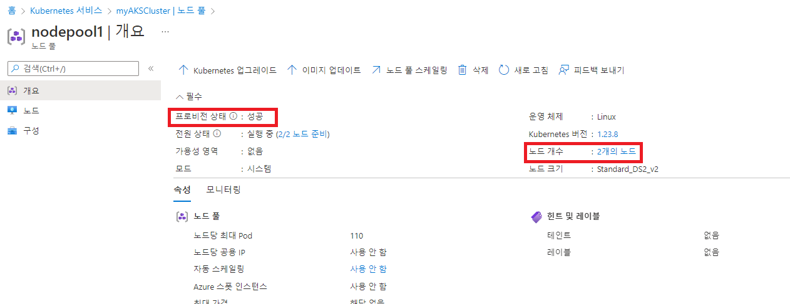
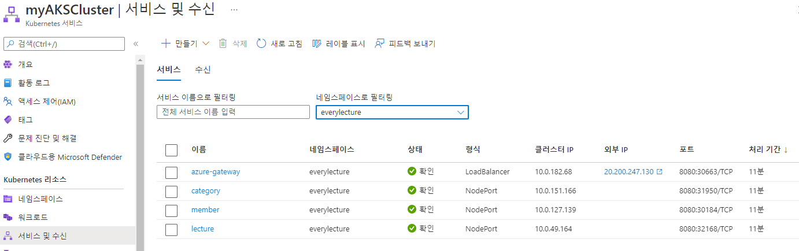
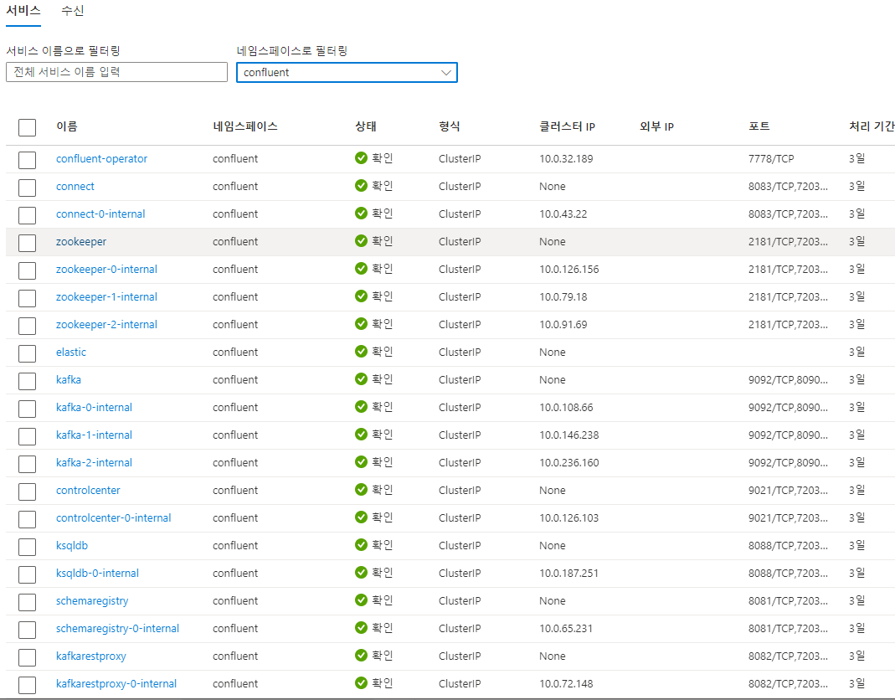
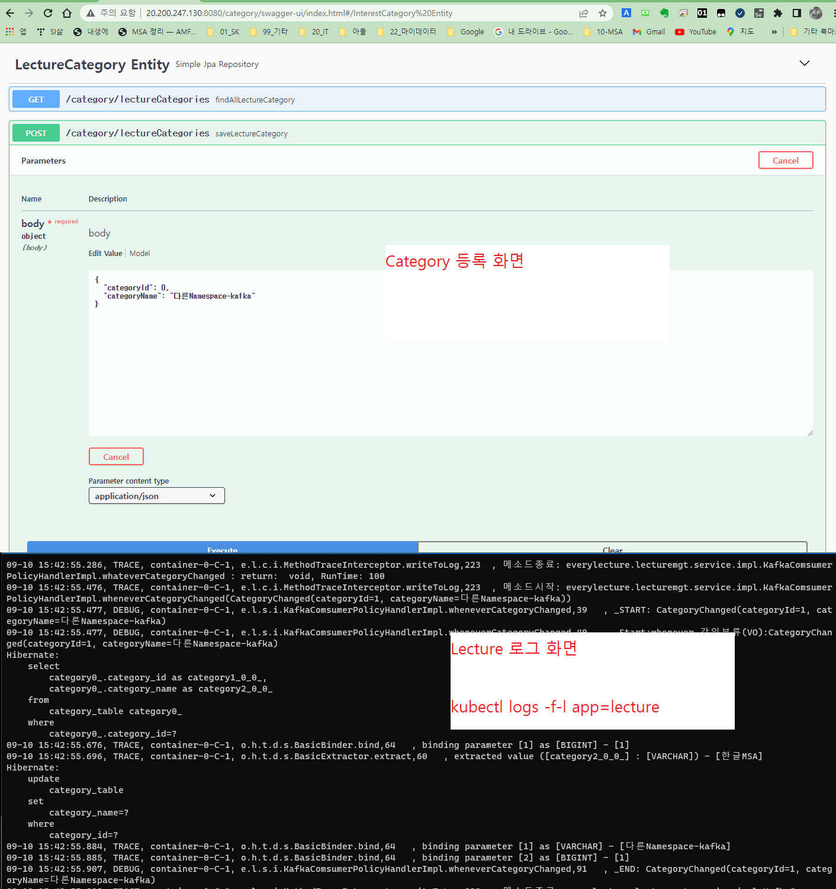

<style>
.burk {
    background-color: red;
    color: yellow;
    display:inline-block;
}
</style>

# 모두의 강의 AKS 배포(자체)
- [AKS 배포(Azure Docs)](https://docs.microsoft.com/ko-kr/azure/aks/tutorial-kubernetes-prepare-app)
- [자체 요약정리](41-AKS애플리케이션배포.md)

EveryLecture를 AKS에 배포해 보자(2022-09-02)

- https://docs.microsoft.com/ko-kr/azure/aks/configure-kubenet
  (가상 네트워크에서 AKS 클러스터 만들기)


## 1. AKS 생성

### 1.1 기본 환경변수 설정
```bash
az login # Sign into an azure account(부라우저에서  로그인 함)
az account show # See the currently signed-in account.
# 교육시 사용한 그룹

# Azure 리소스 이름
AZ_RESOURCE_GROUP=rg-aks
# 쿠베네트스 이름
AZ_AKS_NAME=myAKSCluster
# Azure 리파지토리 이름
AZ_ACR_NAME=acr13myinno

az configure --defaults group=$AZ_RESOURCE_GROUP
#az configure --defaults spring=$AZ_SPRING_APPS_NAME

K8S_NAMESPACE=everylecture
SUBNET_ID=myAKSSubnet
```
- app을 배포하는 resource_group은 "everylecture"
### 1.2 기본 리소스 생성
1. 리소스 그룹 생성 (처음 한번)
    ```bash
    $ az group create --name $AZ_RESOURCE_GROUP --location koreacentral
    ```
2. 네트워크 생성(생략-제거 대상)
    ```bash
    az network vnet create \
        --resource-group $AZ_RESOURCE_GROUP \
        --name myAKSVnet \
        --address-prefixes 192.168.0.0/16 \
        --subnet-name myAKSSubnet \
        --subnet-prefix 192.168.1.0/24
    ```
3. az acr create 명령을 사용하여 Azure Container Registry 인스턴스생성(가이드에 없음)
   - 도커 이미지를 저장하는 Azure에 있는 저장소(10s)
    ```bash
    az acr create --resource-group $AZ_RESOURCE_GROUP --name $AZ_ACR_NAME --sku Basic
    ```

4. aks 생성(console cli에서 수행, 일정 시간 소비 5분)
   ```bash
   SUBNET_ID=$(az network vnet subnet show --resource-group $AZ_RESOURCE_GROUP --vnet-name myAKSVnet --name myAKSSubnet --query id -o tsv)
   ```
   - attach-acr는 배포를 위하여 추가
   - 약간의 시간이 소비됨
   - 생성중 오류가 발생하면 ACI cloud CLI에서 수행 권고

   - <span class=burk>POD간 네트워크를 Azure 방식으로</span>
   ```bash
   az aks create \
        --resource-group $AZ_RESOURCE_GROUP \
        --name $AZ_AKS_NAME \
        --node-count 2 \
        --attach-acr $AZ_ACR_NAME \
        --network-plugin azure \
        --network-policy azure
   ```
   - bash.sh에서 수행하면 "ERROR: --vnet-subnet-id is not a valid Azure resource ID." 오류 발생 ==> console cli에서 수행함

5. AKS 상태 확인



### 1.3 Kubernetes CLI 설치
1. az aks install-cli 명령을 사용하여 kubectl을 로컬에 설치
   - Azure Cloud Shell을 사용하는 경우 kubectl이 이미 설치되어 있습
   - 이전 설치 이력이 있으면 아래 디렉토리 삭제후 작업(c:\Users\Administrator\.azure-kubelogin\,  .azure-kubectl)    \
    ```bash
    az aks install-cli
    ```
### 1.4 kubectl을 사용하여 클러스터에 연결
 1. Kubernetes 클러스터에 연결하도록 kubectl을 구성
    - 아래 작업중 오류가 발생하면 아래 "C:\Users\Administrator\.kube\config" 삭제후 처리
    ```bash
    az aks get-credentials --resource-group $AZ_RESOURCE_GROUP --name $AZ_AKS_NAME
    ```
2. 클러스터 노드 목록 (기본으로 2개 출력됨)
    ```bash
    kubectl get nodes
    ```
<span class=burk>여기 까지 하면 **AKS** 사용 가능한 상태 </span>

## 2. aks 환경 설정

ACR(Azure Container Registry) 인스턴스 만들기
ACR에 대한 컨테이너 이미지 태그 지정: docker push를 Azure로 하기 위하여
ACR에 이미지 업로드
레지스트리의 이미지 보기

1. kafka 관련
   - 처음에는 별도 설치했음(43-AzureKafka설치.md <== 다양한 기능 있음, 한 번정도 생성 권고함)
   - 최종은 docker기반으로 실행한 그대로 AKS로 이동 했음(비용 고려)
### 2.1 Azure Container Registry 만들기

1. az acr create 명령을 사용하여 Azure Container Registry 인스턴스생성
   - 도커 이미지를 저장하는 Azure에 있는 저장소(30s)
    ```bash
    az acr create --resource-group $AZ_RESOURCE_GROUP --name $AZ_ACR_NAME --sku Basic
    ```

### 2.2 컨테이너 레지스트리에 로그인
1. ACR 인스턴스를 사용하려면 먼저 로그인
    ```bash
    az acr login --name $AZ_ACR_NAME
    ```
### 2.3 컨테이너 이미지 태그 지정
1. 로컬 이미지 목록
    ```bash
    $ docker images
    REPOSITORY                  TAG         IMAGE ID       CREATED              SIZE
    backend_gateway             latest      e508e700c677   About a minute ago   375MB
    mysql                       5.7         daff57b7d2d1   8 days ago           430MB
    jenkins_jenkins-blueocean   latest      b552f3e66e69   10 days ago          779MB
    myjenkins-blueocean         2.346.3-1   b552f3e66e69   10 days ago          779MB
    docker                      dind        780523c12933   2 weeks ago          310MB
    confluentinc/cp-kafka       7.2.1       d893473a6510   7 weeks ago          782MB
    confluentinc/cp-zookeeper   7.2.1       3f28db6a433d   7 weeks ago          782MB
    ```
2. ACR에 azure-vote-front 컨테이너 이미지를 사용하려면 레지스트리의 로그인 서버 주소를 사용하여 이미지에 태그를 지정해야 합
    ```bash
    $ az acr list --resource-group $AZ_RESOURCE_GROUP --query "[].{acrLoginServer:loginServer}" --output table

    AcrLoginServer
    ----------------------
    acr13myinno.azurecr.io
    ```
3.  acrLoginServer 주소를 사용하여 로컬 이미지에 태그를 지정
    - confluentinc/cp-zookeeper
    - confluentinc/cp-kafka
    - mysql (제거- 서버 설치버전으로)
    - backend_gateway

    ```bash
    docker tag confluentinc/cp-zookeeper:7.2.1 acr13myinno.azurecr.io/cp-zookeeper:7.2.1
    docker tag confluentinc/cp-kafka:7.2.1 acr13myinno.azurecr.io/cp-kafka:7.2.1
    docker tag backend_gateway:latest acr13myinno.azurecr.io/gateway:latest

    docker tag backend_lecture:latest acr13myinno.azurecr.io/lecture:latest
    docker tag backend_member:latest acr13myinno.azurecr.io/member:latest
    docker tag backend_category:latest acr13myinno.azurecr.io/category:latest

    ```
4. 태그가 적용되었는지 확인하려면 docker images
    ```bash
    docker images
    ```
### 2.4 레지스트리에 이미지 푸시
1. 빌드 및 태그가 지정된 이미지를 사용하여 이미지를 ACR 인스턴스로 푸시
    ```bash
    docker push acr13myinno.azurecr.io/cp-zookeeper:7.2.1
    docker push acr13myinno.azurecr.io/cp-kafka:7.2.1
    docker push acr13myinno.azurecr.io/gateway:latest

    docker push acr13myinno.azurecr.io/lecture:latest
    docker push acr13myinno.azurecr.io/member:latest
    docker push acr13myinno.azurecr.io/category:latest
    ```

    - 만약 push 과정에서 "unauthorized: authentication required" 오류 가 밝생하면
    ```bash
    az acr login --name $AZ_ACR_NAME
    ```
### 2.5 레지스트리에서 이미지 나열
1. 특정 이미지의 태그 확인(push된 이미지 확인)
    ```bash
    $ az acr repository list --name $AZ_ACR_NAME --output table

    Result
    ---------------
    gateway
    cp-kafka
    cp-zookeeper
    mysql
    ```

## 3 - 애플리케이션 실행
- Kubernetes 매니페스트 파일 업데이트
- Kubernetes에서 애플리케이션 실행
- 애플리케이션 테스트

### 3.1 애플리케이션 배포
1. 애플리케이션용 별도의 NameSpace 생성 (처음 한번만)
   - 배포하는 에플리케이션이 서로 다른 NameSpace에 설치되는 경우 서버 설정이 약간 변경됨
   - 동일NameSpace: kafka:9092
   - 다른 NameSpace: kafka.NameSpace이름:9092
    ```bash
    K8S_NAMESPACE=everylecture
    kubectl create namespace $K8S_NAMESPACE
    ```

2. 작업대상 NameSpace지정 (처음부터 여기까지 했으면 무시, 다시 로그인 한경우)
    ```bash
    K8S_NAMESPACE=everylecture
    kubectl config set-context --current --namespace $K8S_NAMESPACE
    ```


3. 배포하려면 kubectl apply 명령을 사용합니다. 이 명령은 매니페스트 파일을 구문 분석하고 정의된 Kubernetes 개체를 만듭
   - "/d/app/GIT-AMF3/backend/doc/server-k8s" 아래 파일이 있는 위치에서 수행
   -
    ```bash
    $ kubectl apply -f k8s-kafka.yml
    $ kubectl apply -f k8s-gateway.yml
    $ kubectl apply -f k8s-member.yml
    $ kubectl apply -f k8s-category.yml
    $ kubectl apply -f k8s-lecture.yml
    ```

4. k8s-lecture.yml  실행 확인
   - pod 상세 확인
    ```bash
    kubectl describe pods lecture-6b66d8f4c-thzgm

    ---마지막 로그
    Events:
    Type    Reason     Age   From               Message
    ----    ------     ----  ----               -------
    Normal  Scheduled  45s   default-scheduler  Successfully assigned everylecture/lecture-6b66d8f4c-thzgm to aks-nodepool1-39826085-vmss00000b
    Normal  Pulling    44s   kubelet            Pulling image "acr13myinno.azurecr.io/lecture"
    Normal  Pulled     40s   kubelet            Successfully pulled image "acr13myinno.azurecr.io/lecture" in 4.324230583s
    Normal  Created    40s   kubelet            Created container lecture
    Normal  Started    40s   kubelet            Started container lecture
    ```
   - pod 상세 로그
```bash
kubectl logs -f -l app=lecture인
```

### 3.2 애플리케이션 테스트
1. 진행 상태를 모니터링하려
    ```bash
    kubectl get service azure-gateway --watch
    ```
2. 애플리케이션이 실제로 작동하는 모습을 보려면 웹 브라우저를 서비스의 외부 IP 주소로 엽니다
   - EXTERNAL-IP로 브라우저에서 테스트(80 port)
   - 로컬과 동일기능이 되는지 확인

### 3.3 NameSpace가 다른 경우
kafka=confluent,  일반 APP은 "everylecture"로 Namespace을 다르게 구성한 경우는 각각의 application.yaml을 수정 해여 함

- lecture의 application.yaml
    ```yaml
    spring:
    cloud:
        stream:
        kafka:
            binder:
    #          brokers: kafka:9092
            brokers: kafka.confluent:9092
    ```
## 4. 몇가지 수행 화면
1. gateway만 LoadBalancer설정함
   
2. kafka는 "confluent" NameSpace로 설정
   
3. 테스트 (category 등록)
   

## 5. 최종적으로는 kafka도 docker 기반으로 변경해서 테스트 완료
```bash
# 서버 접속
$ kubectl exec -it kafka-7d57bff879-nm744 sh
kubectl exec [POD] [COMMAND] is DEPRECATED and will be removed in a future version. Use kubectl exec [POD] -- [COMMAND] instead.

# 토픽 리스트 조회
sh-4.4$ /bin/kafka-topics --list --bootstrap-server localhost:9092
__consumer_offsets
lecture
lectureChanged

# 특정 토픽 데이터 조회
sh-4.4$ /bin/kafka-console-consumer \
>        --bootstrap-server localhost:9092 \
>        --topic lecture \
>        --from-beginning
{"eventType":"LectureCategoryRegistered","timestamp":1662795780010,"categoryId":1,"categoryName":"한글로컬"}

```

## 6. mysql 이외는 기존 Docker기반을 그대로 kubectl로 실행 했음
- mysql은 무료 사용 기간 동안은 해당 서비스 이용
- kafka는 별도 설치하면 다양한 모니터링을 제공하고 있으나 (관련 pod가 15개 정도 임)
- 비용등을 고려하여 docker기반으로 테스트 전환
