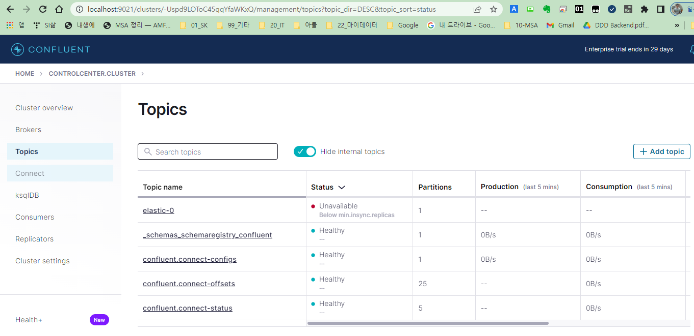

<style>
.burk {
    background-color: red;
    color: yellow;
    display:inline-block;
}
</style>


# Kafka on k8s
[원본 가이드-Confluent for Kubernetes Quickstart](https://docs.confluent.io/operator/current/co-quickstart.html)

[namespace 강제 삭제](https://computingforgeeks.com/how-to-force-delete-a-kubernetes-namespace)
How to force delete a Kubernetes Namespace)
- kafka 설치이후 Namespace 삭제가 안됨
- 토픽에 자료가 있어 삭제가 안되듯 --> 강제 삭제하는 가이드

## 1. 가이드에 있는 내용 그대로 따라 하기

### Step 0:기본 환경 설정 (이 부분은 1,2,3모두 적용됨)
- bash 에서 az 로그인 가능 하여야 함
- 기본 환경설정 (namespace 또는 리소스 이름 일괄 변경을 위하여)
    ```bash
    az login # Sign into an azure account(부라우저에서  로그인 함)
    az account show # See the currently signed-in account.
    # 교육시 사용한 그룹

    # Azure 리소스 이름
    AZ_RESOURCE_GROUP=rg-aks
    # 쿠베네트스 이름
    AZ_AKS_NAME=myAKSCluster
    # Azure 리파지토리 이름
    AZ_ACR_NAME=acr13myinno

    az configure --defaults group=$AZ_RESOURCE_GROUP
    #az configure --defaults spring=$AZ_SPRING_APPS_NAME
    K8S_NAMESPACE=confluent

    ```

### Step1:Create a namespace
1. Create the namespace to use
    ```bash
    K8S_NAMESPACE=confluent
    kubectl create namespace $K8S_NAMESPACE
    ```
2. namespace default값 설정
   - 이후는 별도 지정하지 않으면 해당 ns로 설정됨
   - 위에서 환경설정에서 했으므로 무시해도...
    ```bash
    kubectl config set-context --current --namespace $K8S_NAMESPACE
    ```
### Step 2: Install Confluent for Kubernetes
1. Add the Confluent for Kubernetes Helm repository
    ```bash
    helm repo add confluentinc https://packages.confluent.io/helm
    helm repo update
    ```
2. Install Confluent for Kubernetes.
    ```bash
    helm upgrade --install confluent-operator confluentinc/confluent-for-kubernetes
    ```
### Step 3: Install Confluent Platform
여기서는 zookeeper, kafka는 3개의 pod가 구성됨 ==> 이후 1개로 변경예정
1. Install all Confluent Platform components.
   - zookeeper가 설치됨
    ```bash
    kubectl apply -f https://raw.githubusercontent.com/confluentinc/confluent-kubernetes-examples/master/quickstart-deploy/confluent-platform.yaml
    ```

    ```bash
    kubectl get pods
    ```
2. Install a sample producer app and topic.(kafka 관련 pod 설치됨)
    ```bash
    kubectl apply -f https://raw.githubusercontent.com/confluentinc/confluent-kubernetes-examples/master/quickstart-deploy/producer-app-data.yaml
    ```

### Step 4: View Control Center
kafka 모니터링 (꼭 한번씩 보자)
1. Set up port forwarding to Control Center web UI from local machine:
   -  이기능은 별도 확인해보자(todo:myinno)
    ```bash
    kubectl port-forward controlcenter-0 9021:9021
    ```
2. 브라우저에서 확인
    ```bash
    http://localhost:9021
    ```

---

## 2. 설치 최종 정리(가이드 수정)
1, 2번 이후 삭제후 다시 시작
### 2.1 yaml파일 변경
1. kafka, zookeeper 노드 3에서 1로 변경 (원복)
2. zookeeper  yaml
   - 원본: https://raw.githubusercontent.com/confluentinc/confluent-kubernetes-examples/master/quickstart-deploy/confluent-platform.yaml
   - html_zookeeper.ymlfh 변경
     - replicas: 3 ==> 1 ==> 3로 변경(원복)
3. kafka  yaml
   - 원본: https://raw.githubusercontent.com/confluentinc/confluent-kubernetes-examples/master/quickstart-deploy/producer-app-data.yaml
   - html_kafka.yml  변경
     - replicas: 3 ==> 1로 변경
### Step1:Create a namespace

 1. Kubernetes 클러스터에 연결하도록 kubectl을 구성
    - 아래 작업중 오류가 발생하면 아래 "C:\Users\Administrator\.kube\config" 삭제후 처리
    (ERROR: A different object named myAKSCluster already exists in clusters in your kubeconfig file.)
    -
    ```bash
    az aks get-credentials --resource-group $AZ_RESOURCE_GROUP --name $AZ_AKS_NAME
    ```

2. Create the namespace to use
    ```bash
    K8S_NAMESPACE=confluent
    kubectl create namespace $K8S_NAMESPACE
    ```
3. namespace default값 설정
   - 이후는 별도 지정하지 않으면 해당 ns로 설정됨
   - 위에서 환경설정에서 했으므로 무시해도...
    ```bash
    kubectl config set-context --current --namespace $K8S_NAMESPACE
    ```
### Step 2: Install Confluent for Kubernetes
1. Add the Confluent for Kubernetes Helm repository
    ```bash
    helm repo add confluentinc https://packages.confluent.io/helm
    helm repo update
    ```
2. Install Confluent for Kubernetes.
    ```bash
    helm upgrade --install confluent-operator confluentinc/confluent-for-kubernetes
    ```
### Step 3: Install Confluent Platform
기존 pod 개수 3--> 1로 변경
1. Install all Confluent Platform components.
   - zookeeper가 설치됨
    ```bash
    $ kubectl apply -f html_zookeeper.yml

    zookeeper.platform.confluent.io/zookeeper unchanged
    kafka.platform.confluent.io/kafka unchanged
    connect.platform.confluent.io/connect unchanged
    ksqldb.platform.confluent.io/ksqldb unchanged
    controlcenter.platform.confluent.io/controlcenter unchanged
    schemaregistry.platform.confluent.io/schemaregistry unchanged
    kafkarestproxy.platform.confluent.io/kafkarestproxy created
    ```
    - 5분 정도 경과 시점
    ```bash
    $ kubectl get pods
    NAME                                  READY   STATUS            RESTARTS      AGE
    confluent-operator-6bc887b798-8t5sv   1/1     Running           0             10m
    connect-0                             0/1     Running           1 (95s ago)   4m31s
    controlcenter-0                       0/1     PodInitializing   0             75s
    kafka-0                               1/1     Running           0             2m16s
    kafkarestproxy-0                      0/1     Running           0             76s
    ksqldb-0                              0/1     Running           0             78s
    schemaregistry-0                      0/1     Running           0             77s
    zookeeper-0                           1/1     Running           0             4m33s
    ```
2. Install a sample producer app and topic.(kafka 관련 pod 설치됨)
    ```bash
    $ kubectl apply -f html_kafka.yml

    secret/kafka-client-config created
    statefulset.apps/elastic created
    service/elastic created
    kafkatopic.platform.confluent.io/elastic-0 created
    ```

    ```bash
    $ kubectl get pods
    NAME                                  READY   STATUS    RESTARTS      AGE
    confluent-operator-6bc887b798-8t5sv   1/1     Running   0             14m
    connect-0                             0/1     Running   3 (89s ago)   8m12s
    controlcenter-0                       0/1     Running   4 (66s ago)   4m56s
    elastic-0                             1/1     Running   0             103s
    kafka-0                               1/1     Running   0             5m57s
    kafkarestproxy-0                      1/1     Running   0             4m57s
    ksqldb-0                              1/1     Running   0             4m59s
    schemaregistry-0                      1/1     Running   0             4m58s
    zookeeper-0                           1/1     Running   0             8m14s
    ```

### Step 4: View Control Center
kafka 모니터링 (꼭 한번씩 보자)
1. Set up port forwarding to Control Center web UI from local machine:
   -  이기능은 별도 확인해보자(todo:myinno)
    ```bash
    kubectl port-forward controlcenter-0 9021:9021
    ```
2. 브라우저에서 확인
    ```bash
    http://localhost:9021
    ```
   
## A. NameSpace 강제 삭제하기
confluent NameSpace 삭제 하기
- [namespace 강제 삭제](https://computingforgeeks.com/how-to-force-delete-a-kubernetes-namespace)
   How to force delete a Kubernetes Namespace)
- 사용이유: kafka 설치이후 Namespace 삭제가 안됨
  - 토픽에 자료가 있어 삭제가 안되듯 --> 강제 삭제하는 가이드
  - kubectl proxy  방법을 통한 삭제

### 1. tmp.json 파일생성
 마지막 finalizers() 부분 주목 필요
- tmp.json
```json
{
    "kind": "Namespace",
    "apiVersion": "v1",
    "metadata": {
        "name": "confluent"
    },
    "spec": {
        "finalizers": []
    }
}
```
 ### STEP 2: OPEN A NEW TERMINAL
```bash
$ kubectl proxy
Starting to serve on 127.0.0.1:8001
```
### STEP 3: APPLY THE EDITED JSON FILE
tmp.json파일이 있는 곳에서 수행
```bash
curl -k -H "Content-Type: application/json" -X PUT --data-binary \
  @tmp.json http://127.0.0.1:8001/api/v1/namespaces/confluent/finalize
```
- 수행 후 해당 NameSpace 삭제여부 확인 (바로 삭제됨)
