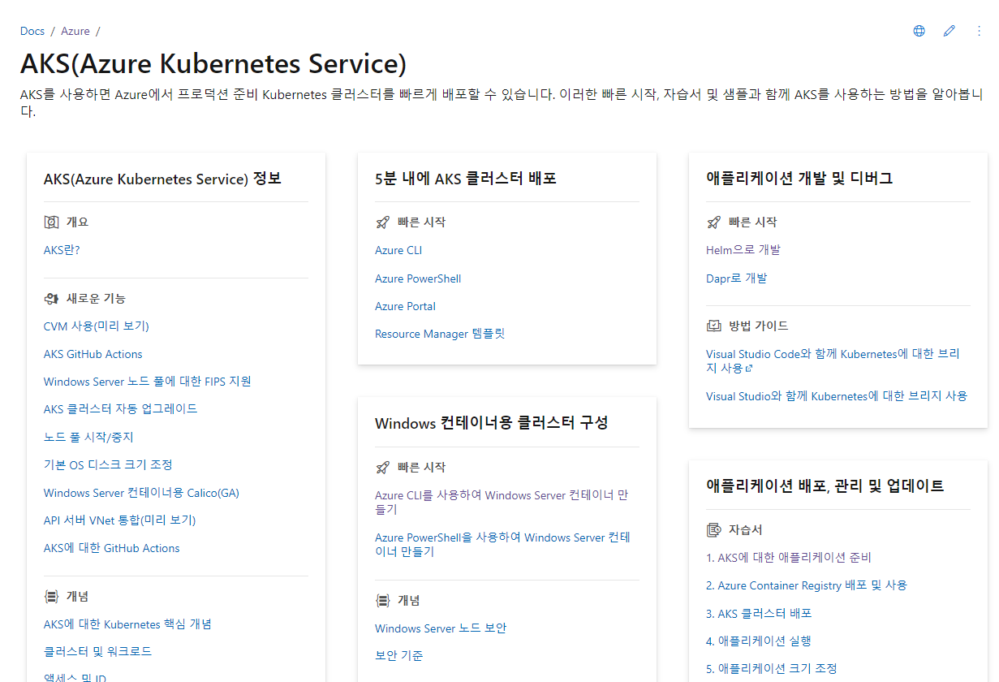

(pipeline:41-AKS애플리케이션배포)=
# Helm을 사용한 AKS 개발
- https://docs.microsoft.com/ko-kr/azure/aks/quickstart-helm?tabs=azure-cli
- 

Helm은
- Kubernetes 애플리케이션을 설치하고 수명 주기를 관리하는 오픈 소스 패키징 도구
- APT 및 Yum과 같은 Linux 패키지 관리자와 마찬가지로 사전 구성된 Kubernetes 리소스의 패키지인 Kubernetes 차트 관리에 Helm을 사용

빠른 시작에서 Helm을 사용하여 AKS에서 애플리케이션을 패키지하고 실행

## 1. Azure Container Registry 만들기
AKS 클러스터에서 Helm을 사용하여 애플리케이션을 실행하려면 컨테이너 이미지를 ACR (Azure Container Registry)에 저장해야 합

```bash
# 이미 있음
az group create --name MyHelmResourceGroup --location koreacentral

# acr이름은 소문자 숫자만 가능(유일하여야 함)
az acr create --resource-group MyHelmResourceGroup --name acr14myinno --sku Basic

```
## 2. AKS 클러스터 만들기

새 AKS 클러스터는 컨테이너 이미지를 풀해서 실행하기 위해 ACR에 액세스해야 합

1. MyAKS라는 AKS 클러스터를 만들고 MyHelmACR을 연결합니다.
2. MyAKS 클러스터에 MyHelmACR ACR에 대한 액세스 권한을 부여

    ```bash
    az aks create --resource-group MyHelmResourceGroup --name MyAKS --location koreacentral --attach-acr acr14myinno --generate-ssh-keys
    ```
## 3. AKS 클러스터에 연결

Kubernetes 클러스터를 로컬로 연결하려면 Kubernetes 명령줄 클라이언트인 kubectl을 사용

1. az aks install-cli 명령을 사용하여 kubectl을 로컬로 설치
   - "C:\Users\Administrator\.azure-kubectl" 이 디렉토리가 있으면 생략 가능
    ```bash
    az aks install-cli
    ```
2. az aks get-credentials 명령을 사용하여 Kubernetes 클러스터에 연결하도록 kubectl을 구성

```bash
az aks get-credentials --resource-group MyHelmResourceGroup --name MyAKS
```
## 4. 샘플 애플리케이션 다운로드

작업 디렉토리 이동: d:\APP\workspace-azure
```bash
git clone https://github.com/Azure-Samples/azure-voting-app-redis.git
cd azure-voting-app-redis/azure-vote/
```

## 5. 애플리케이션 예제를 빌드하여 ACR로 푸시합니다.
앞의 Dockerfile을 사용하여 az acr build 명령을 실행하여 이미지를 빌드하여 레지스트리로 푸시

- 명령 끝부분에 있는 "."는 소스 코드 디렉터리 경로의 위치(이 경우에는 현재 디렉터리)를 표시
- --file 매개 변수는 이 소스 코드 디렉터리 경로를 기준으로 Dockerfile의 경로를 사용합니다

    ```bash
    az acr build --image azure-vote-front:v1 --resource-group MyHelmResourceGroup --registry acr14myinno --file Dockerfile .
    ```

## 6. Helm 차트 만들기
1. helm create 명령을 사용하여 Helm 차트를 생성
    ```bash
    helm create azure-vote-front
    ```

2. azure-vote-front/Chart.yaml을 업데이트하여 https://charts.bitnami.com/bitnami 차트 리포지토리의 redis 차트에 대한 종속성을 추가하고
   - azure-voting-app-redis\azure-vote\azure-vote-front\Chart.yaml
```yaml
apiVersion: v2
name: azure-vote-front
description: A Helm chart for Kubernetes

dependencies:
- name: redis
# 가이드 14.7.1  오류가 발생하여 최신버전으로 변경
    version: 17.1.3
    repository: https://charts.bitnami.com/bitnami


type: application

version: 0.1.0

appVersion: V1
```

3. azure-vote-front/values.yaml 업데이트:
    ```bash
    helm dependency update azure-vote-front
    ```
4. azure-vote-front/values.yaml 업데이트:
   - redis 섹션을 추가하여 이미지 세부 정보, 컨테이너 포트 및 배포 이름을 설정
   - 프런트 엔드 부분을 redis 배포에 연결하기 위한 backendName을 추가
   - image.repository를 <loginServer>/azure-vote-front로 변경
   - image.tag를 v1로 변경
   - service.type을 LoadBalancer로 변경
    ```yaml
    # Default values for azure-vote-front.
    # This is a YAML-formatted file.
    # Declare variables to be passed into your templates.

    replicaCount: 1
    # myinno 추가 start
    backendName: azure-vote-backend-master
    redis:
    image:
        registry: mcr.microsoft.com
        repository: oss/bitnami/redis
        tag: 6.0.8
    fullnameOverride: azure-vote-backend
    auth:
        enabled: false

    image:
    repository: acr14myinno.azurecr.io/azure-vote-front
    pullPolicy: IfNotPresent
    tag: "v1"
    # myinno 추가 둥

    imagePullSecrets: []
    nameOverride: ""
    fullnameOverride: ""

    serviceAccount:
    # Specifies whether a service account should be created
    create: true
    # Annotations to add to the service account
    annotations: {}
    # The name of the service account to use.
    # If not set and create is true, a name is generated using the fullname template
    name: ""

    podAnnotations: {}

    podSecurityContext: {}
    # fsGroup: 2000

    securityContext: {}
    # capabilities:
    #   drop:
    #   - ALL
    # readOnlyRootFilesystem: true
    # runAsNonRoot: true
    # runAsUser: 1000

    service:
    type: LoadBalancer
    port: 80

    ingress:
    enabled: false
    className: ""
    annotations: {}
        # kubernetes.io/ingress.class: nginx
        # kubernetes.io/tls-acme: "true"
    hosts:
        - host: chart-example.local
        paths:
            - path: /
            pathType: ImplementationSpecific
    tls: []
    #  - secretName: chart-example-tls
    #    hosts:
    #      - chart-example.local

    resources: {}
    # We usually recommend not to specify default resources and to leave this as a conscious
    # choice for the user. This also increases chances charts run on environments with little
    # resources, such as Minikube. If you do want to specify resources, uncomment the following
    # lines, adjust them as necessary, and remove the curly braces after 'resources:'.
    # limits:
    #   cpu: 100m
    #   memory: 128Mi
    # requests:
    #   cpu: 100m
    #   memory: 128Mi

    autoscaling:
    enabled: false
    minReplicas: 1
    maxReplicas: 100
    targetCPUUtilizationPercentage: 80
    # targetMemoryUtilizationPercentage: 80

    nodeSelector: {}

    tolerations: []

    affinity: {}

    ```

## 7. Helm 차트 실행

1. helm install 명령을 사용하여 Helm 차트를 사용하여 애플리케이션을 설치
```bash
helm install azure-vote-front azure-vote-front/
# 여기서 오류 발생하여 다음으로 이동 못하고 있음 (이후는 일단 단순 문서 정리 )
```
2. 서비스가 공인 IP 주소를 반환하는 데 몇 분이 걸릴 수 있습니다. --watch 인수와 함께 kubectl get service 명령을 사용하여 진행 상황을 모니터
```bash
$ kubectl get service azure-vote-front --watch
NAME               TYPE           CLUSTER-IP    EXTERNAL-IP     PORT(S)        AGE
azure-vote-front   LoadBalancer   10.0.18.228   <pending>       80:32021/TCP   6s
...
azure-vote-front   LoadBalancer   10.0.18.228   52.188.140.81   80:32021/TCP   2m6s
```

## 8. 클러스터 삭제
az group delete 명령을 사용하여 리소스 그룹, AKS 클러스터, 컨테이너 레지스트리, ACR에 저장된 컨테이너 이미지 및 모든 관련 리소스를 제거
```bash7
az group delete --name MyHelmResourceGroup --yes --no-wait
```
