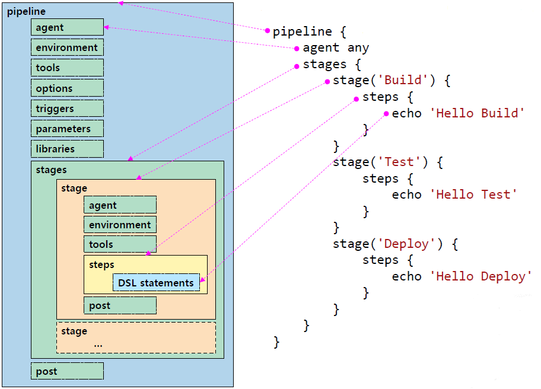

<style>
.burk {
    background-color: red;
    color: yellow;
    display:inline-block;
}
</style>

# Jenkins(공식설치가이드정리)
- https://github.com/jenkinsci/docker/blob/master/README.md
- Docker기반으로 jenkins 설치(Jenkins공식 가이드)
- docker pull jenkins/jenkins:2.346.3-lts-jdk11


## 설치(On Windows)

### 1.1 Docker 설치
https://www.jenkins.io/doc/book/installing/docker/
- Jenkins 및 Docker의 모든 기능을 사용하려면 아래에 설명된 설치 프로세스를 진행
  - 이미지 다운로드는 docker CLI가 없으며 자주 사용하는 Blue Ocean 플러그인 및 기능과 함께 번들로 제공되지 않습니다

1. Docker에서 브리지 네트워크 만들기
    ```bash
    $ docker network create jenkins
    4f74cde13c972e88918a54fa929979d12acb76a9a5a1242baab3766e7a5b06e7

    ## 참고 (삭제 하기)
    $> docker network rm jenkins
    ```
2. dRun a docker:dind Docker image
   - pipeline에서 docker 관련 실행을 위하여 (꼭 window에서 수행: CMD창)
    ```bash
    docker run --name jenkins-docker --rm --detach ^
      --privileged --network jenkins --network-alias docker ^
      --env DOCKER_TLS_CERTDIR=/certs ^
      --volume jenkins-docker-certs:/certs/client ^
      --volume jenkins-data:/var/jenkins_home ^
      --publish 2376:2376 ^
      docker:dind
    ```
   - <span class=burk>실행후 Docker의 "Environment"
     - DOCKER_TLS_CERTDIR: /certs  확인 필요
     - git bash 창에서 수행하면 "C:/Program Files/Git/certs"로 설정됨
     - 왜 설정이 안되는지는 확인 안됨 </span>

3.  공식 Jenkins Docker 이미지를 사용자 지정
    1.  dockerfile 생성(git bash에서 실행)
        ```docker
        FROM jenkins/jenkins:2.346.3-jdk11
        USER root
        RUN apt-get update && apt-get install -y lsb-release
        RUN curl -fsSLo /usr/share/keyrings/docker-archive-keyring.asc \
          https://download.docker.com/linux/debian/gpg
        RUN echo "deb [arch=$(dpkg --print-architecture) \
          signed-by=/usr/share/keyrings/docker-archive-keyring.asc] \
          https://download.docker.com/linux/debian \
          $(lsb_release -cs) stable" > /etc/apt/sources.list.d/docker.list
        RUN apt-get update && apt-get install -y docker-ce-cli
        USER jenkins
        RUN jenkins-plugin-cli --plugins "blueocean:1.25.6 docker-workflow:1.29"
        ```
    2.  docker 이미지 빌드
        ```bash
        #이미지 빌드(Dokerfile기준)
        docker build -t myjenkins-blueocean:2.346.3-1 .
        ```
4. ocker에서 컨테이너로 자체 이미지를 실행(cmd에서 실행)
    ```bash
    docker run --name jenkins-blueocean --restart=on-failure --detach ^
      --network jenkins --env DOCKER_HOST=tcp://docker:2376 ^
      --env DOCKER_CERT_PATH=/certs/client --env DOCKER_TLS_VERIFY=1 ^
      --volume jenkins-data:/var/jenkins_home ^
      --volume jenkins-docker-certs:/certs/client:ro ^
      --publish 8080:8080 --publish 50000:50000 myjenkins-blueocean:2.346.3-1
    ```

### 1.2 Post-installation setup wizard

1. Unlocking Jenkins
    ```bash
    http://localhost:8090
    # 비밀번호: cat /var/lib/jenkins/secrets/initialAdminPassword
    #
    ```
    여기서 plugins을 설치해야 함(회사 네트워크는 오류 있음)
    
    - "Install suggwsted plugins" 선택
2. Creating the first administrator user
  - 계정 생성


### 1.3 Jenkins와 GitHub 연동
https://github.com/myinno/skcc-devops-lecture/blob/master/04-MYINNO-Building-Basic-CI-Pipeline-with-Jenkins.md

1. 사이드 바에서 새로운 Item (New Item) 메뉴를 클릭 합니다.
2. Job 이름(TEST-01)을 입력하고 Freestyle project를 선택한 다음 OK 버튼을 클릭합니다.
3. Source Code Management(소스 코드 관리) 탭을 클릭하면 아래로 스크롤 되어 소스 코드 관리 섹션으로 이동
4. Git을 선택하면 Repository 정보를 입력할 수 있는 폼
5. GitHub Repository의 녹색 버튼을 클릭하여 Clone HTTPS URL을 복사하여 Jenkins의 Repository URL 필드에 붙여 넣습니다
6. Credentials 필드의 Add 버튼을 클릭하고 Jenkins를 선택
7. Jenkins Credentials Provider: Jenkins 모달 창이 나타나면, 다음 항목을 입력하거나 선택한 후 Add 버튼을 클릭
   - Domain : Global credentials (unrestricted) 선택
   - Kind : Username and password 선택
   - Scope : Global (Jenkins, nodes, items, all child items, etc) 선택
   - Username : GitHub의 ID (또는 이메일 입력)
   - Password : GitHub 패스워드(토큰) 입력
   - ID : 원하는 고유한 ID 입력해도 되나, 여기서는 skcc-devopsXX-github으로 통일한다. (XX는 부여받은 번호)
   - Description : (선택사항) 유사한 자격 증명(credentials)을 구분하는 데 도움이 되는 설명 입력
8. Branch Specifier (blank for 'any') 필드를 */master를 확인
9. Save(저장)
10. 사이드 바에서 Build Now를 클릭하면 Job이 실행

## 2. 기본 CI Pipeline 구성

### 2.1 Jenkinsfile 생성
- Jenkins Pipeline은
  - Jenkins에 지속적 전달(delivery) 파이프라인을 구현하고 통합하는 것을 지원하는 플러그인 모음
  - Pipeline은 Pipeline DSL(domain-specific language, 도메인 특정 언어) 구문을 통해 "코드로" 간단한 것에서 복잡한 것으로(simple-to-complex) 전달 파이프라인을 모델링하기 위한 확장 가능한 도구 세트를 제공합니다.
- Jenkins Pipeline의 정의는 프로젝트의 소스 제어 저장소에 커밋 될 수 있는 텍스트 파일(Jenkinsfile)에 기록됩니다.
- Pipeline Script - Syntax
  - Imperative Pipeline Symtax
    - 강력한 기능, 학습/이해/유지 어려움
  - Declarative Pipeline Syntax
    - 학습/구조화 쉬움, 제한적 기능
    - Groovy 문법의 좀 더 간단하고 구조하된 버전
    - Node Block, Stage Block, Directive, Step의 집합
  - https://www.jenkins.io/doc/book/pipeline/
    - 
- Jenkins Pipeline은 String interpolation(문자열 보간)을 위한 Groovy와 동일한 규칙을 사용
  - 작은 따옴표 또는 큼 따옴표로 문자열 선언을 지원
  - 큰 따옴표로 문자열 선언만 String interpolation을 지원


