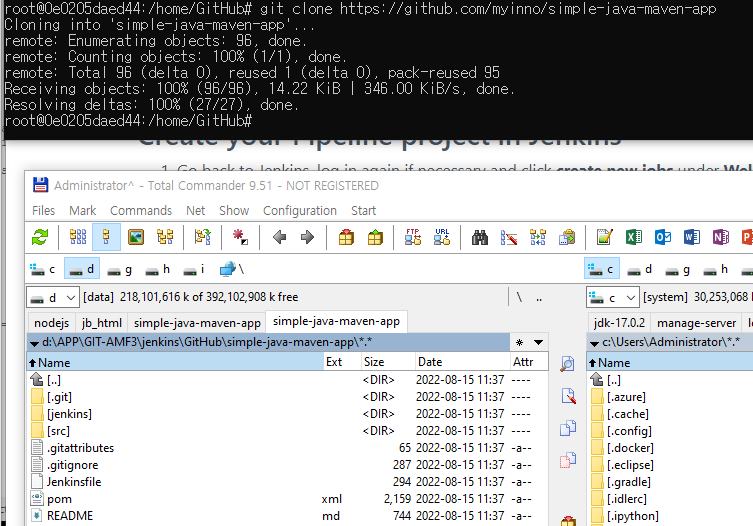

<style>
.burk {
    background-color: red;
    color: yellow;
    display:inline-block;
}
</style>

# build-a-java-app-with-maven
- https://www.jenkins.io/doc/tutorials/build-a-java-app-with-maven/

## Docker 에서 Docker기반으로 수행
Windows에서
### Docker기반으로 Jenkins 설정
중복되는 부분이 대부분임(최종 기동시 "/home" volumn 추가 부분)

1. Docker에서 브리지 네트워크 만들기
    ```bash
    docker network create jenkins
    ```
2. docker:dind Docker 이미지 실행
    ```bash
    docker run --name jenkins-docker --rm --detach ^
      --privileged --network jenkins --network-alias docker ^
      --env DOCKER_TLS_CERTDIR=/certs ^
      --volume jenkins-docker-certs:/certs/client ^
      --volume jenkins-data:/var/jenkins_home ^
      --publish 2376:2376 ^
      docker:dind
    ```
   - <span class=burk>실행후 Docker의 "Environment"
     - DOCKER_TLS_CERTDIR: /certs  확인 필요
     - git bash 창에서 수행하면 "C:/Program Files/Git/certs"로 설정됨
     - 왜 설정이 안되는지는 확인 안됨 </span>
     -
3. Jenkins Docker 이미지를 사용자 지정
   - Dockerfile
        ```bash
        FROM jenkins/jenkins:2.346.3-jdk11
        USER root
        RUN apt-get update && apt-get install -y lsb-release
        RUN curl -fsSLo /usr/share/keyrings/docker-archive-keyring.asc \
        https://download.docker.com/linux/debian/gpg
        RUN echo "deb [arch=$(dpkg --print-architecture) \
        signed-by=/usr/share/keyrings/docker-archive-keyring.asc] \
        https://download.docker.com/linux/debian \
        $(lsb_release -cs) stable" > /etc/apt/sources.list.d/docker.list
        RUN apt-get update && apt-get install -y docker-ce-cli
        USER jenkins
        RUN jenkins-plugin-cli --plugins "blueocean:1.25.6 docker-workflow:1.29"
        ```
   - 새 도커 이미지를 빌드
        ```bash
        docker build -t myjenkins-blueocean:2.346.3-1 .
        ```
4. 컨테이너로 자체 이미지를 실행(CMD창)
    -   --volume "%HOMEDRIVE%%HOMEPATH%":/home ^
    - /home 에 추가 volumn 설정

    ```bash
    docker run --name jenkins-blueocean --detach \
    --network jenkins --env DOCKER_HOST=tcp://docker:2376 \
    --env DOCKER_CERT_PATH=/certs/client --env DOCKER_TLS_VERIFY=1 \
    --volume jenkins-data:/var/jenkins_home \
    --volume jenkins-docker-certs:/certs/client:ro \
    --volume "d:/APP/GIT-AMF3/jenkins":/home \
    --restart=on-failure \
    --env JAVA_OPTS="-Dhudson.plugins.git.GitSCM.ALLOW_LOCAL_CHECKOUT=true" \
    --publish 8099:8080 --publish 50000:50000 myjenkins-blueocean:2.346.3-1
     ```
5. Git 소스 다운로드
    ```bash
    git clone https://github.com/myinno/simple-java-maven-app
    ```
    


### Create your Pipeline project in Jenkins
1. Pipeline 구성
    ```bash
    item name: simple-java-maven-app

    Pipeline
    Definition : Pipeline script from SCM
    SCM : Git.
    Repository URL: /home/GitHub/simple-java-maven-app

    ```

2. Jenkinsfile파일 생성
    ```bash
    pipeline {
        agent {
            docker {
                image 'maven:3.8.1-adoptopenjdk-11'
                args '-v /root/.m2:/root/.m2'
            }
        }
        stages {
            stage('Build') {
                steps {
                    sh 'mvn -B -DskipTests clean package'
                }
            }
        }
    }
    ```

    - Jenkinsfile 파일 생성
    ```bash
    git add .
    git commit -m "Add initial Jenkinsfile"
    ```

3. jenlins 실행
   - 회사 네트워크에서는 오류 발생
   - docker 이미지 다운로드 관련
        ```bash
        + docker pull maven:3.8.1-adoptopenjdk-11
        Error response from daemon: Head "https://registry-1.docker.io/v2/library/maven/manifests/3.8.1-adoptopenjdk-11": Get "https://auth.docker.io/token?scope=repository%3Alibrary%2Fmaven%3Apull&service=registry.docker.io": x509: certificate signed by unknown authority
        ```
   - docker 이미지 다운로드 이후 오류
        ```bash
        [ERROR] Plugin org.apache.maven.plugins:maven-enforcer-plugin:3.0.0-M3 or one of its dependencies could not be resolved: Failed to read artifact descriptor for org.apache.maven.plugins:maven-enforcer-plugin:jar:3.0.0-M3: Could not transfer artifact org.apache.maven.plugins:maven-enforcer-plugin:pom:3.0.0-M3 from/to central (https://repo.maven.apache.org/maven2): transfer failed for https://repo.maven.apache.org/maven2/org/apache/maven/plugins/maven-enforcer-plugin/3.0.0-M3/maven-enforcer-plugin-3.0.0-M3.pom: Unknown host repo.maven.apache.org: Temporary failure in name resolution -> [Help 1]
        ```
   - 네트워크 변경이후 정상 수행됨
        ```console
        root@0e0205daed44:/var/jenkins_home/workspace/simple-java-maven-app# ls
        '?'   Jenkinsfile   README.md   jenkins   pom.xml   src   target

        root@0e0205daed44:/var/jenkins_home/workspace/simple-java-maven-app/target# ls
        classes  generated-sources  generated-test-sources  maven-archiver  maven-status  my-app-1.0-SNAPSHOT.jar  test-cla
        ```
