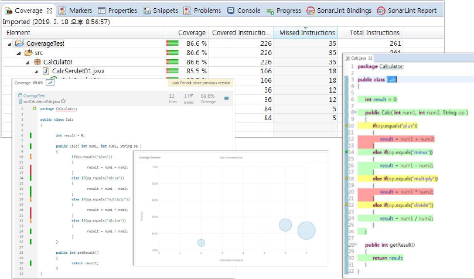

# CI Pipeline 개선

## Unit Test stage 개선

* **EclEmma** (https://www.eclemma.org/)

|  |
| - |

|  |
| - |

|  |
| - |

[JaCoCo](https://www.eclemma.org/jacoco/) 라이브러리를 사용하여 CI Pipeline의 Unit Test stage에 Code Coverage를 추가합니다.  
Jenkins에서 Job을 실행하고 Code Coverage report로 확인합니다.

> **JaCoCo**는 **Java Code Coverage를 구현하는 데에 사용되는 오픈 소스 툴킷**으로  line, branch coverage를 제공합니다. 사용하는데에 코드가 필요한 Clover와 Cobertura와는 다르게 JaCoCo는 runtime에 실행이 가능합니다.  
이를 위해 Java agent 형태로 사용하며, report 데이터를 파일 형태로 저장이 가능하며 TCP 프로토콜을 통해 원격 JVM의 데이터를 가져올 수도 있습니다. 분산된 Code 환경에서의 report들을 통합하는 기능이 제공되어 Intergration Testing에 사용이 가능합니다.

### JaCoCo Maven plugin 추가

다음을 수행하여 `pom.xml`에 **JaCoCo Maven plugin**을 추가하고 GitHub에 Push 합니다.

* STS에서 `pom.xml` 파일을 열고 `properties` 엘리먼트(element)에서 `java.version` 아래에 다음 내용을 확인(추가)합니다.

    ```xml
    <jacoco.version>0.8.8</jacoco.version>
    ```

* `build > plugins` 엘리먼트에 다음 내용을 확인(추가)합니다.

    ```xml
    <plugin>
        <groupId>org.jacoco</groupId>
        <artifactId>jacoco-maven-plugin</artifactId>
        <version>${jacoco.version}</version>
        <executions>
            ...
        </executions>
    </plugin>
    ```

* pom.xml 파일이 수정되었다면 터미널에서 아래 명령을 수행하여 GitHub에 Push 합니다.

    ```bash
    git add .
    git commit -m "Add 'JaCoCo Maven plugin' in pom.xml"
    git push
    ```

### Jenkins에 JaCoCo plugin 설치

Jenkins UI를 통해 JaCoCo Code Coverage 결과를 보기 위해 [JaCoCo plugin](https://plugins.jenkins.io/jacoco/)을 설치 확인합니다.

* **Dashboard menu > Manage Jenkins(Jenkins 관리) > System Configuration > Manage Plugins(플러그인 관리)**을 선택
* **Available(설치 가능)** 탭을 클릭하고 검색 필드에 `jacoco`를 입력합니다.
* **JaCoCo** 플러그인을 체크하고 **재시작 없이 설치하기** 버튼을 클릭하여 설치합니다. (재시작 권고. 이후 플러그인 인식이 안되는 경우가 있음)

    ||
    |-|

### Jenkinsfile에 `Unit Test` stage 수정

다음을 수행하여 `Jenkinsfile` 파일에 `Unit Test` stage를 수정하고 GitHub에 Push 합니다.

* `Jenkinsfile` 파일을 열고 `Unit Test` stage를 `step([ $class: 'JacocoPublisher' ])`를 추가하여 아래와 같이 수정합니다.

    ```groovy
        stage('Unit Test') {
            steps {
                sh './mvnw test'
            }
            post {
                always {
                    junit 'target/surefire-reports/*.xml'
                    step([ $class: 'JacocoPublisher' ])
                }
            }
        }
    ```
    ``` 기존 Jenkinsfile 파일 내용 중 step([ $class: 'JacocoPublisher' ]) 부분 추가 ```

* 아래 명령을 수행하여 GitHub에 Push 합니다.

    ```bash
    git add .
    git commit -m "Update 'Unit Test' stage in Jenkinsfile"
    git push
    ```

### Jenkins CI Pipeline Job 실행 (Unit Test & Code Coverage)

* **Dashboard**에서 Job 선택한 다음, 사이드 바에서 **Build Now**를 클릭하여 Job이 실행합니다.
* **Build History**에서 **#일련번호**을 선택한 다음, **Console Output**을 선택하여 빌드 로그를 확인합니다.

```bash
Started by user admin
Obtained Jenkinsfile from git https://github.com/skcc-devops01/spring-petclinic-rest.git
Running in Durability level: MAX_SURVIVABILITY
[Pipeline] Start of Pipeline
[Pipeline] node
Running on Jenkins in /var/jenkins_home/workspace/Petclinic-Basic-CI-Pipeline
[Pipeline] {
[Pipeline] stage
[Pipeline] { (Declarative: Checkout SCM)
[Pipeline] checkout (hide)
The recommended git tool is: git
using credential skcc-devops01-github
 > git rev-parse --resolve-git-dir /var/jenkins_home/workspace/Petclinic-Basic-CI-Pipeline/.git # timeout=10
Fetching changes from the remote Git repository
 > git config remote.origin.url https://github.com/skcc-devops01/spring-petclinic-rest.git # timeout=10
Fetching upstream changes from https://github.com/skcc-devops01/spring-petclinic-rest.git
 > git --version # timeout=10
 > git --version # 'git version 2.20.1'
using GIT_ASKPASS to set credentials skcc-devops01-github credential
 > git fetch --tags --force --progress -- https://github.com/skcc-devops01/spring-petclinic-rest.git +refs/heads/*:refs/remotes/origin/* # timeout=10
 > git rev-parse refs/remotes/origin/master^{commit} # timeout=10
Checking out Revision a6fc4c57fa3f38ecce442efbba5515dcc0da60a3 (refs/remotes/origin/master)
 > git config core.sparsecheckout # timeout=10
 > git checkout -f a6fc4c57fa3f38ecce442efbba5515dcc0da60a3 # timeout=10
Commit message: "Update 'Unit Test' stage in Jenkinsfile"
 > git rev-list --no-walk 63ba6ad33e6db30eb3d5c2e81e8cb3d80725470f # timeout=10
[Pipeline] }
[Pipeline] // stage
[Pipeline] withEnv
[Pipeline] {
[Pipeline] stage
[Pipeline] { (Build)
[Pipeline] sh
+ ./mvnw clean compile
[INFO] Scanning for projects...

(생략)

[INFO] --- maven-compiler-plugin:3.8.1:compile (default-compile) @ spring-petclinic-rest ---
[INFO] Changes detected - recompiling the module!
[INFO] Compiling 83 source files to /var/jenkins_home/workspace/Petclinic-Basic-CI-Pipeline/target/classes
[INFO] ------------------------------------------------------------------------
[INFO] BUILD SUCCESS
[INFO] ------------------------------------------------------------------------
[INFO] Total time:  5.830 s
[INFO] Finished at: 2021-09-07T14:37:50+09:00
[INFO] ------------------------------------------------------------------------
[Pipeline] }
[Pipeline] // stage
[Pipeline] stage
[Pipeline] { (Unit Test)
[Pipeline] sh
+ ./mvnw test
[INFO] Scanning for projects...
[INFO] 
[INFO] ---------< org.springframework.samples:spring-petclinic-rest >----------
[INFO] Building spring-petclinic-rest 2.4.2
[INFO] --------------------------------[ jar ]---------------------------------
[INFO] 
[INFO] --- jacoco-maven-plugin:0.8.5:prepare-agent (default) @ spring-petclinic-rest ---
[INFO] argLine set to -javaagent:/var/jenkins_home/.m2/repository/org/jacoco/org.jacoco.agent/0.8.5/org.jacoco.agent-0.8.5-runtime.jar=destfile=/var/jenkins_home/workspace/Petclinic-Basic-CI-Pipeline/target/jacoco.exec

(생략)

[INFO] 
[INFO] Results:
[INFO] 
[INFO] Tests run: 172, Failures: 0, Errors: 0, Skipped: 0
[INFO] 
[INFO] ------------------------------------------------------------------------
[INFO] BUILD SUCCESS
[INFO] ------------------------------------------------------------------------
[INFO] Total time:  40.941 s
[INFO] Finished at: 2021-09-07T14:38:33+09:00
[INFO] ------------------------------------------------------------------------
Post stage
[Pipeline] junit
Recording test results
[Checks API] No suitable checks publisher found.
[Pipeline] jacoco
[JaCoCo plugin] Collecting JaCoCo coverage data...
[JaCoCo plugin] **/**.exec;**/classes;**/src/main/java; locations are configured
[JaCoCo plugin] Number of found exec files for pattern **/**.exec: 1
[JaCoCo plugin] Saving matched execfiles:  /var/jenkins_home/workspace/Petclinic-Basic-CI-Pipeline/target/jacoco.exec
[JaCoCo plugin] Saving matched class directories for class-pattern: **/classes: 
[JaCoCo plugin]  - /var/jenkins_home/workspace/Petclinic-Basic-CI-Pipeline/target/classes 84 files
[JaCoCo plugin] Saving matched source directories for source-pattern: **/src/main/java: 
[JaCoCo plugin] Source Inclusions: **/*.java,**/*.groovy,**/*.kt,**/*.kts
[JaCoCo plugin] Source Exclusions: 
[JaCoCo plugin] - /var/jenkins_home/workspace/Petclinic-Basic-CI-Pipeline/src/main/java 83 files
[JaCoCo plugin] Loading inclusions files..
[JaCoCo plugin] inclusions: []
[JaCoCo plugin] exclusions: []
[JaCoCo plugin] Thresholds: JacocoHealthReportThresholds [minClass=0, maxClass=0, minMethod=0, maxMethod=0, minLine=0, maxLine=0, minBranch=0, maxBranch=0, minInstruction=0, maxInstruction=0, minComplexity=0, maxComplexity=0]
[JaCoCo plugin] Publishing the results..
[JaCoCo plugin] Loading packages..
[JaCoCo plugin] Done.
[JaCoCo plugin] Overall coverage: class: 93.75, method: 90.789474, line: 88.59112, branch: 75.17007, instruction: 89.14044, complexity: 79.37916
[Pipeline] }
[Pipeline] // stage
[Pipeline] }
[Pipeline] // withEnv
[Pipeline] }
[Pipeline] // node
[Pipeline] End of Pipeline
Finished: SUCCESS
```

### Jenkins에서 Code Coverage 결과 확인

Job Dashboard 화면에 **Code Coverage Trend**가 추가된 것을 확인합니다.

||
|-|

Job Build 번호를 클릭하여 상세 페이지로 이동하면 **Jacoco - Overall Coverage Summary**이 추가된 것을 알 수 있습니다.

||
|-|

사이드 바에서 **Coverage Report**를 클릭하면 **JaCoCo Coverage Report**를 확인할 수 있습니다.

||
|-|

* * *

* STS에서 실행한 EclEmma 실행결과 (Build Path 에러가 발생할 경우, 설정 후 진행)

상단 메뉴 Windows > Preferences 클릭 후 나온 팝업 창에서 Java > Code Coverage에서 'Only path entries matching'에 해당 소스 위치를 지정한다.   

|  |
| - |

|  |
| - |

* 비고   
SonarQube 8.2 이상 또는 Java 분석기를 6.2로 업데이트하면 JaCoCo .exec 형식을 더 이상 지원하지 않는다. (XML 타입만 허용)   
sonar.jacoco.reportPaths 설정은 Deprecated되고, sonar.coverage.jacoco.xmlReportPaths를 사용해야 한다.   

Not Testing...   
```bash
$ mvn clean package
$ mvn jacoco:report sonar:sonar
```

## Static Code Analysis

* **SonarQube** (https://www.sonarqube.org/)

|  |
| - |

|  |
| - |

|  |
| - |

* SonarQube 플랫폼은 4가지 구성 요소로 구성됩니다.
1) SonarQube 서버
2) SonarQube 데이터베이스
3) SonarQube 플러그인
4) SonarScanner

|  |
| - |

* 도구 간 연계

|  |
| - |

Jenkins와 SonarQube 연동 설장하고 Jenkins에서 Job을 실행하여 SonarQube에서 Code Coverage report 및 정적 코드 분석 결과를 확인합니다.

SonarQube 로그인 주소는 http://[AWS > EC2 > 네트워크 및 보안 > 탄력적 IP > tools-eip의 IP주소]:9000

ID/PW : admin/...01

### SonarQube Token 생성

SonarQube에서 아래와 같이 수행하여 인증 Token을 생성합니다.

* 우측 상단의 프로필 **A**를 클릭한 후 **My Account**를 선택합니다.
* **Security** 탭을 클릭한 다음, **Tokens** 섹션의 **Generate Tokens** 필드에 Token 이름을 입력하고 **Generate** 버튼을 클릭합니다.
* 생성된 Token이 화면에 나타나면 복사하여 기록해 둡니다.

||
|-|

### Jenkins에 Config File Provider plugin 설치

Jenkins UI를 통해 구성된 Maven settings.xml을 Jenkins Pipeline에서 사용하기 위해 [Config File Provider plugin](https://plugins.jenkins.io/config-file-provider/)을 설치합니다.

* **Dashboard menu > Manage Jenkins(Jenkins 관리) > System Configuration > Manage Plugins(플러그인 관리)**을 선택합니다.
* **Available(설치 가능)** 탭을 클릭하고 검색 필드에 `config`를 입력합니다.
* **Config File Provider** 플러그인을 체크하고 **재시작 없이 설치하기** 버튼을 클릭하여 설치합니다. (재시작 권고. 이후 메뉴가 안 보이는 경우가 있음)
- 기 설치되어 있음  
### Maven settings.xml 설정

* **Dashboard dropdown menu > Jenkins 관리 > System Configuration > Managed files**을 선택합니다.
* 사이드 바에서 **Add a new Config**를 클릭합니다.
* `Global Maven settings.xml`를 체크한 다음 **ID** 필드에 `maven-settings`을 입력하고 **다음** 버튼을 클릭합니다.
* **Edit Configuration File** 페이지의 **Content** 필드에 아래 내용을 복사하여 붙여넣고 `sonar.host.url`, `sonar.login`를 수정한 후 **Submit** 버튼을 클릭합니다.

    ```bash
    <?xml version="1.0" encoding="UTF-8"?>
    <settings xmlns="http://maven.apache.org/SETTINGS/1.0.0" 
            xmlns:xsi="http://www.w3.org/2001/XMLSchema-instance" 
            xsi:schemaLocation="http://maven.apache.org/SETTINGS/1.0.0 http://maven.apache.org/xsd/settings-1.0.0.xsd">
        <pluginGroups>
            <pluginGroup>org.sonarsource.scanner.maven</pluginGroup>
        </pluginGroups>
        <profiles>
            <profile>
                <id>sonar</id>
                <activation>
                    <activeByDefault>true</activeByDefault>
                </activation>
                <properties>
                    <sonar.host.url>http://[your_sonarqube_ip]:9000</sonar.host.url>
                    <sonar.login>[your_auth_token]</sonar.login>
                </properties>
            </profile>
        </profiles>
    </settings>
    ```

### Jenkinsfile에 `Static Code Analysis` stage 추가

다음을 수행하여 `Jenkinsfile` 파일에 `Static Code Analysis` stage를 추가하고 GitHub에 Push 합니다.

* `Jenkinsfile` 파일을 열고 `Unit Test` stage 다음에 아래 내용을 붙여 넣습니다.

    ```groovy
            stage('Static Code Analysis') {
                steps {
                    configFileProvider([configFile(fileId: 'maven-settings', variable: 'MAVEN_SETTINGS')]) {
                        sh './mvnw package -DskipTests=true -Dmaven.test.failure.ignore=true sonar:sonar -s $MAVEN_SETTINGS'
                    }
                }
            }
    ```

* pom.xml에서 SonarQube와 JaCoCo관련 주석을 해제 후, 소스 우측 버튼 > Maven > Update Project...

    ```
    <properties>
        ...
        <jacoco.version>0.8.8</jacoco.version>
    
        <sonar.java.coveragePlugin>jacoco</sonar.java.coveragePlugin>
        <sonar.dynamicAnalysis>reuseReports</sonar.dynamicAnalysis>
        <sonar.jacoco.reportPath>${project.basedir}/../target/jacoco.exec</sonar.jacoco.reportPath>
        <sonar.language>java</sonar.language>
        ...
    </properties>
    ```

* 아래 명령을 수행하여 GitHub에 Push 합니다.

    ```bash
    git add .
    git commit -m "Add 'Static Code Analysis' stage to Jenkinsfile"
    git push
    ```

### Jenkins CI Pipeline Job 실행 (Static Code Analysis)

* **Dashboard**에서 Job 선택한 다음, 사이드 바에서 **Build Now**를 클릭하여 Job이 실행합니다.
* **Build History**에서 **#일련번호**을 선택한 다음, **Console Output**을 선택하여 빌드 로그를 확인합니다.

```bash
(생략)

[Pipeline] sh
+ ./mvnw sonar:sonar -s /var/jenkins_home/workspace/Petclinic-Basic-CI-Pipeline@tmp/config1726707231184925607tmp
[INFO] Scanning for projects...
...
Downloaded from central: https://repo.maven.apache.org/maven2/org/sonarsource/scanner/maven/sonar-maven-plugin/3.9.0.2155/sonar-maven-plugin-3.9.0.2155.jar (50 kB at 150 kB/s)
[INFO] 
[INFO] ---------< org.springframework.samples:spring-petclinic-rest >----------
[INFO] Building spring-petclinic-rest 2.4.2
[INFO] --------------------------------[ jar ]---------------------------------
[INFO] 
[INFO] --- sonar-maven-plugin:3.9.0.2155:sonar (default-cli) @ spring-petclinic-rest ---
Downloading from central: https://repo.maven.apache.org/maven2/org/sonatype/plexus/plexus-sec-dispatcher/1.4/plexus-sec-dispatcher-1.4.pom
Progress (1): 3.0 kB
...
Downloaded from central: https://repo.maven.apache.org/maven2/org/sonarsource/scanner/api/sonar-scanner-api/2.16.1.361/sonar-scanner-api-2.16.1.361.jar (625 kB at 727 kB/s)
[INFO] User cache: /var/jenkins_home/.sonar/cache
[INFO] SonarQube version: 7.9.5
[INFO] Default locale: "en_US", source code encoding: "UTF-8"
[INFO] Load global settings
[INFO] Load global settings (done) | time=201ms
[INFO] Server id: 243B8A4D-AXnLsjlAA3v5CakmciEC
[INFO] User cache: /var/jenkins_home/.sonar/cache
[INFO] Load/download plugins

(생략)

[INFO] ------------- Run sensors on module spring-petclinic-rest
[INFO] Load metrics repository
[INFO] Load metrics repository (done) | time=57ms
WARNING: An illegal reflective access operation has occurred
WARNING: Illegal reflective access by net.sf.cglib.core.ReflectUtils$1 (file:/var/jenkins_home/.sonar/cache/866bb1adbf016ea515620f1aaa15ec53/sonar-javascript-plugin.jar) to method java.lang.ClassLoader.defineClass(java.lang.String,byte[],int,int,java.security.ProtectionDomain)
WARNING: Please consider reporting this to the maintainers of net.sf.cglib.core.ReflectUtils$1
WARNING: Use --illegal-access=warn to enable warnings of further illegal reflective access operations
WARNING: All illegal access operations will be denied in a future release
[INFO] Sensor JavaSquidSensor [java]
[INFO] Configured Java source version (sonar.java.source): 8

...

[INFO] Analysis report generated in 125ms, dir size=691 KB
[INFO] Analysis report compressed in 195ms, zip size=354 KB
[INFO] Analysis report uploaded in 495ms
[INFO] ANALYSIS SUCCESSFUL, you can browse http://52.78.xx.xxx:9000/dashboard?id=org.springframework.samples%3Aspring-petclinic-rest
[INFO] Note that you will be able to access the updated dashboard once the server has processed the submitted analysis report
[INFO] More about the report processing at http://52.78.xx.xxx:9000/api/ce/task?id=AXu_OWlxRbtoCSG_mdCH
[INFO] Analysis total time: 16.629 s
[INFO] ------------------------------------------------------------------------
[INFO] BUILD SUCCESS
[INFO] ------------------------------------------------------------------------
[INFO] Total time:  46.662 s
[INFO] Finished at: 2021-09-07T16:46:56+09:00
[INFO] ------------------------------------------------------------------------
[Pipeline] }
Deleting 1 temporary files
[Pipeline] // configFileProvider
[Pipeline] }
[Pipeline] // stage
[Pipeline] }
[Pipeline] // withEnv
[Pipeline] }
[Pipeline] // node
[Pipeline] End of Pipeline
Finished: SUCCESS
```

### SonarQube에서 결과 확인

다음을 수행하여 Code Coverage 및 정적 코드 분석 결과를 확인합니다.

* **SonarQube**에 접속한 다음, 상단 네비게이션 바에서 **Projects**를 클릭하면 아래와 같이 프로젝트 목록을 확인할 수 있습니다.

  

* 프로젝트 ID를 클릭하면 상세 정보를 확인할 수 있습니다.

  

* **Code** 탭으로 이동하여 정적 분석 결과를 확인합니다.


## Spring Boot Application Packaging

### Jenkinsfile에 `Package` stage 추가

다음을 수행하여 `Jenkinsfile` 파일에 `Package` stage를 추가하고 GitHub에 Push 합니다.

* `Jenkinsfile` 파일을 열고 `Static Code Analysis` stage 다음에 아래 내용을 붙여 넣습니다.

    ```groovy
            stage('Package') {
                steps {
                    sh "./mvnw package -DskipTests=true -Dmaven.test.failure.ignore=true"
                    archiveArtifacts artifacts: 'target/*.jar', fingerprint: true
                }
            }
    ```

* 아래 명령을 수행하여 GitHub에 Push 합니다.

    ```bash
    git add .
    git commit -m "Add 'Package' stage to Jenkinsfile"
    git push
    ```

### Jenkins CI Pipeline Job 실행 (Package)

* **Dashboard**에서 Job 선택한 다음, 사이드 바에서 **Build Now**를 클릭하여 Job이 실행합니다.
* **Build History**에서 **#일련번호**을 선택한 다음, **Console Output**을 선택하여 빌드 로그를 확인합니다.

```bash
(생략)

[Pipeline] // stage
[Pipeline] stage
[Pipeline] { (Package)
[Pipeline] sh
+ ./mvnw package -DskipTests
[INFO] Scanning for projects...
[INFO] 
[INFO] ---------< org.springframework.samples:spring-petclinic-rest >----------
[INFO] Building spring-petclinic-rest 2.4.2
[INFO] --------------------------------[ jar ]---------------------------------

(생략)

Downloaded from central: https://repo.maven.apache.org/maven2/org/codehaus/plexus/plexus-utils/3.3.0/plexus-utils-3.3.0.jar (263 kB at 192 kB/s)
Downloaded from central: https://repo.maven.apache.org/maven2/org/apache/commons/commons-compress/1.19/commons-compress-1.19.jar (615 kB at 440 kB/s)
[INFO] Building jar: /var/jenkins_home/workspace/Petclinic-Basic-CI-Pipeline/target/spring-petclinic-rest-2.4.2.jar
[INFO] 
[INFO] --- spring-boot-maven-plugin:2.4.2:repackage (repackage) @ spring-petclinic-rest ---
[INFO] Replacing main artifact with repackaged archive
[INFO] ------------------------------------------------------------------------
[INFO] BUILD SUCCESS
[INFO] ------------------------------------------------------------------------
[INFO] Total time:  21.860 s
[INFO] Finished at: 2021-09-07T17:03:22+09:00
[INFO] ------------------------------------------------------------------------
[Pipeline] archiveArtifacts
Archiving artifacts
Recording fingerprints
[Pipeline] }
[Pipeline] // stage
[Pipeline] }
[Pipeline] // withEnv
[Pipeline] }
[Pipeline] // node
[Pipeline] End of Pipeline
Finished: SUCCESS
```

* **Dashboard**에서 해당 Job 선택하면 Package로 생성된 Artifacts를 확인할 수 있습니다.빌드 로그를 확인합니다.

||
|-|

* Snapshot : 개발 단계
* Milestone : 테스트 버전
* Mixed
* RC(Release candidate) : 베타 버전. 기능은 픽스되었으나, 안정적 동작은 보장하지 않음.
* GA(General Availability) : 테스트가 완료된 정식 운영 릴리즈 버전

## Harbor 구성

* **Harbor** (https://goharbor.io/)

|  |
| - |

|  |
| - |

### 프로젝트 생성

Harbor의 프로젝트에는 애플리케이션의 모든 저장소가 포함됩니다. 프로젝트가 생성되기 전에는 이미지를 Harbor로 Push 할 수 없습니다. RBAC (Role-Based Access Control, 역할 기반 액세스 제어)가 프로젝트에 적용되므로 적절한 역할을 가진 사용자만 특정 작업을 수행 할 수 있습니다.

Harbor에는 두 가지 유형의 프로젝트가 있습니다.

* Public : 모든 사용자가 프로젝트에서 이미지를 Pull 할 수 있습니다. 이것은 다른 사람과 저장소를 공유할 수 있는 편리한 방법입니다.
* Private : 프로젝트에 참여한 사용자만 이미지를 Pull 할 수 있습니다.

Harbor 로그인 주소는 http://[AWS > EC2 > 네트워크 및 보안 > 탄력적 IP > tools-eip의 IP주소]:8000

ID/PW : admin/...01

다음을 수행하여 프로젝트를 생성합니다.

* **Projects** 페이지에서 **NEW PROJECT** 버튼을 클릭합니다.
* **Project Name** 필드에 원하는 프로젝트 이름을 입력합니다.
* (선택사항) 프로젝트를 공개로 설정하려면 **Access Level**의 **Public** 체크박스를 체크합니다.
* **OK** 버튼을 클릭합니다.


* * *

* 기술의 변화...   

|  |
| - |

소스는 결국 운영 환경에서 실행 가능한 형태가 필요합니다.   
대부분의 기업들은 Java EE(J2EE) 환경에서는 .jar/.war/.ear 형태로 사용 중이었습니다.     
하지만, Python/NodeJS/Go 등이 등장하였고,   
운영 시스템에서 실행할 수 있도록 앱을 패키징할 다른 방법이 필요해 졌고, 이를 위해 무엇이든 실행할 수 있는 일종의 가상화 계층이 필요해졌습니다.   

* Container, Docker, Kubernetes
  |  |
  | ----- |

## Build Docker image

### 컨테이너 기반 응용 프로그램 디자인의 원칙

|  |
| ----- |

|  |
| ----- |

|  |
| ----- |

|  |
| ----- |

|  |
| ----- |

|  |
| ----- |

|  |
| ----- |

|  |
| ----- |

|  |
| ----- |

|  |
| ----- |

|  |
| ----- |

|  |
| ----- |

* * *

|  |
| ----- |

|  |
| ----- |

https://www.redhat.com/en/resources/cloud-native-container-design-whitepaper   

* Build Time

1. 단일 관심사(Single Concern) : 각 컨테이너는 단일 문제/관심사를 해결하고 잘 처리합니다.   
2. 자기 격리(Self-Containment) : 컨테이너는 Linux 커널의 상태에만 의존합니다. 컨테이너가 빌드될 때 필요한 라이브러리가 추가됩니다.   
3. 이미지 불변성(Image Immutability) : 컨테이너화된 응용 프로그램은 변경할 수 없도록 되어 있으며(불변), 빌드된 후에는 서로 다른 환경 간에 없을 것으로 예상됩니다.

* Runtime

4. 높은 관찰 가능성(High Observability) : 모든 컨테이너는 플랫폼이 가능한 최선의 방법으로 애플리케이션을 관찰하고 관리하는 데 도움이 되는 모든 필요한 API를 구현해야 합니다.
5. 수명 주기 준수(Lifecycle Conformance) : 컨테이너에는 플랫폼에서 발생하는 이벤트를 읽고 해당 이벤트에 반응하여 준수할 수 있는 방법이 있어야 합니다.
6. 프로세스 폐기 가능성(Process Disposability) : 컨테이너화된 애플리케이션은 가능한 한 일시적이어야 하며 언제든지 다른 컨테이너 인스턴스로 대체될 준비가 되어 있어야 합니다.
7. 런타임 제한(Runtime Confinement) : 모든 컨테이너는 리소스 요구 사항을 선언하고 리소스 사용을 표시된 요구 사항으로 제한해야 합니다. 빌드 시간 원칙은 컨테이너가 올바른 세분성, 일관성 및 구조를 갖출 수 있습니다. 런타임 원칙은 컨테이너화된 응용 프로그램이 클라우드 네이티브 기능을 소유하기 위해 구현해야 하는 기능을 지정합니다. 이러한 원칙을 준수하면 애플리케이션이 쿠버네티스의 자동화에 적합한지 확인하는 데 도움이 됩니다.

* * *

|  |
| ----- |

|  |
| ----- |

* Dockerfile 문법 https://docs.docker.com/engine/reference/builder/

|  |
| ----- |

|  |
| ----- |

|  |
| ----- |

|  |
| ----- |

* * *

* Docker Compose

|  |
| - |

|  |
| - |

|  |
| - |

|  |
| - |

|  |
| - |

* * *
(참고) Docker는 2022-02-01부터 대기업 사용자에게는 유료화되었습니다.(250명 인원 이상이거나 연 10만불 이상 매출 기업이 유료 대상. 개인이나 교육, 비상업적 사용은 무료)   
무료 사용자의 경우, 기타 아래와 같은 제한이 있음.   
* 익명 유저(docker login 안함) : IP 기반으로 6시간동안 100번 request 제한
* 로그인 유저(docker login 함) : 계정 기반으로 6시간동안 200번 request 가능
* 지불 계정 유저(docker login 한 Paid 유저) : 제한 없음(지불 유저의 경우도 IP 기반 제한 (opens new window)이 있음. 공개 저장소를 대량으로 사용하는 경우 주의 필요.)   

제한 확인하는 방법
<pre><code>
$ TOKEN=$(curl "https://auth.docker.io/token?service=registry.docker.io&scope=repository:ratelimitpreview/test:pull" | jq -r .token)

$ curl --head -H "Authorization: Bearer $TOKEN" https://registry-1.docker.io/v2/ratelimitpreview/test/manifests/latest 2>&1 | grep RateLimit

< RateLimit-Limit: 100;w=21600
< RateLimit-Remaining: 96;w=21600
</code></pre>

아래는 제한에 걸렸을 경우 응답 관련 에러 메세지
<pre><code>
HTTP/1.1 429 Too Many Requests
Cache-Control: no-cache
Connection: close
Content-Type: application/json
{
  "errors": [{
      "code": "TOOMANYREQUESTS",
      "message": "You have reached your pull rate limit. You may increase the limit by authenticating and upgrading: https://www.docker.com/increase-rate-limit"
  }]
}
</code></pre>

참고URL:   
Docker Desktop 유료화와 대응방법 https://subicura.com/k8s/2021/01/02/docker-hub-pull-limit/   
Docker Hub Pull 횟수 6시간에 100회 제한 정책 https://subicura.com/k8s/2021/01/02/docker-hub-pull-limit/   
* * *

### Docker plugin 설치

Jenkins Pipeline에서 Docker를 사용하기 위해서는 [Docker plugin](https://plugins.jenkins.io/docker-plugin/)과 [Docker Pipeline plugin](https://plugins.jenkins.io/docker-workflow/)을 설치해야 합니다.

* **Dashboard dropdown menu > Jenkins 관리 > System Configuration > 플러그인 관리**을 선택합니다.
* **설치 가능** 탭을 클릭하고 검색 필드에 `docker`를 입력합니다.
* **Docker Pipeline**과 **Docker** 플러그인을 체크하고 설치합니다.


### Dockerfile 생성

Docker에는 이미지의 레이어(Layers)을 지정하는 데 사용하는 간단한 [Dockerfile](https://docs.docker.com/engine/reference/builder/) 파일 형식이 있습니다.

다음을 수행하여 `Dockerfile` 파일을 작성하고 GitHub에 Push 합니다.

* `spring-petclinic-rest` Workspace에서 `Dockerfile` 파일을 생성하고 아래 내용을 붙여 넣습니다.

    ```dockerfile
    FROM adoptopenjdk/openjdk11:alpine-jre
    ARG JAR_FILE=target/*.jar
    COPY ${JAR_FILE} app.jar
    ENTRYPOINT ["sh", "-c", "java ${JAVA_OPTS} -jar /app.jar"]
    ```

* 아래 명령을 수행하여 GitHub에 Push 합니다.

    ```bash
    git add .
    git commit -m "Add Dockerfile"
    git push
    ```

### Jenkinsfile에 `Build Docker image` stage 추가

다음을 수행하여 `Jenkinsfile` 파일에 `environment`와 `Build Docker image` stage를 추가하고 GitHub에 Push 합니다.

* `Jenkinsfile` 파일을 열고 `agent` 아래 내용을 붙여 넣습니다.

    ```groovy
        environment {
            GIT_COMMIT_SHORT = sh(returnStdout: true, script: 'git rev-parse --short HEAD').trim()
            APP_IMAGE = null
            IMAGE_REPO = 'petclinic'
            IMAGE_NAME = 'spring-petclinic-rest'
            //IMAGE_TAG = '${GIT_COMMIT_SHORT}_${BUILD_NUMBER}'
            IMAGE_TAG = sh(returnStdout: true, script: '(git rev-parse --short HEAD && echo "_$BUILD_NUMBER") | tr -d "\n"').trim()
        }
    ```

* `Jenkinsfile`에서 `Package` stage 다음에 아래 내용을 붙여 넣습니다.

    ```groovy
            stage('Build Docker image') {
                steps {
                    script {
                        APP_IMAGE = docker.build("${IMAGE_REPO}/${IMAGE_NAME}:${IMAGE_TAG}")
                    }
                }
            }
    ```

* 아래 명령을 수행하여 GitHub에 Push 합니다.

    ```bash
    git add .
    git commit -m "Add 'Build Docker image' stage to Jenkinsfile"
    git push
    ```
    
### Jenkins CI Pipeline Job 실행 (Build Docker image)

* **Dashboard**에서 Job 선택한 다음, 사이드 바에서 **Build Now**를 클릭하여 Job이 실행합니다.
* **Build History**에서 **#일련번호**을 선택한 다음, **Console Output**을 선택하여 빌드 로그를 확인합니다.

```bash
(생략)

[Pipeline] // stage
[Pipeline] stage
[Pipeline] { (Build Docker image)
[Pipeline] script
[Pipeline] {
[Pipeline] isUnix
[Pipeline] sh
+ docker build -t petclinic/spring-petclinic-rest:0be77e4_7 .
Sending build context to Docker daemon  64.73MB

Step 1/4 : FROM adoptopenjdk/openjdk11:alpine-jre
alpine-jre: Pulling from adoptopenjdk/openjdk11
a0d0a0d46f8b: Pulling fs layer
083e16b808d4: Pulling fs layer
16cb052eff29: Pulling fs layer
083e16b808d4: Verifying Checksum
083e16b808d4: Download complete
a0d0a0d46f8b: Verifying Checksum
a0d0a0d46f8b: Download complete
16cb052eff29: Verifying Checksum
16cb052eff29: Download complete
a0d0a0d46f8b: Pull complete
083e16b808d4: Pull complete
16cb052eff29: Pull complete
Digest: sha256:ed7ea16ca04b09cb381a094dff07c5d5ce5f0ead97540fcfc4b67c054e25e217
Status: Downloaded newer image for adoptopenjdk/openjdk11:alpine-jre
 ---> fcb7960593e0
Step 2/4 : ARG JAR_FILE=target/*.jar
 ---> Running in 1d7016d96db5
Removing intermediate container 1d7016d96db5
 ---> b36ce3b699af
Step 3/4 : COPY ${JAR_FILE} app.jar
 ---> 81bf38e169db
Step 4/4 : ENTRYPOINT ["sh", "-c", "java ${JAVA_OPTS} -jar /app.jar"]
 ---> Running in 27278cb0918c
Removing intermediate container 27278cb0918c
 ---> cc0128b43a18
Successfully built cc0128b43a18
Successfully tagged petclinic/spring-petclinic-rest:0be77e4_7
[Pipeline] }
[Pipeline] // script
[Pipeline] }
[Pipeline] // stage
[Pipeline] }
[Pipeline] // withEnv
[Pipeline] }
[Pipeline] // withEnv
[Pipeline] }
[Pipeline] // node
[Pipeline] End of Pipeline
Finished: SUCCESS
```

* * *

<details markdown="1">
<summary>Global Variable Reference - Docker</summary>

|  |
| - |

|  |
| - |

|  |
| - |

</details>

* * *

## Push Docker image

### Jenkins에서 Docker Registry 자격 증명 생성

* **Dashboard dropdown menu > Jenkins 관리 > Security > Manage Credentials**을 선택하여 **Credentials** 페이지로 이동합니다.

  |  |
  | - |

* **Domain > (global)** 드롭다운 메뉴에서 **Add Credentials**을 클릭합니다.
* 다음 항목을 입력하거나 선택한 후 **OK** 버튼을 클릭합니다.
  * **Kind** : `Username and password` 선택
  * **Scope** : `Global (Jenkins, nodes, items, all child items, etc)` 선택
  * **Username** : Harbor의 프로젝트 계정 Username ( **`admin`** 사용 )
  * **Password** : Harbor의 프로젝트 패스워드 입력
  * **ID** : 원하는 고유한 ID 입력 (예: `harbor-docker-registry`)
  * **Description** : (선택사항) 유사한 자격 증명(credentials)을 구분하는 데 도움이 되는 설명 입력

    

### Jenkinsfile에 `Push Docker image` stage 추가

다음을 수행하여 `Jenkinsfile` 파일에 `Push Docker image` stage를 추가하고 GitHub에 Push 합니다.

* `Jenkinsfile` 파일을 열고 `environment`에 아래 변수를 추가한 후, Harbor 서버 정보로 변경합니다. (IP, PORT)

    ```groovy
            REGISTRY_URL = 'http://<Harbor_IP>:<Harbor_Port>'
            REGISTRY_CREDENTIALS = 'harbor-docker-registry'
    ```

* `Jenkinsfile`에서 `Build Docker image` stage 다음에 아래 내용을 붙여 넣습니다.

    ```groovy
            stage('Push Docker image') {
                steps {
                    script {
                        docker.withRegistry(REGISTRY_URL, REGISTRY_CREDENTIALS) {
                            APP_IMAGE.push()
                            APP_IMAGE.push('latest')
                        }
                    }
                }
            }
    ```

* 아래 명령을 수행하여 GitHub에 Push 합니다.

    ```bash
    git add .
    git commit -m "Add 'Push Docker image' stage to Jenkinsfile"
    git push
    ```

### Jenkins CI Pipeline Job 실행 (Push Docker image)

* **Dashboard**에서 Job 선택한 다음, 사이드 바에서 **Build Now**를 클릭하여 Job이 실행합니다.
* **Build History**에서 **#일련번호**을 선택한 다음, **Console Output**을 선택하여 빌드 로그를 확인합니다.

실행하면 아래와 같은 오류가 발생합니다.  
Harbor가 HTTP용으로 구성된 경우, 보안되지 않은 레지스트리에 연결할 수 있도록 Docker daemon를 설정해야 합니다.

```bash
[Pipeline] withDockerRegistry
$ docker login -u robot$hello-world+hello-world-robot -p ******** http://xx.xx.xx.xx:8000/hello-world/
WARNING! Using --password via the CLI is insecure. Use --password-stdin.
Error response from daemon: Get https://xx.xx.xx.xx:8000/v2/: http: server gave HTTP response to HTTPS client
[Pipeline] // withDockerRegistry
```

```bash
[Pipeline] withDockerRegistry
$ docker login -u admin -p ******** http://xxx.xxx.xxx.xxx:8000
WARNING! Using --password via the CLI is insecure. Use --password-stdin.
Error response from daemon: Get https://xxx.xxx.xxx.xxx:8000/v2/: http: server gave HTTP response to HTTPS client
[Pipeline] // withDockerRegistry
```

tool VM에 로그인하여 Jenkins 디렉토리로 이동하여 아래 내용을 처리합니다.

```bash
$ cd /data/jenkins
```

Jenkins의 docker-compose.yml에 `command: ['--insecure-registry=<Harbor_IP>:<Harbor_Port>']`를 추가합니다. (ex. sudo nano docker-compose.yml)

```yaml
dind:
    image: docker:dind
    container_name: dind
    restart: always
    privileged: true
    command: ['--insecure-registry=<Harbor_IP>:<Harbor_Port>']
```

Jenkins의 docker-compose.yml 변경 내용을 반영하기 위해 Jenkins를 재구동합니다.

```bash
cd /data/jenkins
sudo docker-compose down
sudo docker-compose up -d
```

Harbor는 선택적으로 HTTP 연결을 지원하지만 Docker 클라이언트는 항상 먼저 HTTPS를 사용하여 레지스트리에 연결을 시도합니다. Harbor가 HTTP용으로 구성된 경우, 보안되지 않은 레지스트리에 연결할 수 있도록 Docker 클라이언트를 구성해야 합니다. Docker 클라이언트가 안전하지 않은 레지스트리에 대해 구성되지 않은 경우 이미지를 Harbour에 Pull 하거나 Push하려고 하면 다음 오류가 표시됩니다.

```bash
Error response from daemon: Get https://myregistrydomain.com/v2/: http: server gave HTTP response to HTTPS client
```

클라이언트의 Docker 데몬 설정에 `insecure-registries`을 추가해야 합니다.

`/etc/docker/daemon.json` 파일에 아래 내용을 붙여 넣고 저장합니다. (ex. sudo nano daemon.json)

```bash
$ sudo nano /etc/docker/daemon.json

{
     "insecure-registries" : ["<Harbor_IP>:<Harbor_Port>"]
}
```

아래 명령을 실행하여 Docker daemon를 재시작합니다.

```bash
sudo service docker restart
```

> 위와 같은 설정은 레지스트리에 대한 보안을 완전히 무시하도록 Docker를 구성합니다. 이것은 매우 안전하지 않으며 권장되지 않습니다. 레지스트리를 MTM (사소한 중간자 공격)에 노출합니다. 이 솔루션은 격리된 테스트 환경에서만 사용해야 합니다.

docker를 재시작한 경우에는 Harbor를 재구동을 위해 아래와 같이 수행합니다.
(또한 AWS instance(VM)을 재시작한 경우에도 수행)

```bash
cd /data/harbor
sudo nano harbor.yml로 들어가 hostname : <Harbor_IP>:<Harbor_Port>로 고치고...
sudo docker-compose down
sudo ./prepare # harbor.yml 수정한 경우에 반드시 실행해야 함
sudo docker-compose up -d
```

아래 명령을 실행하여 로그인 합니다

```bash
docker login http://<Harbor_IP>:<Harbor_Port>
Username: admin
Password: <secret>
WARNING! Your password will be stored unencrypted in /home/ubuntu/.docker/config.json.
Configure a credential helper to remove this warning. See
https://docs.docker.com/engine/reference/commandline/login/#credentials-store

Login Succeeded
```

Jenkins CI Pipeline Job을 다시 실행합니다.

```bash
(생략)

[Pipeline] stage
[Pipeline] { (Push Docker image)
[Pipeline] script
[Pipeline] {
[Pipeline] withEnv
[Pipeline] {
[Pipeline] withDockerRegistry
$ docker login -u admin -p ******** http://XX.XX.XX.XX:8000
WARNING! Using --password via the CLI is insecure. Use --password-stdin.
WARNING! Your password will be stored unencrypted in /var/jenkins_home/workspace/Petclinic-Basic-CI-Pipeline@tmp/498844f2-3f0a-411b-bd58-4fadfe205fb4/config.json.
Configure a credential helper to remove this warning. See
https://docs.docker.com/engine/reference/commandline/login/#credentials-store

Login Succeeded
[Pipeline] {
[Pipeline] isUnix
[Pipeline] sh
+ docker tag petclinic/spring-petclinic-rest:781a619_10 XX.XX.XX.XX:8000/petclinic/spring-petclinic-rest:781a619_10
[Pipeline] isUnix
[Pipeline] sh
+ docker push XX.XX.XX.XX:8000/petclinic/spring-petclinic-rest:781a619_10
The push refers to repository [XX.XX.XX.XX:8000/petclinic/spring-petclinic-rest]
2dcb52fb2e30: Preparing
e454ba979349: Preparing
2f2fe03d8169: Preparing
e2eb06d8af82: Preparing
e2eb06d8af82: Pushed
2f2fe03d8169: Pushed
2dcb52fb2e30: Pushed
e454ba979349: Pushed
781a619_10: digest: sha256:d964388e9d1f1a60147ce7d3719330ae5453b168f98bd49baba90d5cca95631d size: 1163
[Pipeline] isUnix
[Pipeline] sh
+ docker tag petclinic/spring-petclinic-rest:781a619_10 XX.XX.XX.XX:8000/petclinic/spring-petclinic-rest:latest
[Pipeline] isUnix
[Pipeline] sh
+ docker push XX.XX.XX.XX:8000/petclinic/spring-petclinic-rest:latest
The push refers to repository [XX.XX.XX.XX:8000/petclinic/spring-petclinic-rest]
2dcb52fb2e30: Preparing
e454ba979349: Preparing
2f2fe03d8169: Preparing
e2eb06d8af82: Preparing
2dcb52fb2e30: Layer already exists
2f2fe03d8169: Layer already exists
e2eb06d8af82: Layer already exists
e454ba979349: Layer already exists
latest: digest: sha256:d964388e9d1f1a60147ce7dexample453b168f98bd49baba90d5cca95631d size: 1163
[Pipeline] }
[Pipeline] // withDockerRegistry
[Pipeline] }
[Pipeline] // withEnv
[Pipeline] }
[Pipeline] // script
[Pipeline] }
[Pipeline] // stage
[Pipeline] }
[Pipeline] // withEnv
[Pipeline] }
[Pipeline] // withEnv
[Pipeline] }
[Pipeline] // node
[Pipeline] End of Pipeline
Finished: SUCCESS
```

### Harbor에서 결과 확인

`petclinic` 프로젝트 Repositories에 접속하면 Docker image가 업로드된 것을 확인할 수 있습니다.


`petclinic/spring-petclinic-rest` 이미지를 클릭하면 **Artifacts** 목록을 확인할 수 있습니다.


Artifacts를 클릭하면 **Tag** 목록을 확인할 수 있습니다.


* * *

* 데이터 포맷(XML, JSON, YAML)


JSON https://www.json.org/json-ko.html   
YAML https://yaml.org/   

* * *

* 앞의 이야기에 이어서...   

Heroku 기업은 Linux Container(lxc)라는 Linux 가상화 시스템을 사용했으나, 여전히 컨테이너는 소스 코드에서 생성되어야 했기 때문에   
Heroku는 소스를 컨테이너로 변환하는 표준 방법을 만들기 위해 Buildpack을 만들게 됨.   

한편, dotCloud 기업은 궁긍적으로 윈도우/맥/리눅스 등의 플랫폼 전반에서 컨테이너를 만들고 실행하는 표준 방법인 Docker를 만들게 됨.   
시간이 지나, Docker의 컨테이너 사양은 OCI(Open Container Initiative)에서 표준이 되었고,   
가상화 계층은 lxc에서 runc(OCI 프로젝트)로 전환되었음.   

도커의 단점 : 루트 액세스, 데몬 프로세스에 대한 종속성이 필요함.   

1) Container Builder : 소스 코드를 컨테이너 이미지로 변환   
   ex)   
   J2EE방식                  - Ant, Maven, Gradle ...   
   Docker/OCI방식(Dockerize) - Dockerfile, Jib, Buildpack ...   
   > Jib : 구글의 자바 컨테이너라이저. 도커 데몬이 필요없으므로 Docker 설치 및 Dockerfile 유지관리가 필요없음. JVM 앱을 위한 레이어드 방식. 원본 소스 코드는 컨테이너 이미지에 포함되지 않음. 최신 버전에서 해결되고 있으나, distroless 기본 이미지를 제공하고 있음.   
   
   |  |
   | - |   
   
   > Buildpack : 가장 쉽게 애플리케이션 소스 코드를 모든 클라우드에서 실행할 수 있는 폴리글랏 방식. 2011년 Heroku에 의해 처음 구상되었으나, 지금은 CNCF 재단의 일부. Spring Boot 2.3.X(?)부터 jib에서 BuildPack으로 변경됨. 도커 데몬 프로세스가 필요함. 모든 종속성과 컴파일된 애플리케이션 코드가 단일 계층에 저장됨. 이미지를 만들기 위한 커스텀 기능이 부족하여 아직 도커보다는 기술 미성숙.   
   
   |  |
   | - | 

2) Container Image : 실행 가능한 애플리케이션이 포함된 아카이브 파일   
   ex)   
   J2EE방식       - .jar, .war, .ear ...   
   Docker/OCI방식 - .tar (일반적으로 직접 처리되지 않고 컨테이너 레지스트리를 통해 처리됨)   

3) Container : 컨테이너 이미지 실행   
   ex)   
   J2EE방식       - JBoss, WebSphere, WebLogic ...   
   Docker/OCI방식 - Docker, Kubernetes, Cloud Run ...   

기타 : Serverless(Lamda, Azure Functions ...) -> (+ Knative)

14 best practices for containerising your Java applications
https://www.tutorialworks.com/docker-java-best-practices/

* * *

* The future of Linux Containers 세션 (dotCloud사의 Solomon Hykes, 2013-03 Python Conference/Santa Clara)


https://dagger.io/

## 참고

[JaCoCo Java Code Coverage Library](https://www.eclemma.org/jacoco/)  
[Jenkins Config File Provider plugin](https://plugins.jenkins.io/config-file-provider/)  
