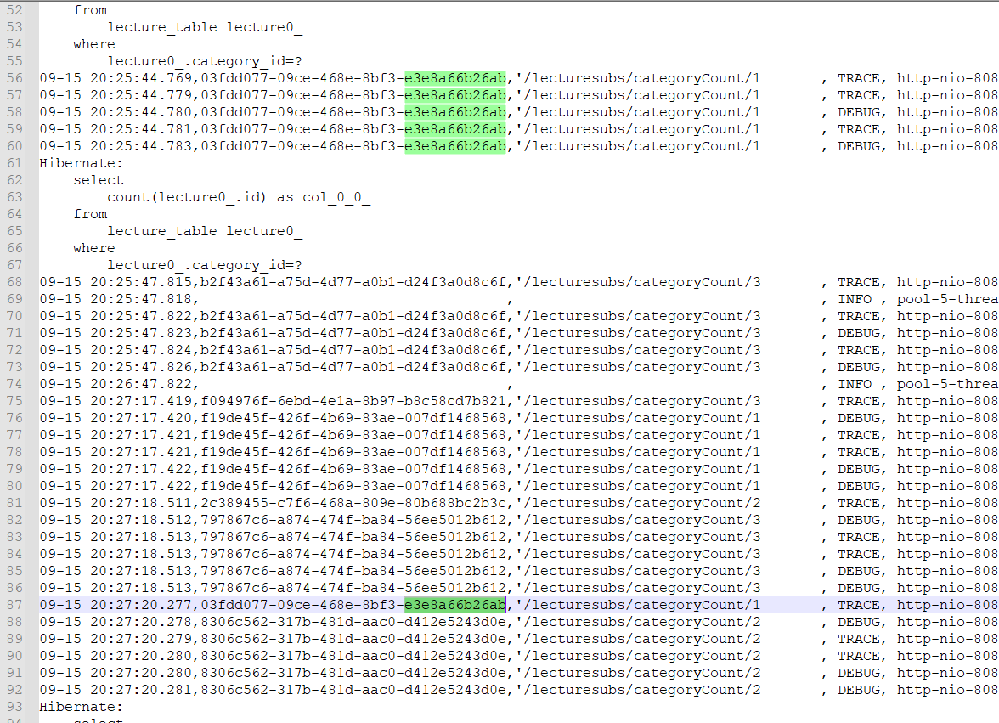

#  AOP 적용

## 기능
### 적용한 프로그램 목록

1. OnlineContext
   - @Scope(value = "request", proxyMode = ScopedProxyMode.TARGET_CLASS)
     - request 생명주기 Bean 생성
   - GUID, URL 만 1차 설정
   - 거래별 로그레벨, 거래 정합성을 위한 거래 추적 Trace
   - ..
2. AOPContext
   - 메소드별 호출 흐름 분석 용, (NEXCORE 참조)
3. 로그 Format (logback.xml)
   - 추가한 설정: %-36X{GUID},%-30X{URL}
   - <pattern>%d{MM-dd HH:mm:ss.SSS},%-36X{GUID},%-30X{URL}, %-5level, %15t, %30class{5}.%-20M,%4L, %m%n</pattern>

### 추가후 로그 분석

