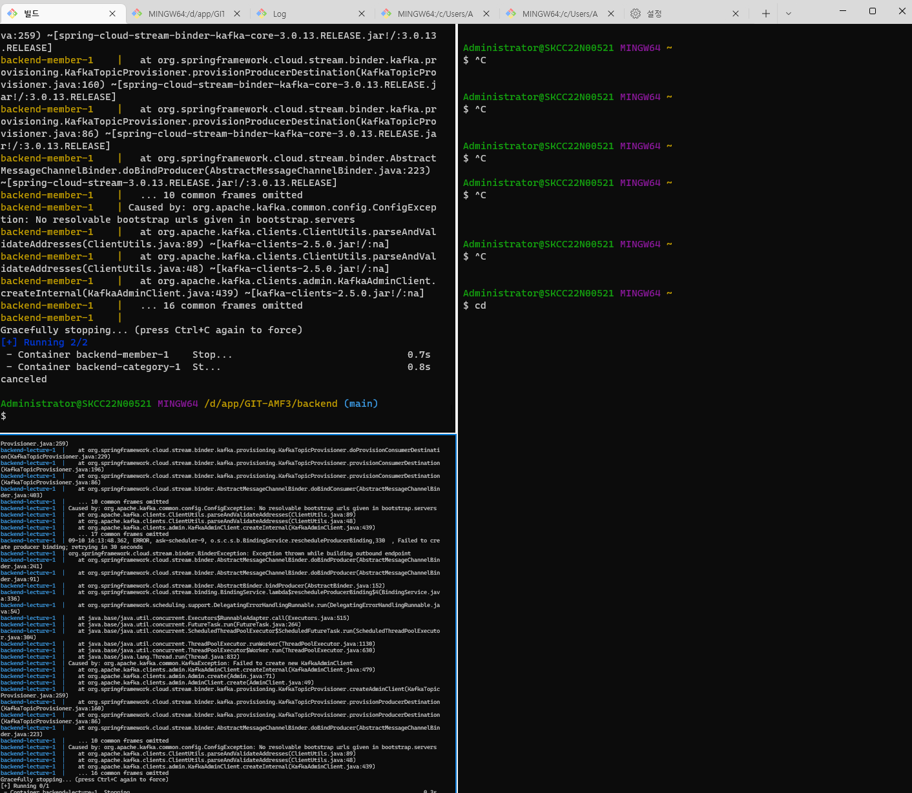
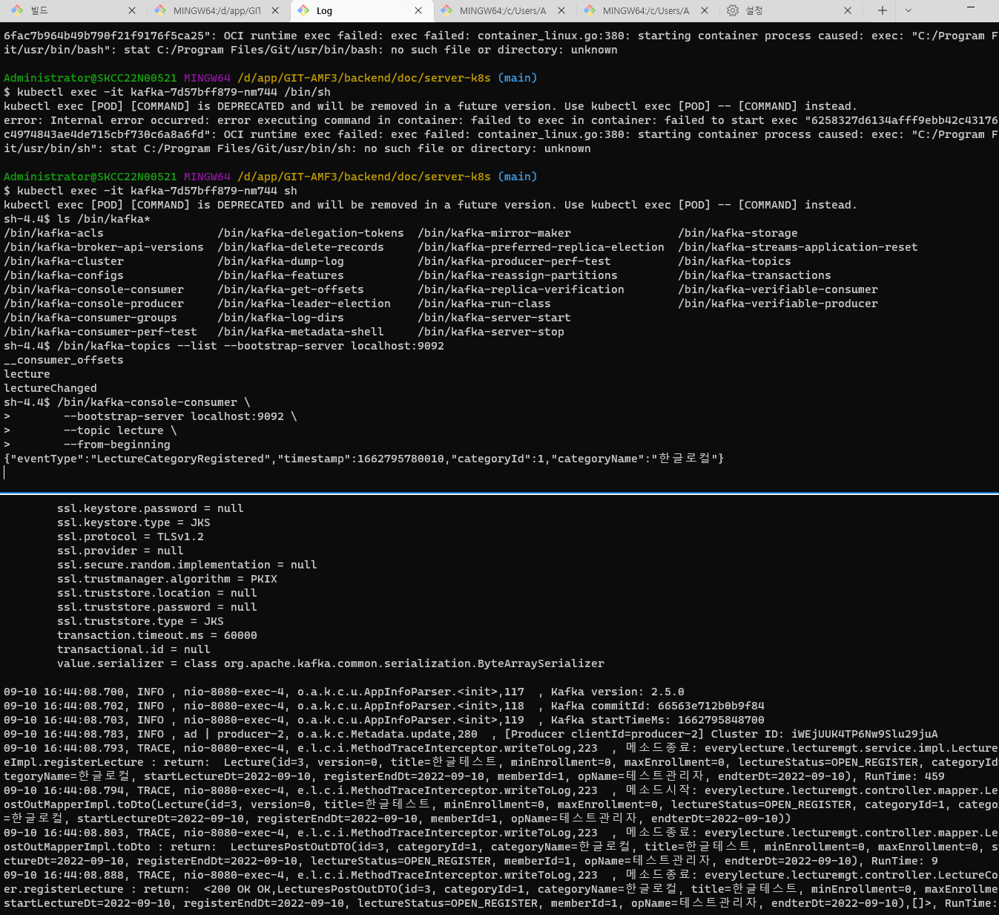

#  도구-terminal
- Git bash 창을 Multi Tab으로 수행하는 방법
## 1. MultiTerminal 설치 하기
MS Store에서 설치
- "Windows Terminal" 조회하여 설치
- [바로가기](https://apps.microsoft.com/store/detail/windows-terminal/9N0DX20HK701)

## 2. 수행 방법
1. 실행명령어
  "wt", 또는 바탕 화면의 바로가기
2. Window Power Shell, CMD, Git Bash, Az Cloud CLI 을 Multi 창으로 수행 가능
3. 하나의 창에서 split하는 방법
   - 해당 창의 제목에서 마우스 오른쪽 --> 분할창
   - 또는 "alt+shift+minus"  ==> 세로 분할창  ((무지 좋아요))
4. 기타 바로 가기는  "설정" ==> 작업 에서 확인 가능

