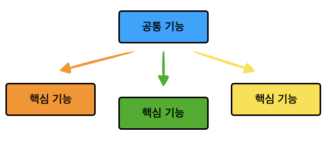

#  정리

## 1. @EnableAspectJAutoProxy 란?
원본: https://intrepidgeeks.com/tutorial/what-is-enableaspectjautoproxy

### AOP 란?
Aspect Object Programming
관점 지향 프로그래밍이라는 뜻으로 코드를 핵심 비즈니스 기능과 공통 기능으로 나눈 후에 핵심 비즈니스 기능에서 따로 빼놓은 공통 기능을 불러와서 적용하는 방법입니다.


### AOP 사용이유
- 자신이 작성한 메소드의 실행 전, 후 로그를 남기고자 할때
- DB의 작업 전후 트랜잭션 관리를 일일히 명시하지 않고 자동으로 한다면 OOP 클래스 관점에서는 대응이 쉽지 않습니다.
- 그렇기 때문에 Aspect 관점의 AOP를 사용하는 것 입니다.

### AOP 세팅 및 @EnableAspectJAutoProxy 설정
1. 빌드 Tool Settings
    ```xml
    #Maven
    <dependency>
        <groupId>org.springframework.boot</groupId>
        <artifactId>spring-boot-starter-aop</artifactId>
    </dependency>
    ```
2. @EnableAspectJAutoProxy 설정
   - 위 어노테이션을 사용하면 AOP를 사용할 수 있습니다.
   - 최상위 패키지에 있는 클래스에 annotation을 적용해서 AOP를 찾을 수 있게 도와줍니다.[main method class]

3. 공통기능을 정의하고 공통기능이 사용될 시점을 정의합니다.

### 설명
@EnableAspectJAutoProxy 는 스프링이 자동으로 개발자의 메소드를 호출하기 전에 가로챌 수 있게 하는 옵션이라고 생각하면 됩니다.
### Sample
- https://github.com/spring-projects/spring-data-examples
- interceptors - Example of how to enrich the repositories with AOP.
    ```java
    @SpringBootApplication
    @EnableAspectJAutoProxy
    public class ApplicationConfiguration {

        private static final Logger log = LoggerFactory.getLogger(ApplicationConfiguration.class);

        public static void main(String[] args) {
            log.info("main: {}, {}", args.length ,args[0]);
            SpringApplication.run(ApplicationConfiguration.class, args);

        }

        public @Bean CustomizableTraceInterceptor interceptor() {

            var interceptor = new CustomizableTraceInterceptor();
            interceptor.setEnterMessage("Entering------- $[methodName]($[arguments]).MYINNO");
            interceptor.setExitMessage("Leaving------- $[methodName](..) with return value $[returnValue], took $[invocationTime]ms.MYINNO");

            return interceptor;
        }

        public @Bean Advisor traceAdvisor() {

            var pointcut = new AspectJExpressionPointcut();
            pointcut.setExpression("execution(public * org.springframework.data.repository.Repository+.*(..))MYINNO");

            return new DefaultPointcutAdvisor(pointcut, interceptor());
        }
    }
    ```
- 로그
    ```console
    2022-08-26 20:51:11,029 TRACE interceptor.CustomizableTraceInterceptor: 225 - Entering------- save(example.springdata.jpa.interceptors.Customer@5ae16aa).MYINNO
    2022-08-26 20:51:11,137 TRACE interceptor.CustomizableTraceInterceptor: 225 - Leaving------- save(..) with return value example.springdata.jpa.interceptors.Customer@5ae16aa, took 111ms.MYINNO
    [INFO] Tests run: 1, Failures: 0, Errors: 0, Skipped: 0, Time elapsed: 7.018 s - in example.springdata.jpa.interceptors.InterceptorIntegrationTest
    ```

```java
interceptor.setHideProxyClassNames(true);

==>
 org.springframework.data.jpa.repository.support.SimpleJpaRepository.save(example.springdata.jpa.interceptors.Customer@5ffdd510)

```
### targetClassname 출력
1. 그냥 출력하면 "proxy명이 출려됨" ==>의미 없음
2. 실 클래스명을 출력하기 위한 방법
```java
package example.springdata.jpa.interceptors;

import org.springframework.aop.framework.AopProxyUtils;
import org.springframework.aop.interceptor.CustomizableTraceInterceptor;
import org.springframework.data.jpa.repository.support.SimpleJpaRepository;

public class MethodTraceInterceptor extends CustomizableTraceInterceptor {
    /**
	 *
	 */
	private static final long serialVersionUID = 1L;

	@Override
    protected Class<?> getClassForLogging(Object target) {
        Class<?> classForLogging = super.getClassForLogging(target);
        if (SimpleJpaRepository.class.equals(classForLogging)) {
            Class<?>[] interfaces = AopProxyUtils.proxiedUserInterfaces(target);
            if (interfaces.length > 0) {
                return interfaces[0];
            }
        }
        return classForLogging;
    }
}
```

```java
	public @Bean CustomizableTraceInterceptor interceptor() {
//		var interceptor = new CustomizableTraceInterceptor();

		var interceptor = new MethodTraceInterceptor();
		//class명이 proxy를 제외하기 위하여
		interceptor.setHideProxyClassNames(true);
		interceptor.setEnterMessage("Entering------- $[targetClassName].$[methodName]($[arguments])");
		interceptor.setExitMessage("Leaving------- $[targetClassShortName].$[methodName] : return value $[returnValue], took $[invocationTime]ms.MYINNO");

		return interceptor;
	}
```

```console
2022-08-26 22:11:29,810 TRACE .jpa.interceptors.MethodTraceInterceptor: 225 - Entering------- example.springdata.jpa.interceptors.CustomerRepository.save(example.springdata.jpa.interceptors.Customer@30437e9c)
2022-08-26 22:11:29,867 TRACE .jpa.interceptors.MethodTraceInterceptor: 225 - Leaving------- CustomerRepository.save : return value example.springdata.jpa.interceptors.Customer@30437e9c, took 57ms.MYINNO
[INFO] Tests run: 1, Failures: 0, Errors: 0, Skipped: 0, Time elapsed: 3.282 s - in example.springdata.jpa.interceptors.InterceptorIntegrationTest
```

## 2. logback설정

### 설정(logback.xml)
```xml
<?xml version="1.0" encoding="UTF-8"?>
<configuration>

	<appender name="console" class="ch.qos.logback.core.ConsoleAppender">
		<encoder>
			<pattern>%d %5p %40.40c:%4L - %m%n</pattern>
		</encoder>
	</appender>

	<logger name="org.springframework" level="error"/>
	<logger name="org.springframework.aop.interceptor" level="trace"/>
	<logger name="example.springdata.jpa.interceptors" level="trace"/>

	<root level="error">
		<appender-ref ref="console"/>
	</root>

</configuration>
```


