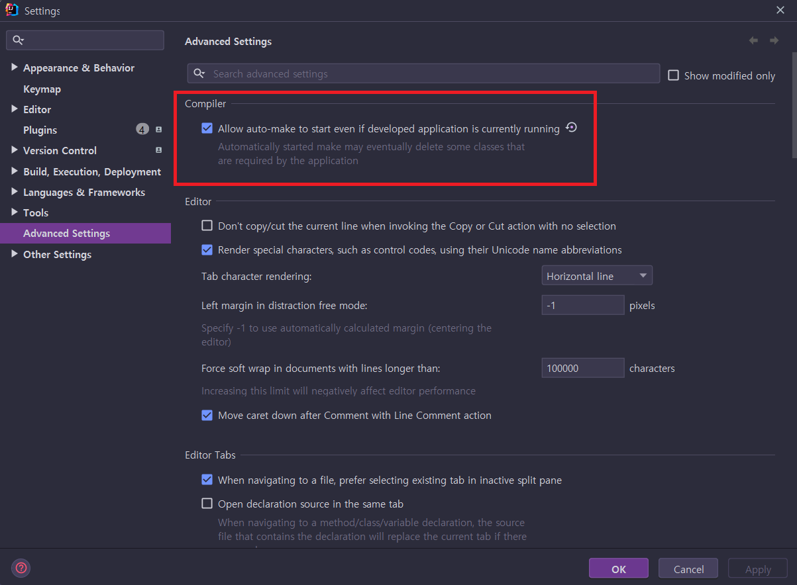
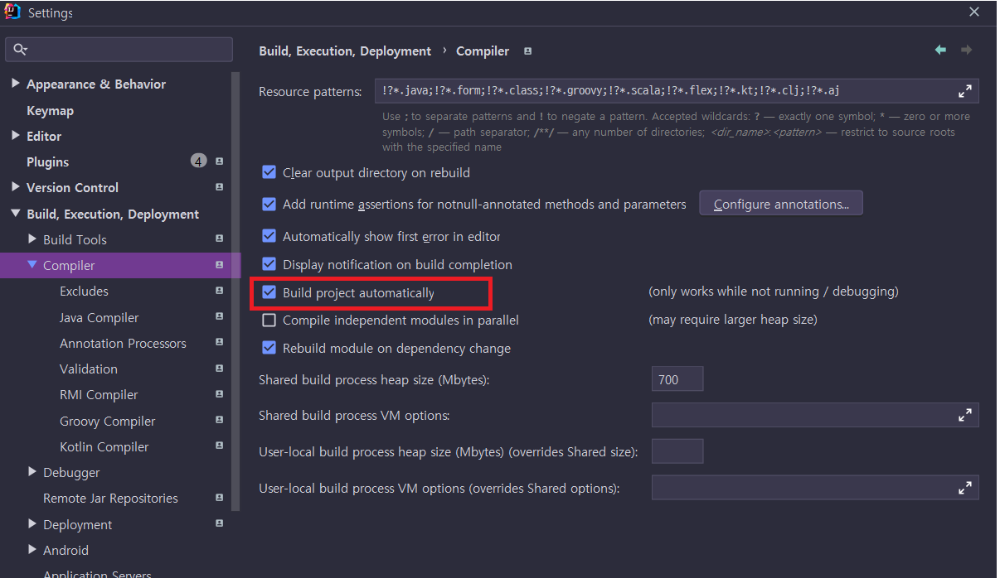

#  일반 사항 정리

## 1. Git Bash-title 설정

- Git Bash 다중창 실행시 각창의 Title 설정
```Bash
export TITLEPREFIX="빌드-Lecture::"
export TITLEPREFIX="빌드-Category::"
export TITLEPREFIX="DOcker-infra::"
export TITLEPREFIX="Docker-Domain::"

```
## 2. JPA에서 특정 컬럼 제거
1. @Entity등록된 프로그램에서 로깅을 위하여 logger필드를 추가하면 오류 발생(static, final 필드 사용으로 오류)
    ```java
        private final Logger log = LoggerFactory.getLogger(LectureController.class);
    ```

2. 특정 필드 예외 처리 방법
    ```java
        @Transient  //  Hibernate will ignore it
        private final Logger log = LoggerFactory.getLogger(LectureController.class);
    ```
## 3. Docker 관련 메모리 설정

WSL을 사용하면 'c:\Users\Administrator\\.wslconfig' 설정
- 도커로 수행되는 개수가 많아지면 OOM(Exit Code 137? 발생)
- 개별 서비스의 메모리를 최소로 줄여주고
- 총 메모리를 좀더 활당 하자
    ```bash
    [wsl2]
    memory=8GB
    # Sets amount of swap storage space to 8GB, default is 25% of available RAM
    swap=4GB

    # Sets swapfile path location, default is %USERPROFILE%\AppData\Local\Temp\swap.vhdx
    swapfile=C:\\temp\\wsl-swap.vhdx

    # Sets the VM to use two virtual processors
    processors=2
    ```
## 4. docker에 특정 SW 임시 설치
BaseImage가 아닌 임시로 특정 SW를 설치하는 방법
설정을 위하여 임시로 필요한 경우

1. docker에 VIM 설치
   - root 계정으로 접속(power shell로 접속)
      ```bash
      PS C:\Users\Administrator> docker exec -u 0 -it jenkins-blueocean bash

      root@b1b5c4c5d51b:/# apt-get update

      root@b1b5c4c5d51b:/# apt-get viinstall vim
      ```
2. vim에서 paste 하기
    ```bash
    #vim aaa.txt

    :set mouse=v
    ```
## 4. docker image 디렉토리 이동
- "C"드라이브의 용량이 부족한 경우 사용으로
    - https://stackoverflow.com/questions/62441307/how-can-i-change-the-location-of-docker-images-when-using-docker-desktop-on-wsl2
    ```bash
    #export
    wsl --export docker-desktop-data "d:\Docker\WSL\Data\docker-desktop-data.tar"

    #이제 WSL에서 VHD 이미지를 등록해제 한다.
    wsl --unregister docker-desktop-data

    # unregister
    wsl --import docker-desktop-data "D:\Docker\wsl\data" "d:\Docker\WSL\Data\docker-desktop-data.tar" --version 2

    ```
## 5. Docker 상태확인
1. 도커 상태 확인(docker stats)
    ```bash
    $ docker stats
    CONTAINER ID   NAME                          CPU %     MEM USAGE / LIMIT   MEM %     NET I/O          BLOCK I/O   PIDS
    88990b1388ed   jenkins-jenkins-blueocean-1   0.16%     1001MiB / 2GiB      48.87%    3.07MB / 186MB   0B / 0B     53
    a08541fd0012   jenkins-jenkins-docker-1      0.62%     50.63MiB / 200MiB   25.31%    170MB / 154MB    0B / 0B     24
    013ea19d7a21   backend-kafka-1               0.45%     427.6MiB / 512MiB   83.52%    107kB / 157kB    0B / 0B     77
    c2a998550459   backend-mysql-1               0.11%     216MiB / 300MiB     72.01%    1.35kB / 0B      0B / 0B     28
    2ca7f6e3fb1b   backend-zookeeper-1           0.15%     126.7MiB / 150MiB   84.47%    158kB / 106kB    0B / 0B     47
    5f45caffb9cf   backend-gateway-1             0.25%     196.9MiB / 300MiB   65.62%    1.53kB / 0B      0B / 0B     25

    ```
## 6. SDK 환경설정(git bash)
1. wsl 설정
    ```bash
    $>wsl
    뭐 .. register를 등록하고, PC가 Reboot됨

    # 아래 SW 설치 확인()
    #https://stackoverflow.com/questions/38782928/how-to-add-man-and-zip-to-git-bash-installation-on-windows
    unzip
    zip

    ```
2. sdk install
   1. https://sdkman.io/install
        ```bash
        $ curl -s "https://get.sdkman.io" | bash

        # install ... 뭐 나오지 않으면 wsl 설치를 확인하여야함
        ```
      처리 로그
        ```console
        All done!
        You are subscribed to the STABLE channel.
        Please open a new terminal, or run the following in the existing one:
            source "/home/Administrator/.sdkman/bin/sdkman-init.sh"
        Then issue the following command:
            sdk help
        Enjoy!!!
        ```
   2. 초기화
        ```bash
        $ source "$HOME/.sdkman/bin/sdkman-init.sh"
        #별도 처리 로그는 없음
        ```
   3. 설치확인
        ```bash
        $ sdk version

        SDKMAN 5.16.0
        ```

## 7. Spring Boot Devtools 사용법
https://barbera.tistory.com/47


### Devtools란 ?
Spring boot에서 제공하는 개발 편의를 위한 모듈
- 개발을 하다보면, 코드 수정시 브라우저에서 보여주는 내용도 수정하려면 어플리케이션을 재시작해야 하기 때문에 불편한 점이 많은데
- devtools를 이용하면 이러한 불편한 점을 해결할 수 있다.

크게 아래의 5가지 기능들을 제공한다고 하는데
- Property Defaults
- Automatic Restart
- Live Reload
- Global Settings
- Remote Applications

쉽게 말하면 브라우저로 전송되는 내용들에 대한 코드가 변경되면, 자동으로 어플리케이션을 재시작하여 브라우저에도 업데이트를 해주는 역할을 한다.

자주 사용하는 H2 콘솔로 예를 들면
- 인텔리제이에서 엔티티에 새로운 필드를 추가하거나 새로운 엔티티를 추가해도 프로젝트를 다시 시작하지 않고 h2 콘솔에서 업데이트된 정보를 볼 수 있다.
- 추가로 H2 데이터베이스를 사용중이라면 자동으로 H2콘솔도 활성화 시켜주는 장점도 있다.
- (server(tcp)모드로 h2를 사용할때 콘솔을 활성화 하지 않아도 프로젝트를 실행시킬 수 있다....!!)


### 설정방법

1. Dependency에 Devtools를 추가한다.
   - Gradle 사용시

    ```console
    dependencies {
    ​​​​  compileOnly("org.springframework.boot:spring-boot-devtools")
    }
    ```
   - Maven 사용시

    ```console
    <dependencies>
        ​​​​<dependency>
            ​​​​​​​​<groupId>org.springframework.boot</groupId>
            ​​​​​​​​<artifactId>spring-boot-devtools</artifactId>
            ​​​​​​​​<optional>true</optional>
        ​​​​</dependency>
    </dependencies>
    ```
2. Advanced Settings 설정

   - IntelliJ 2021이전에는 registry에 있는 compiler.automake.allow.when.app.running 설정에 체크해 주어야 했지만
   - 2021 부터는 해당 설정이 레지스트리에서 Advanced Settings으로 옮겨 졌다.
   - 아래의 빨간색 상자안에 있는 체크박스를 체크해주면 된다
   

3. Build project automatically 체크
   - Build, Execution, Deployment -> Compiler -> Build project automatically 체크
   


